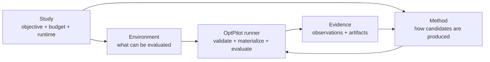

# OptPilot

OptPilot is a lightweight orchestration layer for iterative optimization studies. It connects a user-owned method to a user-owned environment, runs candidate solutions, records objective metrics, and keeps an auditable evidence trail.

OptPilot is not an optimizer, simulator, RL framework, or LLM agent framework. Those pieces remain yours. OptPilot standardizes the loop around them:

1. A method proposes one or more candidates.
2. OptPilot validates and materializes each candidate.
3. An environment evaluates the candidate and reports metrics.
4. OptPilot records trials, observations, saved output files, method calls, and run metadata.
5. The method can use the accumulated evidence to propose the next candidates.



The boundary between environment and method is the candidate contract. Start with `docs/candidate-contracts.md` after the quickstart if you are adding a new integration.

## Current Surface

Users author three public YAML config files:

- `config: environment`: candidate contract, evaluator, metrics, trial workspace, saved output-file rules, and optional records.
- `config: method`: method entrypoint, protocol, settings, compatibility requirements, and optional method runtime.
- `config: study`: the concrete run binding an environment config to a method config with objective, budget, execution, and evidence settings.

OptPilot validates those YAML files with packaged JSON Schemas, compiles them into an internal `StudySpec`, and writes the compiled spec into every run directory.

Included in the current release:

- JSON Schema validation for public environment, method, and study configs
- parameter, file, and opaque candidate contracts
- Python and command environment evaluators
- Python and command methods with batch protocol, plus Python session protocol
- local thread, local subprocess, and Docker/Podman-compatible environment execution
- Docker/Podman-compatible command-method runtime isolation
- local JSONL evidence store with run summaries, trials, observations, candidate records, saved output files, method calls, and events
- curated job-shop scheduling tutorial environment with shared validation cases, a shared objective, parameter/file candidate variants, JobShopLib-backed method wrappers, Stable-Baselines3 RL, and LLM file-candidate examples
- strategic-airlift DEVS example using an external generated simulator
- OptPilot Studio, a local UI for browsing reusable catalogs, opening workspaces, checking compatibility, launching studies, inspecting runs, and optionally using an OpenHands-backed assistant

Not included:

- production Bayesian optimization, RL, LLM, or metaheuristic frameworks
- remote execution backends
- automatic dependency inference for study runtimes
- multi-user UI authentication

## Prerequisites

OptPilot currently supports Python 3.10 and newer.

Before running the examples below, install:

- Python 3.10+
- `uv`

## Install

OptPilot uses `uv`.

```bash
uv sync
uv run optpilot --help
```

## Quickstart

Start with the job-shop parameter baseline. It is the recommended first run, works from a fresh checkout, and does not require API keys or external solvers.

The job-shop examples are the main tutorial comparison set: environments declare what they can evaluate, methods declare how they produce candidates, and study files bind one environment, one method, objective, budget, and runtime.

Run the job-shop parameter baseline:

```bash
uv run optpilot run catalog/example_package/studies/job_shop_rule_parameters_baseline.yaml
```

Validate a config without running it:

```bash
uv run optpilot validate catalog/example_package/studies/job_shop_rule_parameters_baseline.yaml
```

Open the local UI:

```bash
uv run optpilot ui --open-browser
```

The UI scans packages under `catalog/` by default. Stop the local server with
`Ctrl-C` in the terminal when you are done.

For the assistant-enabled Studio workflow with OpenHands, embedded Code Server,
and per-workspace containers, see [UI](docs/ui.md).

Some advanced examples, such as Strategic Airlift and future curated application packages, require extra setup. Use the job-shop example first, then continue with the example-specific docs.

## Full Config Examples

The first tutorial shows the full environment, method, and study YAML files for a runnable job-shop baseline:

- `catalog/example_package/environments/job_shop_scheduling/environment_rule_parameters.yaml`
- `catalog/example_package/methods/fixed_rule_parameters/method.yaml`
- `catalog/example_package/studies/job_shop_rule_parameters_baseline.yaml`

Read [Getting Started](docs/getting-started.md) for the full configs and the explanation of how the three files fit together. Python evaluator references use `module:function`; Python method references use `module:Class`.

## Catalog Packages

OptPilot ships one package at `catalog/example_package/`. When Studio registers
user-owned files, it creates `catalog/local_package/` on demand. Future curated
packages should be added as additional siblings under `catalog/`; they should
not overwrite existing packages.

```text
catalog/
  example_package/
  local_package/
  another_curated_package/
```

Each package can contain `environments/`, `methods/`, `resources/`, and
`studies/`. Environment and method directories own reusable implementation code
and reusable config variants. Resources are reusable reference folders or
launchable apps. Study configs are concrete run plans.

## Container Runtime Example

Run environment trials in a container:

```yaml
execution:
  backend: local
  runtime:
    sandbox: container
    network: disabled
    container:
      image: python:3.11-slim
      executable: docker
```

Run a command method in its own container:

```yaml
entrypoint:
  command: [python, my_agent.py, "{input_file}", "{output_file}"]
  protocol: batch

runtime:
  sandbox: container
  network: disabled
  container:
    image: my-agent-image:latest
    executable: docker
    build:
      context: .
      dockerfile: Dockerfile.agent
      tag: my-agent-image:latest
  envFromHost: [OPENAI_API_KEY]
```

## Documentation

- [Getting Started](docs/getting-started.md)
- [Concepts](docs/concepts.md)
- [Candidate Contracts](docs/candidate-contracts.md)
- [Methods](docs/methods.md)
- [How A Run Works](docs/how-it-works.md)
- [Evidence](docs/evidence.md)
- [Examples](docs/examples.md)
- [Job-Shop Environment](docs/job-shop-environment.md)
- [Configuration Reference](docs/configuration.md)
- [Catalog](docs/catalog.md)
- [UI](docs/ui.md)

Build the docs locally:

```bash
uv run --extra docs mkdocs serve
```

## Development Checks

```bash
uv run python -m unittest discover -s tests -p 'test_*.py'
uv run python -m compileall src/optpilot
./scripts/smoke_test.sh
```

OptPilot is licensed under the Apache License 2.0. See [LICENSE](LICENSE).
