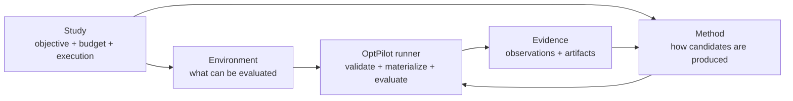
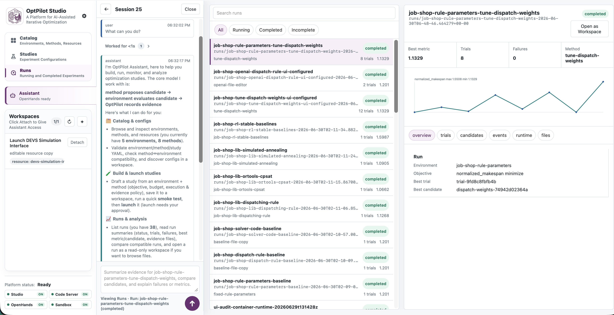

# OptPilot

OptPilot is a lightweight orchestration layer for iterative optimization studies. It connects a user-owned method to a user-owned environment, runs candidate solutions, records objective metrics, and keeps an auditable evidence trail.

OptPilot is not an optimizer, simulator, RL framework, or LLM agent framework. Those pieces remain yours. OptPilot standardizes the loop around them:

1. A method proposes one or more candidates.
2. OptPilot validates and materializes each candidate.
3. An environment evaluates the candidate and reports metrics.
4. OptPilot records trials, observations, saved output files, method calls, and run metadata.
5. The method can use the accumulated evidence to propose the next candidates.



The boundary between environment and method is the candidate contract. Start with `docs/candidate-contracts.md` after the quickstart if you are adding a new integration.

## Current Surface

Users author three public YAML config files:

- `config: environment`: candidate contract, evaluator, metrics, trial workspace, saved output-file rules, and optional records.
- `config: method`: method entrypoint, protocol, settings, compatibility requirements, and optional method runtime.
- `config: study`: the concrete run binding an environment config to a method config with objective, budget, execution, and evidence settings.

OptPilot validates those YAML files with packaged JSON Schemas, compiles them into an internal `StudySpec`, and writes the compiled spec into every run directory.

Included in the core CLI/SDK:

- JSON Schema validation for public environment, method, and study configs
- package validation for folders that contain environments, methods, resources, and studies
- parameter, file, and opaque candidate contracts
- Python and command environment evaluators
- Python and command methods with batch protocol, plus Python session protocol
- local thread, local subprocess, and Docker/Podman-compatible environment execution
- Docker/Podman-compatible command-method runtime isolation
- local JSONL evidence store with run summaries, trials, observations, candidate records, saved output files, method calls, and events

Included in a source checkout:

- runnable job-shop scheduling tutorial package with shared validation cases, a shared objective, parameter/file candidate variants, JobShopLib-backed method wrappers, Stable-Baselines3 RL, and LLM file-candidate examples
- OptPilot Studio, a local UI for browsing reusable catalogs, opening workspaces, checking compatibility, launching studies, inspecting runs, and optionally using an OpenHands-backed assistant

Not included:

- production Bayesian optimization, RL, LLM, or metaheuristic frameworks
- remote execution backends
- automatic dependency inference for study runtimes
- multi-user Studio authentication

## Prerequisites

OptPilot currently supports Python 3.10 and newer.

Before running the examples below, install:

- Python 3.10+
- `uv`

## Install Options

Use the PyPI package when you want the Python SDK and CLI in your own project.
This path does not install OptPilot Studio, OpenHands, Code Server, or the
bundled example catalog.

```bash
python -m pip install optpilot
optpilot --help
optpilot package validate path/to/package
optpilot validate path/to/package/studies/my_study.yaml
optpilot run path/to/package/studies/my_study.yaml
```

Use a source checkout when you want the bundled tutorial package, full local
Studio, docs, and contributor workflow:

```bash
git clone https://github.com/MINDS-THU/OptPilot.git
cd OptPilot
uv sync --all-packages --group examples --group docs
uv run optpilot --help
```

## First Run

Start with the job-shop parameter baseline from a source checkout. It is the
recommended first run, works after the full source sync above, and does not
require API keys or external solvers.

The job-shop examples are the main tutorial comparison set: environments declare what they can evaluate, methods declare how they produce candidates, and study files bind one environment, one method, objective, budget, and execution policy.

Run the job-shop parameter baseline:

```bash
uv run optpilot run catalog/example_package/studies/job_shop_rule_parameters_baseline.yaml
```

Validate a config without running it:

```bash
uv run optpilot validate catalog/example_package/studies/job_shop_rule_parameters_baseline.yaml
```

After the first run succeeds, open Studio:

```bash
uv run optpilot ui --open-browser
```



Studio scans packages under `catalog/` by default. Stop the local server with
`Ctrl-C` in the terminal when you are done.

For the assistant-enabled Studio workflow with OpenHands, embedded Code Server,
and per-workspace containers, see [OptPilot Studio](docs/ui.md).

Some examples, such as the JobShopLib and Stable-Baselines method wrappers, require optional dependencies. Use the dependency-free job-shop baseline first, then continue with the example-specific docs.

## Full Config Examples

The first tutorial shows the full environment, method, and study YAML files for a runnable job-shop baseline:

- `catalog/example_package/environments/job_shop_scheduling/environment_rule_parameters.yaml`
- `catalog/example_package/methods/fixed_rule_parameters/method.yaml`
- `catalog/example_package/studies/job_shop_rule_parameters_baseline.yaml`

Read [First Job-Shop Run](docs/getting-started.md) for the full configs and the explanation of how the three files fit together. Python evaluator references use `module:function`; Python method references use `module:Class`.

## Catalog Packages

OptPilot ships one package at `catalog/example_package/`. When Studio registers
user-owned files, it creates `catalog/local_package/` on demand. Add future
packages as additional siblings under `catalog/`; they should not overwrite
existing packages.

```text
catalog/
  example_package/
  local_package/
  another_package/
```

Each package can contain `environments/`, `methods/`, `resources/`, and
`studies/`. Environment and method directories own reusable implementation code
and reusable config variants. Resources are reusable reference folders or
launchable apps. Study configs are concrete run plans.

## Container Runtime Example

Run an environment evaluator in a container by declaring the component runtime
on the environment config:

```yaml
runtime:
  sandbox: container
  container:
    image: python:3.11-slim
    executable: docker
    network: disabled
```

The study still owns trial policy:

```yaml
execution:
  parallelism: 1
  timeoutSeconds: 300
```

Run a command method in its own container:

```yaml
entrypoint:
  command: [python, my_agent.py, "{input_file}", "{output_file}"]
  protocol: batch

runtime:
  sandbox: container
  container:
    image: my-agent-image:latest
    executable: docker
    network: disabled
    build:
      context: .
      dockerfile: Dockerfile.agent
      tag: my-agent-image:latest
  envFromHost: [OPENAI_API_KEY]
```

## Documentation

- [Installation](docs/installation.md)
- [First Job-Shop Run](docs/getting-started.md)
- [OptPilot Core](docs/concepts.md)
- [Candidate Contracts](docs/candidate-contracts.md)
- [Methods](docs/methods.md)
- [Packages and Catalogs](docs/catalog.md)
- [Configuration Reference](docs/configuration.md)
- [How a Run Works](docs/how-it-works.md)
- [Evidence](docs/evidence.md)
- [Job-Shop Tutorial Map](docs/examples.md)
- [Job-Shop Environment](docs/job-shop-environment.md)
- [OptPilot Studio](docs/ui.md)
- [Workspace Management](docs/studio-workspaces.md)
- [OptPilot Assistant](docs/assistant.md)

Build the docs locally:

```bash
uv run --group docs mkdocs serve
```

## Development Checks

```bash
uv run python -m unittest discover -s tests -p 'test_*.py'
uv run python -m compileall src/optpilot
uv run python -m compileall studio/src/optpilot_studio
./scripts/smoke_test.sh
```

OptPilot is licensed under the Apache License 2.0. See [LICENSE](LICENSE).
