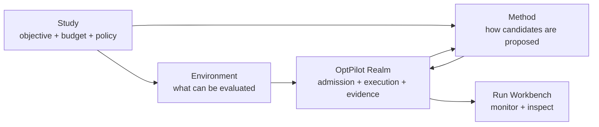

# OptPilot

OptPilot is a lightweight orchestration layer for iterative optimization
studies. It connects a user-owned method to a user-owned environment and owns
the boundary around evaluation:

1. A method proposes candidates.
2. OptPilot validates and admits them as logical trials.
3. The environment evaluates them in fresh attempts.
4. OptPilot commits observations, artifacts, events, and recovery state.
5. The method receives filtered evidence for the next decision.

OptPilot is not an optimizer, simulator, RL framework, or LLM agent framework.
Those pieces remain yours.


```mermaid
flowchart LR
  Env["Environment\nwhat can be evaluated"]
  Method["Method\nhow candidates are proposed"]
  Study["Study\nobjective + budget + policy"]
  Realm["OptPilot Realm\nadmission + execution + evidence"]
  Workbench["Run Workbench\nmonitor + inspect"]

  Study --> Env
  Study --> Method
  Env --> Realm
  Method --> Realm
  Realm --> Method
  Realm --> Workbench
```

The environment/method boundary is the candidate contract. See
[Candidate Contracts](https://MINDS-THU.github.io/OptPilot/candidate-contracts/)
when adding an integration.

## Public configs

Experiment packages use three core YAML config roles:

- `config: environment`: candidate contract, evaluator, metrics, context, and
  runtime requirements
- `config: method`: proposal entrypoint, settings, protocol, compatibility,
  and runtime requirements
- `config: study`: environment/method binding, objective, budget, execution,
  evidence, and reproducibility policy

Packages may additionally expose `config: resource` manifests for helper
assets, interfaces, and reviewed headless actions that sit outside the
Method-to-Environment Run loop.

OptPilot validates the YAML, captures one explicit package root, and compiles an
exact retained study definition. A run is a canonical namespace in a local
Realm, not a mutable output directory.

## Current executable surface

The retained Realm runner supports parameter and bounded-file Candidates,
Python evaluators, Python batch Methods, and Python-headed command batch
Methods. It can run declared process or digest-pinned container runtimes and
prepare narrow, hash-locked pure-Python dependency layers. Opaque Candidates,
session Methods, command evaluators, arbitrary build/setup execution, and other
unsupported combinations fail closed. See the authoritative
[Executable Capabilities](https://MINDS-THU.github.io/OptPilot/capabilities/)
matrix before designing an integration.

Packages may explicitly select host environment values for a launch. Studio
binds the current saved revisions while keeping secret values out of process
records and Run evidence; direct CLI launches use the exported process
environment. Unsupported authoring configurations fail during retained
compilation instead of falling back to an implicit execution path.

Package code is trusted code. Container images run only after approval of their
exact digest, and authored process code is not sandboxed against deliberate
hostility. See [Local Operations and Security](https://MINDS-THU.github.io/OptPilot/operations/)
before running packages from an untrusted source.

## Install

OptPilot supports Python 3.10 and newer.

Install the core CLI and Python package from PyPI:

```bash
python -m pip install optpilot
optpilot --help
optpilot package validate path/to/package
optpilot validate path/to/package/studies/my_study.yaml
optpilot run path/to/package/studies/my_study.yaml \
  --package-root path/to/package
```

The PyPI package does not include Studio, OpenHands, Code Server, or this
repository's example catalog.

For Studio, docs, examples, and contributor tooling, use a source checkout:

```bash
git clone https://github.com/MINDS-THU/OptPilot.git
cd OptPilot
uv sync --all-packages --group examples --group docs
uv run optpilot --help
uv run optpilot ui --open-browser
```

Check one of the packages that ship with OptPilot, then run it:

```bash
uv run optpilot package validate catalog/devs_gallery --check-source
```

```bash
uv run optpilot run --package-root catalog/devs_gallery \
  catalog/devs_gallery/studies/seird_minimize_deaths.yaml
```

That run needs no container software and no model provider key. It optimises
an epidemic simulator and prints the result, including the best parameters it
found.

See [Getting Started](https://MINDS-THU.github.io/OptPilot/getting-started/)
for the current run boundary and command shape.

## Runs and Studio

Without `--realm-root`, CLI and Studio use OptPilot's private per-user Realm
in the OS user-data location. `--realm-root` is an operational override for an
isolated local Realm, not an output-folder option.

The Studio Runs page reads the same canonical Realm and provides:

- status, stop reason, objective, budget, counts, and best result
- bounded candidate, logical-trial, attempt, observation, and artifact pages
- an exact-head correlated timeline
- direct Run pages: selecting a Run never creates or opens a Workspace
- same-Run Candidate comparison, a Run-local **Shortlist**, and exact
  **Re-evaluate in a new Run** when eligible

Studio resolves each Candidate action from the exact retained selection.
**Run headless** runs a noninteractive inspection; **Open interactive
interface** opens the Environment's live view when its retained profile and
provider support it.
Both are explicitly inspection-only: they never consume the source Run's
budget or change its ranking or evidence.

Container-backed interfaces require an explicit approval for their exact,
digest-pinned image. Persistent approvals live in the selected private Realm:

```bash
optpilot environment-preview trust approve \
  registry.example/preview@sha256:aaaaaaaaaaaaaaaaaaaaaaaaaaaaaaaaaaaaaaaaaaaaaaaaaaaaaaaaaaaaaaaa
optpilot environment-preview trust list
```

Use the same absolute `--realm-root` as Studio when it does not use the default
Realm, and restart Studio after changing an approval. See
[Operations](https://MINDS-THU.github.io/OptPilot/operations/#environment-preview-image-approvals)
for revocation, JSON output, confirmation, and session-only override behavior.

**Inspect** shows semantic inputs without launching. **View files** browses
retained file Candidates and artifacts through a bounded read-only view.
**Edit in Workspace** is available only for an eligible complete project and
creates or reopens one durable editable Workspace. Viewing or trying a
Candidate does not create a Workspace, copy its content, or expose internal
storage paths.

## Catalog packages

A package may contain `environments/`, `methods/`, `resources/`, and
`studies/`. Environment and method directories own implementation code and
reusable config variants; resources are supporting content/apps; studies are
concrete run plans.

```text
catalog/
  devs_gallery/                 # DEVS-Gen research package
  production_agv_scheduling/   # LLM-guided heuristic-design research package
  or_solving/                  # COOPA research package
  optpilot_tutorial/           # small package-authoring tutorial
```

## Documentation

- [Getting Started](https://MINDS-THU.github.io/OptPilot/getting-started/)
- [How a Run Works](https://MINDS-THU.github.io/OptPilot/how-it-works/)
- [Executable Capabilities](https://MINDS-THU.github.io/OptPilot/capabilities/)
- [Runs and Evidence](https://MINDS-THU.github.io/OptPilot/evidence/)
- [Configuration](https://MINDS-THU.github.io/OptPilot/configuration/)
- [Studio UI](https://MINDS-THU.github.io/OptPilot/ui/)
- [Research Packages](https://MINDS-THU.github.io/OptPilot/devs-gallery/)

## Development

```bash
uv sync --all-packages --group examples --group docs
uv run pytest
uv run mkdocs serve
```

Contributors should see the
[Development guide](https://MINDS-THU.github.io/OptPilot/development/) and the
[maintainer design notes](https://github.com/MINDS-THU/OptPilot/tree/main/designs).

OptPilot is licensed under the
[Apache License 2.0](https://github.com/MINDS-THU/OptPilot/blob/main/LICENSE).
