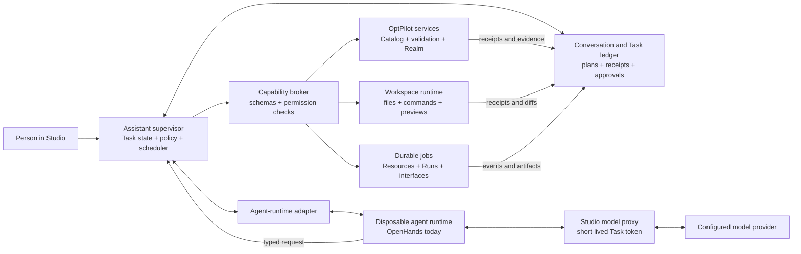

# How the OptPilot Assistant should work — the target design

> **Historical target-design snapshot (2026-08-17).** This file is not the
> current implementation contract; several “not built” rows, tool names, and
> security notes have since changed. Use
> [Assistant](../docs/assistant.md),
> [Executable Capabilities](../docs/capabilities.md), and the
> [release-readiness review](../docs/release-readiness-review.md) for current
> behavior.

Written to be read without prior knowledge of OptPilot; every product term is
defined where it first appears.

**What is described here.** This is a target design, not a claim that every
part exists. Studio already has locally persisted Conversations, page context,
attached Workspaces, an OpenHands bridge, a typed OptPilot tool surface,
permission gates, approval records, structured cards, package-plan validation,
Run launch, and Run inspection. Those are useful foundations. The durable Task
model, action receipts, general recovery protocol, capability activation,
Assistant access to Resource actions, safe Catalog edit-copy entry point, and
evaluation system in this document are not all built. Section 17 gives the
precise relationship to the present code. Last revised 2026-08-17.

This proposal is intentionally separate from
`designs/how-the-assistant-works.md`. It chooses the end state that would make
the Assistant reliably useful across different kinds of work, even when the
model is rate-limited, the agent process is restarted, or a task spans hours.

## At a glance

The target loop is simple even though the supporting system is substantial:

1. A person states an outcome. Studio records a Task with acceptance criteria,
   relevant object references, and explicit budgets.
2. A replaceable reasoning worker proposes the next typed Action. It has no
   ambient authority over files, secrets, Runs, the Catalog, or the network.
3. Studio validates the Action, applies policy, obtains an exact approval when
   needed, executes it through the owning OptPilot service, and records a
   receipt.
4. Long-running work becomes a durable Job. The Task can survive a closed
   browser, rate limit, Studio restart, or replacement reasoning worker.
5. The Assistant verifies the requested outcome from receipts and retained
   evidence before claiming completion.

Readers focused on product behavior can start with §§1, 4, and 7–10. Sections
2–6 and 11–15 define the architecture and safety model. Sections 16–20 cover
evaluation, current implementation gaps, migration, tradeoffs, and release
criteria. In this document, **must** marks a required safety or correctness
property, **should** marks the recommended product default, and **may** marks an
optional implementation choice.

## 1. What OptPilot does, and what the Assistant promises

OptPilot runs optimisation experiments. A **Method** proposes candidate
solutions—each proposed solution is a **Candidate**—an **Environment** evaluates
them, and a **Run setup** binds a Method and Environment to an objective and a
budget. The settings files and internal APIs call a Run setup a *study*; this
document uses the user-facing term throughout. Executing one creates a **Run**
whose code, inputs, proposals, results, and evidence are retained.

Related components live in a **package**. A package may also contain a
**Resource**: a supporting tool such as a simulator generator. The **Catalog**
is the set of package folders available on the machine. **Studio** is the local
application for browsing the Catalog, creating editable **Workspaces**,
launching Runs, and inspecting their evidence.

A Catalog entry is backed by an ordinary package folder. Registration is the
controlled service that updates that folder and takes an immutable, numbered
**snapshot** of its exact contents; the folder remains the current editable
source while the snapshot never changes. The Assistant treats the Catalog
folder as read-only and works in an editable copy, then asks registration to
apply checked changes and take the next snapshot. The **Realm** is OptPilot's
local ledger and archive service behind snapshots, Runs, and retained evidence.
Stored code and definitions use content **fingerprints**: identifiers derived
from their exact bytes, so a changed byte produces a different identity.

The design also uses a small Assistant vocabulary. A **Conversation** is the
human-facing thread; a **Task** is one requested outcome inside it. A
**capability** is a user-level thing the Assistant can accomplish. A versioned
Studio service endpoint for doing part of it is an **operation**; the schema
shown to the model for an operation is a **tool**; one invocation is an
**Action**. A **Job** is an Action whose work continues independently, and a
**receipt** is Studio's recorded evidence of what an Action did. The versioned
set of tools loaded by one reasoning worker is its **tool manifest**. Section 4
expands the Task lifecycle.

The Assistant is the conversational way to accomplish work across those
objects. Its promise is:

> **State an outcome. The Assistant will carry any supported OptPilot task to a
> verified result, pausing only when it needs information, judgement, or
> authority that belongs to the person, and leaving an auditable account of
> what it inspected, changed, ran, and verified.**

This is stronger than “the Assistant can click everything in the menus.” Some
useful Assistant work has no menu equivalent, such as diagnosing a package and
repairing several related files. Some menu actions, such as approving unknown
software or deleting retained evidence, deliberately remain human-only.
Usefulness is measured by completed outcomes, not by menu parity or the number
of tools exposed to a model.

The supported outcome families and their verified success conditions are:

| Outcome | What counts as verified success |
| --- | --- |
| Understand | A concise answer grounded in the selected object, OptPilot documentation, or retained evidence, with uncertainty stated. |
| Find | A small ranked set of exact Catalog references, an explanation of fit and prerequisites, and one sensible next action. |
| Use a Resource | A declared Resource action has produced its typed artifact. If the Task was only to open a human interface, success is the exact live interface; otherwise opening it leaves the Task at `needs_input`. |
| Configure and launch | A valid Run setup with explicit inputs, objective, budget, grants, and image state has been approved and launched once; the exact Run is linked. |
| Run to a result | The Run reached the Task's requested terminal condition and the result was read from retained evidence. Merely launching it is not success when the requested outcome includes analysis. |
| Build or adapt | An editable Workspace contains the requested code and configs, validation has passed, and the strongest applicable smoke check authorized within the Task budget has succeeded. |
| Update | Registration applied checked changes to the Catalog folder and recorded the new immutable snapshot. |
| Diagnose and improve | The cause is tied to files, validation results, logs, or Run evidence; any requested fix is verified and its diff is available. |
| Analyze and compare | Claims come from structured Run evidence, incompatible comparisons are called out, and any generated report is a separate artifact rather than a mutation of the Run. |

A missing credential, unavailable image, unsupported capability, failed smoke
Run, or registration conflict is an honest `blocked` result or human handoff,
not verified success. The Task remains valuable because it preserves the exact
blocker and completed work, but the final answer does not blur the distinction.

## 2. The rules that govern the Assistant

Five rules determine the rest of the design.

### 2.1 The model proposes; Studio has authority

The language model may choose what to inspect and propose what should happen.
Only Studio may validate the request, decide whether it is permitted, ask for
approval, execute it, and record the result.

The model and its agent runtime receive no ambient access to the user's files,
the Catalog, the Run archive, the container engine, network credentials, or
Studio settings. All such access crosses a Studio-owned typed operation. A
generic shell remains possible inside an attached editable Workspace, but it is
still a Studio operation executed in that Workspace's runtime under command,
path, network, time, output, and approval policy.

### 2.2 Durable task state lives outside the model

Conversation history inside OpenHands, or inside any other model runtime, is a
cache. It is never the only copy of the goal, plan, decisions, completed steps,
pending approvals, active jobs, or evidence.

Studio owns that state. It must be able to destroy one reasoning runtime, create
another, and continue from the last verified step. A provider rate limit pauses
reasoning; it does not erase the task or turn a half-completed action into a
guess.

### 2.3 Untrusted content supplies data, never authority

Package documentation, source code, problem statements, generated files,
command output, Resource output, web content, and Run artifacts may all contain
instructions addressed to a model. They are treated as quoted input. They may
inform a recommendation, but they cannot change Studio policy, attach a
Workspace, grant a credential, approve an action, or redefine the user's goal.

Prompt wording helps the model respect this boundary; server enforcement makes
the boundary real.

### 2.4 Completion requires evidence

The Assistant may say that a file changed only after a write receipt exists. It
may say a config is valid only after validation of the current file revision. It
may say a package works only after the required smoke result. It may say a Run
completed only from the retained Run state.

A plausible model answer is a proposal. A tool result is an observed fact. A
successful tool call is not always proof of the user's outcome, so multi-step
tasks finish with an explicit verification step.

### 2.5 Every effect is bound to exact state

Every side effect carries:

- the exact arguments and target object;
- the relevant Workspace, package, Run setup, or Run revision;
- a stable operation id used for idempotency;
- the policy decision and, when required, the exact approval;
- a receipt stating what actually happened.

If the target changes after preview or approval, execution stops with a stale
state error. It never silently applies an old decision to new bytes. An
operation id deduplicates Studio dispatch. For OptPilot services that support
lookup by that id, a retry returns or reconciles the prior result instead of
launching a second Run or registering a second snapshot. It cannot make an
arbitrary external command or API intrinsically idempotent; an unreconcilable
timeout remains outcome-unknown and is never retried automatically.

## 3. The system boundary

The Assistant is a Studio control plane around a replaceable reasoning worker.



The ownership split is deliberate:

| Part | Owns | Does not own |
| --- | --- | --- |
| Studio UI | The person's messages, visible selections, review surfaces, cards, approval controls, and manual workflows | Model reasoning or execution policy |
| Assistant supervisor | Task lifecycle, context assembly, capability selection, budgets, approval workflow, scheduling, recovery, and the canonical event stream | Final authorization, optimisation execution, or package internals |
| Agent-runtime adapter | Starting, prompting, interrupting, and replacing a reasoning runtime; translating its tool calls and events | Durable task truth, permissions, or business operations |
| Agent runtime | Ephemeral planning and language-model interaction | Direct user-file access, secrets, Catalog writes, Run launches, or canonical memory |
| Model proxy | Provider-credential custody, provider egress policy, accounting, and safe request/response transport | Task planning, Workspace access, or effect authorization |
| Capability broker | Versioned operation schemas and the sole enforcement point for policy, grants, exact approvals, input validation, idempotency, routing, redaction, and receipts | Deciding the user's goal or capturing the person's approval click |
| OptPilot services | Catalog, compatibility, configuration, package plans, registration, Realm Runs, and retained evidence | Conversation prose |
| Workspace runtime | Bounded file and command work in one editable project | The Catalog, archive, host home directory, or container-engine control socket |

OpenHands is the current reasoning runtime and remains a valid implementation.
It is not the product contract. The adapter protocol must support at least:

- create a worker from a Task brief and a tool-manifest revision;
- send a turn or a resumed job/approval event;
- stream normalized text, tool requests, status, usage, and errors;
- return a tool result to the matching request;
- interrupt a turn; and
- discard and recreate the worker.

The runtime acknowledges the tool-manifest revision it loaded. If schemas
change, Studio creates or refreshes a worker with the new revision. “Restart the
agent server because it cached an old schema” is an implementation defect, not
an intended user workflow.

Messages to a runtime and Job continuations use a durable **outbox**: Studio
records each item before attempting delivery and marks it delivered only after
acknowledgement. Each delivery has a stable id that the receiver acknowledges
and deduplicates. If a reasoning runtime cannot deduplicate an ambiguously
delivered item, Studio discards that worker and rebuilds a new one from the
durable checkpoint instead of resending into the same conversation. Supervisor
and executor workers claim outbox rows under expiring database leases, so two
processes cannot dispatch one row concurrently.

Studio may expose three honest modes:

| Mode | Behavior |
| --- | --- |
| Off | Conversations and manual Studio features work; the composer explains why the Assistant cannot answer and how to enable it. |
| Advisory | The model can answer from supplied read-only context but cannot carry out tool workflows. The UI labels this limitation before a message is sent. |
| Agentic | The durable Task loop and Studio capabilities are available. |

There is no fake queue in which a message looks pending forever. A paused Task
has a reason, a retry time when one is known, and explicit Resume or Change
runtime controls.

## 4. Conversations are the interface; Tasks are the unit of work

A Conversation may discuss several objects and contain several sequential
goals, each represented by a Task. A simple factual question may be a one-step
Task whose plan is hidden; building a package is a multi-step Task with a
visible plan.

Two additional records matter here:

- A **Step** is a meaningful item in a Task plan, such as “validate the package
  plan.”
- An **artifact** is a typed output that can be passed to another operation by
  handle instead of copying its entire contents through the model.

Each Task records at least:

```yaml
id: task_...
goal: Generate a clinic simulator and optimize its staffing policy
status: waiting_for_job
acceptanceCriteria:
  - a generated simulator package passes package validation
  - a compatible smoke Run completes without failures
budgets:
  modelCalls: 20
  toolActions: 80
  wallClockSeconds: 7200
  externalCost: user-approved-per-action
plan:
  - id: discover_generator
    status: completed
  - id: generate_bundle
    status: waiting_for_job
  - id: curate_package
    status: pending
bindings:
  - kind: catalog-entry
    id: devs-gen-interface
    revision: <exact revision>
workspaceGrants: []
activeJobs: [job_...]
lastVerifiedReceipt: receipt_...
```

The model may suggest and revise the plan, but Studio stores it and checks its
transitions. The useful lifecycle is:

1. **Understand the outcome.** Use visible context and the user's words. Infer
   harmless details; ask only when different answers materially change the
   work, cost, or authority.
2. **Set acceptance criteria.** For a multi-step task, state what observable
   result will count as done. Each goal, constraint, and criterion records
   whether it came from the person or was proposed by the Assistant. The model
   may refine its own proposal, but weakening or removing a user criterion
   requires confirmation.
3. **Inspect purposefully.** Read the smallest relevant Catalog shortlist,
   files, configs, or Run evidence. Do not dump an entire Catalog or repository
   into context.
4. **Plan when needed.** Show a short outcome-oriented checklist for work with
   multiple effects, approvals, or long-running jobs. Do not burden a direct
   question with ceremony.
5. **Prepare effects.** Produce a diff, launch preview, action input form, or
   registration plan against exact revisions.
6. **Obtain authority.** Ask once for the narrowest meaningful approval. A
   rejection is a normal result that lets the model propose another path.
7. **Execute and observe.** Studio performs the Action. Long work becomes a Job
   and the model turn ends rather than polling wastefully.
8. **Verify.** Run the relevant validator, test, smoke Run, status query, or
   evidence inspection against the new revision.
9. **Finish or hand off.** Report what is verified, what is inferred, links to
   outputs, and any remaining blocker. No pending Step is silently described as
   complete.

Task states are `ready`, `working`, `needs_input`, `needs_approval`,
`waiting_for_job`, `paused`, `blocked`, `completed`, `failed`, and `cancelled`.
Failures are normally events that return a Task to `working` or `needs_input`;
they do not destroy its history. `paused` covers a recoverable runtime condition
such as a provider rate limit. `blocked` names a missing external prerequisite
or unsupported capability. `failed` is terminal only when the requested outcome
was attempted and cannot be achieved within the agreed scope.

State transitions have explicit owners and triggers:

| From | Trigger and owner | To |
| --- | --- | --- |
| `ready` | The supervisor claims the Task under a lease and starts one model turn. | `working` |
| `working` | The supervisor needs a user answer, creates an approval request, subscribes to a Job wake condition, or reaches a recoverable runtime/budget pause. | `needs_input`, `needs_approval`, `waiting_for_job`, or `paused` |
| `needs_input` | The person supplies the requested information or explicitly changes scope. | `ready` |
| `needs_approval` | The approval is resolved; rejection is recorded as information for replanning, not hidden as a tool failure. | `ready` or `blocked` |
| `waiting_for_job` | A unique Job event satisfies the Task's recorded wake condition. | `ready` |
| `paused` | The person resumes it, or an eligible retry time arrives while a continue-autonomously grant and budget remain. | `ready` |
| `blocked` | A person changes scope or Studio observes that the named external prerequisite changed. | `ready` |
| Any non-terminal state | The person cancels the Task. | `cancelled` |
| `working` | Acceptance criteria are verified, or the agreed attempt irrecoverably ends. | `completed` or `failed` |

`completed`, `failed`, and `cancelled` are terminal records. Continuing one
creates an explicit reopen event or a new Task attempt rather than rewriting
history. Step states are `pending`, `working`, `waiting`, `succeeded`, `failed`,
`skipped`, and `cancelled`. A failed Job does not directly fail its Task; the
supervisor evaluates the failure against the plan and acceptance criteria.

A Task also has explicit budgets for model calls/tokens/cost, tool Actions,
elapsed work, command execution, Run trials, and external-service cost where
applicable. Individual capabilities may impose tighter bounds. Exhausting a
budget pauses the Task and asks whether to stop, reduce scope, or approve a new
bound; it never silently expands the budget. A plan describes intended work,
but is not itself permission or budget authority.

Only one model turn mutates a Task at a time. Jobs may continue concurrently.
If the person sends another message while a turn is active, Studio preserves it
and lets them choose to add it, interrupt the current turn, or start a new Task;
the message is never silently raced against the active turn.

## 5. Context and memory

The Assistant should know what matters without being sent everything.

### Four context layers

Each model turn is assembled from four explicit layers:

1. **Policy** — the small stable contract covering OptPilot concepts, safety,
   truthfulness, tool use, and response behavior.
2. **Task brief** — goal, acceptance criteria, plan, user decisions, pending
   approval or job, and the receipts needed to resume.
3. **Visible context** — which Studio page is open and opaque, revisioned
   references to the selected Catalog entry, Run setup, Run, Candidate,
   Workspace, interface, or package plan.
4. **Retrieved evidence** — bounded results explicitly read through tools for
   this turn.

A relevant built-in Task guide (§6) may be added after policy. A package- or
user-supplied guide is instead a provenance-labelled, untrusted procedural
reference; installing or selecting it does not give it policy precedence. Every
guide is identified by version so a resumed Task knows which one it used.

Visible context is identity plus a compact projection, not a scrape of the DOM.
It does not contain absolute host paths, preview bearer tokens, secret values,
whole files, raw Run event streams, or full Catalog settings. Exact details are
fetched on demand using the opaque reference and expected revision.

### Context stays current

Every mutable reference carries a revision. When a page selection, Workspace,
package plan, or latest retained Run state changes, a tool either returns the
newer revision or a structured `stale_reference` result. The model must re-read
before continuing.

Large results are paginated or stored as artifact handles. Catalog search
returns slim records; file reads accept line ranges; Run inspection exposes
purpose-built summaries and selectors; command output is capped. Truncation is
explicit and supplies a way to request the next portion.

When history must be compacted, Studio regenerates the Task brief from durable
state. A model-authored summary may improve prose, but it cannot replace exact
object references, user decisions, pending approvals, active Job ids, action
receipts, or acceptance criteria. Hidden chain-of-thought is neither required
nor stored.

### Privacy and model egress

Reading a file through a model-backed Assistant may send that returned text to
the configured model provider. Studio therefore shows the active provider and
the Workspaces available to the Conversation. Attaching a Workspace grants
bounded Assistant read access and clearly discloses this model-egress
consequence; a Workspace may instead be marked local-only and excluded from a
remote model.

Studio never sends an entire Workspace merely because it was attached. Files
are retrieved intentionally. Known secret files and Studio's private settings
are denied by policy, and user-configured sensitive patterns may add further
exclusions. The model sees that a credential such as `OPENROUTER_API_KEY` is
configured or missing; it never sees the value.

Credential-store values and policy-denied files are protected by construction.
Arbitrary sensitive text placed in an otherwise readable source file may still
be sent to the configured provider; pattern detection and redaction are
best-effort defenses, not a secret vault. This is why Workspace grants, path
scope, provider disclosure, and intentional retrieval matter.

All material retrieved from packages, Workspaces, Runs, Resources, commands, or
the web is labelled with provenance and treated as untrusted content. Text in
those results cannot masquerade as policy or a new user message.

## 6. Capabilities, tools, and Task guides

A capability groups the operations needed to deliver one user-level outcome.
For example, “Generate a simulator” may combine a typed Resource action,
credential check, Job monitor, and artifact handoff.

### Capability sources and trust

Capabilities come from four places:

1. **Built-in OptPilot services** — Catalog discovery, compatibility, Workspaces,
   validation, package plans, Run setups, Runs, evidence, trust state, and docs.
2. **Package declarations** — Environment and Method contracts, Resource
   actions, and interactive interfaces. A declaration automatically becomes
   discoverable; a developer does not hand-edit the global system prompt.
3. **Task guides** — versioned instructions, examples, and checklists for a
   recurring workflow such as adapting an external solver or diagnosing a
   failed Run.
4. **Optional extensions** — explicitly installed Model Context Protocol (MCP)
   servers or custom tools proxied by Studio under declared permissions.

A Task guide is the narrow useful meaning of a “skill.” It can describe a
workflow and reference declared capabilities, schemas, templates, and
verifiers. It cannot execute code, add a tool, grant permission, or override
Studio policy.

Guides have explicit trust tiers. Built-in and administrator-approved guides may
be loaded as model instructions below Studio policy. An ordinary package guide
travels with its snapshot but is shown to the model only as provenance-labelled
advisory data. A package may additionally declare a **recipe**: a validated,
declarative sequence containing only known capability ids, typed bindings, and
acceptance checks. A recipe can help Studio compose Actions without granting
authority or turning arbitrary package prose into instructions. Extensions that
add executable powers are installed and approved separately.

Each capability descriptor includes:

- a stable id, version, user-facing name, description, task vocabulary, and
  examples;
- typed input and output schemas;
- required object kinds and compatibility rules;
- whether it is read-only, changes a Workspace, starts a Job, changes the
  Catalog, contacts an external service, or spends a declared budget;
- expected duration, cancellability, network needs, and credential names;
- approval class and human-only prerequisites;
- artifact kinds it consumes and produces; and
- the Studio card or deep link suitable for reviewing its result.

This makes discovery, forms, tool use, approvals, and handoffs derive from the
same declaration.

### Task-scoped activation and target surface

The model should not receive hundreds of unrelated schemas on every turn.
Always-available operations cover Task state, capability search/detail, compact
Catalog and documentation search, attached Workspace discovery, and selected
object inspection. Once a capability is chosen, the broker activates the small
typed set it requires for that Task.

Built-in domain operations keep explicit schemas because they encode important
semantics. Package Resource actions are invoked through generic
`resource_action_list`, `resource_action_prepare`, and `resource_action_run`
operations that validate inputs against the selected package declaration.
Optional external tools are proxied the same way; their raw process, URL, and
credentials are not handed to the model.

Invoking a package capability does not create a second execution regime.
Resource actions and interactive interfaces resolve their own image override,
otherwise the package image, otherwise OptPilot's default image. They require
human approval for the exact image fingerprint together with declared network
and credential grants and any raised limits, and run under the mounts and
resource limits in `designs/how-optpilot-runs-code.md`. The capability broker
may prepare and route that execution; it cannot fall back to an unrestricted
host process. The Job receipt records the executed image fingerprint, grants,
and applied limits.
Opening an already-produced artifact is a read; launching an interface starts a
container Job and therefore follows approval, supervision, lease, and cleanup
rules.

The broad target surface is:

| Area | Queries | Effects |
| --- | --- | --- |
| Task | Read plan, decisions, receipts, Jobs, and artifacts | Propose criteria or plan revisions; update Assistant-proposed plan details; propose completion |
| Discovery | Search and inspect Catalog, docs, capabilities, compatibility, prerequisites, and image approval state | None |
| Workspaces | List only the Workspaces granted to this Conversation; read/search files; inspect diffs and test state | Request a fresh task-owned Workspace or access to an existing one; apply or revert a change set; run a bounded command; open Preview |
| Catalog editing | Inspect exact snapshot and lineage | Create an edit copy; prepare/check/smoke/apply a package plan |
| Resources | List actions, inputs, grants, interfaces, and output types | Prepare/run/cancel an action; open an interface or output |
| Run setup | Draft, validate, compare, and bind launch inputs | Save a setup; prepare and launch it |
| Runs | List, inspect, compare, and diagnose retained evidence | Stop live work; create a separate analysis artifact |
| Extensions | Search installed guides and tool connectors | Invoke only an enabled, policy-routed extension operation |

Each capability descriptor names its approval class and any human-only
prerequisite. Section 11 is the canonical list of defaults and actions that the
Assistant may explain but never execute.

### Operation and retry contract

Every operation has one versioned schema and one Studio executor. The manual UI
and the Assistant call the same domain service; separate implementations would
drift. A UI button may collect inputs differently, but validation, policy,
execution, and receipts are shared.

A result has a common envelope:

```json
{
  "schema": "optpilot.assistant-operation-result.v1",
  "operation_id": "op_...",
  "status": "succeeded",
  "summary": "Package plan validation passed.",
  "data": {"plan_ref": "plan_...", "revision": 4},
  "evidence": [{"kind": "validation-receipt", "ref": "receipt_..."}],
  "artifacts": [],
  "retry": {"safe": true},
  "next": ["package-plan-smoke"]
}
```

Errors use stable codes such as `invalid_input`, `not_found`,
`stale_reference`, `permission_denied`, `approval_required`,
`prerequisite_missing`, `conflict`, `rate_limited`, `timeout_unknown_outcome`,
and `unsupported`. The result states whether retry is safe and, for an unknown
outcome, how Studio will reconcile it.

Effects use a prepare/execute boundary. Preparation returns the normalized
arguments, affected objects, state revisions, diff or launch preview, network
and credential names, expected budget, approval class, and an **action digest**.
An approval binds to that digest. Execution rechecks every precondition and
uses the stable operation id. A changed argument produces a different digest
and needs a new decision.

The action digest identifies the prepared content. The operation id identifies
one intended execution. Reusing an operation id deduplicates delivery;
intentionally performing the same prepared Action twice requires a new
operation id and, when applicable, a new approval.

The broker classifies every operation as one of:

- **repeatable read** — retry is safe;
- **transactional broker mutation** — Studio commits or rolls back it locally;
- **durable service effect** — the owning OptPilot service can reconcile it by
  operation id; or
- **opaque external effect** — another system cannot promise lookup or
  idempotency, so a lost response becomes `outcome_unknown` and needs inspection
  or a human decision.

An Action moves through this implementable state machine:

```text
prepared -> awaiting_approval | authorized
awaiting_approval -> authorized | rejected | expired | superseded
authorized -> dispatching
dispatching -> succeeded | failed | stale | cancelled | outcome_unknown
outcome_unknown -> reconciling -> succeeded | failed | unresolved
```

Approval records are `pending`, `approved`, `rejected`, `expired`, or
`superseded`. Rejection and expiry do not masquerade as execution failures. For
a long operation, the Action succeeds when the durable Job is created; Job
completion is a separate event. A Task enters `waiting_for_job` only after its
subscription and wake condition are recorded. Reconciliation appends a new
state and receipt rather than rewriting history.

## 7. Finding the right thing without making the user learn the Catalog

The Assistant's first job is often translation: turn “improve my clinic” into
the relevant Environment, Method, Resource, or existing Run setup.

Catalog discovery uses a compact index containing exact identity plus name,
description, package, task vocabulary, tags, accepted and produced artifact
types, candidate format, metrics, interface/action availability, prerequisites,
and examples. It does not return every entry's raw YAML.

Search is hybrid:

- deterministic matching over names, descriptions, task vocabulary, tags,
  inputs, outputs, and examples;
- structured filtering by component kind, candidate contract, metric,
  capability, credential availability, or interface/action support; and
- optional local semantic ranking to recognize paraphrases.

Search results say why they matched. The Assistant normally inspects details for
the best one to three candidates, checks compatibility and prerequisites, and
recommends one path. It gives alternatives only when they represent a material
tradeoff. A broad opening receives a fast useful recommendation before any
Workspace is created or long task begins.

Package authors should declare the tasks their components support and include
representative examples. Manual tags remain useful but are not the sole search
strategy. Search quality is evaluated against real user phrasings (§16), not
judged by whether one hand-written query happens to work.

The answer never exposes tool names or internal references as instructions to a
new user. It renders exact references as server-generated cards with actions
such as **Open**, **Configure**, or **Use**.

## 8. End-to-end example: generate a simulator, then optimize it

This example exercises the design's reason for existing.

A person asks: “Generate a simulator of my clinic and find a staffing policy
that reduces waiting time.”

1. The Assistant searches capabilities and finds the discrete-event simulation
   (DEVS) generator's declared `generate` Resource action. It explains that
   generation uses a model provider, names the required configured credential
   without reading it, and asks for the missing clinic details only if they
   affect the specification.
2. The action declaration supplies a typed form: the system specification,
   generated system name, and whether thorough verification is wanted. Studio prepares
   an action showing its network use, credential names, time limit, and likely
   external model cost or an explicit “provider-controlled/unknown” estimate.
3. The person approves that exact action. Studio starts a durable Job. The model
   turn ends; closing the Conversation does not stop generation.
4. The Job produces a typed simulator-bundle artifact. The model receives the
   handle, manifest summary, and verification result—not a many-megabyte bundle
   pasted into context.
5. The Assistant creates an editable Workspace from the artifact, prepares a
   package plan, repairs validation issues if necessary, and asks before any
   setup or smoke execution. The later registration approval covers the checked
   source and settings, installed-software capture and placement when needed,
   Catalog-folder update, and snapshot as one prepared action.
6. A smoke Environment and Method pair is run. Only a completed smoke Run with
   no failures and the declared objective metric verifies run-readiness. If a
   credential, image approval, or compatible Method is missing, that exact fact
   becomes a visible blocker rather than a fabricated success.
7. The Assistant registers the checked package changes after approval, searches
   for compatible Methods, and proposes a small Run setup. The person sees the
   objective, budget, launch inputs, grants, image state, and exact package
   revisions before approving launch.
8. The optimisation Run continues as a Job. On completion, the supervisor wakes
   the Task, the Assistant inspects structured evidence, and the final answer
   links the generated package, Run setup, Run, best Candidate, and relevant
   artifacts.

Every boundary is explicit: natural language becomes typed action input; output
becomes a typed artifact; package code passes package-plan validation and smoke;
launch is an approved exact definition; conclusions come from retained
evidence.

An interactive Resource can still offer its custom browser interface. The
Assistant opens it and explains the decision the person needs to make. It does
not drive an arbitrary interface by pixel automation. If the package wants an
operation to be automatable, it declares a typed Resource action.

## 9. Building, adapting, and safely updating packages

The Assistant is most valuable when it can do engineering work without gaining
an unsafe shortcut into the Catalog.

### Workspace rules

A Workspace attachment is the unit of read and model-egress authority. Mutation
is a separate Task grant bound to a change set and base revision. There are
three Workspace modes:

| Mode | Use | Assistant writes |
| --- | --- | --- |
| Editable | A user project, imported project, generated project, or Catalog edit copy | Only inside a Task change set after a scoped mutation grant |
| Read-only | A Catalog snapshot or other immutable source view | Never |
| Analysis | Run evidence or another retained record | Never; reports go in a separate editable Workspace |

An attachment is a user-issued grant, not a convenience the model can give
itself. The Assistant sees only Workspaces already granted to the Conversation.
It may request access to another named Workspace, but Studio shows that request
to the person before revealing its root, files, or metadata. Selecting or
focusing an ungranted Workspace cannot auto-attach it. A fresh empty or
generated Studio-owned Workspace may be created as part of an explicitly
requested Task; importing an existing local folder still requires the person to
choose or approve that folder.

The first requested mutation creates or selects a change set and asks once for
authority scoped to the Task, Workspace, base revision, and optional path set.
Entering through **Edit with Assistant** may create that grant as part of the
explicit UI action. Attachment alone never implies write or code-execution
authority.

All file operations use an opaque Workspace id and a relative path. Studio
resolves the real path for every call, follows it canonically, and rejects `..`,
absolute paths, symlink escapes, and paths outside the attached root.
`workspace.search` provides policy-routed filename and content search with
bounded match count, snippet size, and total bytes; it applies the same denied
path and model-egress rules as a file read. Removing a native Workspace mount
must not force the model to enumerate a large tree one file at a time.

Canonical Catalog folders, the Realm archive, Studio's private coordination
files, and container-engine sockets can never be created or attached as
editable Assistant Workspaces. A generic “register this local folder” action
must reject any root inside those locations even if the filesystem permissions
would allow writes.

The agent runtime itself is not started with a user's Workspace as a native
local filesystem. Search, reads, writes, and commands all go through Studio. A
reasoning runtime may keep an empty private scratch area for its own ephemeral
state, but that area is not a second path to user files.

### Changes are reviewable and recoverable

All Assistant file tools and commands operate in a Task-owned copy-on-write
overlay over the exact Workspace base revision. A **change set** is the complete
filesystem difference in that overlay. Writes are atomic and include the
expected previous file digest; each returns a before/after digest and diff.
Commands, tests, and validation see the same overlay, so files changed through
a shell cannot bypass the aggregate review. System-level changes inside the
authoring container and separately approved external/network effects are
recorded but are not misrepresented as reversible source-file changes.

Studio previews the complete bounded change set, checks the base revision, and
applies it to the Workspace as one logical action backed by a durable change
journal. If application fails part-way through—or Studio restarts during
apply—the recovery worker completes the recorded write set or restores the
captured pre-change bytes before permitting another mutation. If the base
changed before apply, Studio preserves the overlay and reports a conflict
rather than applying it.

The scoped mutation Grant permits staging in the overlay. A separate bounded
code-execution Grant permits authorized tests and project commands there.
Applying the final overlay to the person's base Workspace is prepared from the
complete diff and base revision and receives its own exact approval. A person
may instead enable a narrow auto-apply Grant in advance—for example, bounded
source changes under named paths—but that is explicit authority, not an
approval of an unknown future digest.

The Workspace has an Assistant change journal independent of Git. If it is a
Git repository, normal source-control tools remain available, but the Assistant
does not assume every Workspace is clean or commit user changes without being
asked. Existing unrelated changes are preserved.

Commands run inside a Task-owned authoring container that persists for the Task
and mounts the source overlay, with bounded processor, memory, time, process
count, and output. It starts from the package's resolved image, as described in
`designs/how-optpilot-runs-code.md`. Approved dependency installation changes
that container's software layer. Tests, package-plan checks, software inventory,
and registration therefore inspect the same source and installed software that
the Task used. Registration captures or reuses that exact software state before
the container is discarded.

The command process sees the Workspace overlay and a temporary output location,
not the Catalog, archive, host home, or Docker socket. Network use, dependency
installation, and credential injection are explicit effects. Human terminal
access may have a broader authoring profile; the Assistant does not inherit it
implicitly.

### Updating a Catalog entry

The only update path is:

1. Choose an exact Catalog package snapshot and current-folder fingerprint.
2. Ask Studio to create an editable copy carrying that origin snapshot and
   lineage.
3. Make and journal changes in the copy.
4. Validate the configs and package plan.
5. Run the strongest applicable smoke check authorized within the Task budget.
6. Prepare registration against the expected origin snapshot and folder
   fingerprint.
7. Apply after approval.

The final apply is one prepared registration action. It binds the checked code
and settings, any required installed-software capture and its chosen placement,
the Catalog-folder update, and the new immutable snapshot. The receipt is
successful only after the canonical Catalog commit and read-back complete; the
Assistant cannot separately register code first and attach its runtime image or
snapshot later.

The registration service implements that one user-visible Action as a
recoverable saga rather than claiming one database transaction spans files,
container images, and the archive. It first seals the checked code, settings,
and required image artifacts; records their immutable identities and expected
Catalog-folder fingerprint; then journals the canonical folder update and
snapshot commit. A failure before commit leaves only reclaimable staged
artifacts. A restart after commit reconciles by operation id and reads back the
snapshot before issuing the success receipt.

If another registration moved the package forward meanwhile, apply returns a
conflict. The old copy is preserved, and the Assistant offers to inspect the
new snapshot and port or rebase the changes. It never overwrites newer Catalog
work or edits the canonical folder through file or shell tools.

When registration preparation compares the Workspace software inventory with
the package image and finds additions, Studio names the installed difference
and asks whether the captured image belongs only to the registered components
or to the whole package, following
`designs/how-optpilot-runs-code.md`. The Assistant may explain the consequences
and recommend the narrow component choice; it does not silently broaden the
package runtime.

### What verifies authoring work

Verification gets progressively stronger:

1. config schema valid;
2. every declared source, import, and setup file is present in the package;
3. each declared component and the complete package can be assembled;
4. focused unit or project tests pass;
5. approved smoke execution succeeds; and
6. the new snapshot is read back from the Catalog.

Every validator, test, smoke, and readiness receipt records the change-set
digest, relevant config and package-plan revisions, and runtime software/image
fingerprint. Any later source, settings, or software mutation invalidates its
dependent receipts and returns the affected Steps to `pending`; registration
can never reuse evidence produced for different bytes.

The Task records the strongest level reached. A one-sided package may be
honestly “component-ready” without inventing a dummy counterpart. An
Environment-plus-Method package is not “run-ready” until a compatible smoke Run
completes with its required evidence.

## 10. Run setup, monitoring, diagnosis, and analysis

### Prepare and launch

Launching a Run is not one opaque button press. Preparation resolves and shows:

- exact Environment, Method, package, and image fingerprints;
- compatibility and objective-metric checks;
- typed per-launch inputs and which values are retained as evidence;
- budget, timeouts, parallelism, failure policy, and expected external costs;
- network and credential names for each component; and
- missing images or human image approvals.

Studio validates this preview before asking for approval. The approval binds to
the compiled launch definition. Launch returns a durable Job and, once created,
the canonical Run id. Replaying the operation id cannot launch twice.

Image approval is a human trust decision. The Assistant can list current
approval state, show the exact image, component, grants, and raised limits, and
open or explain the human command. It cannot approve the image itself.

### Monitor and diagnose

Runs proceed without keeping a model call open. Progress events update the
Conversation and **Open work**. An active Task may declare that it should resume
when the Job completes; that continuation grants no new authority. If the model
is unavailable then, the Task becomes paused and can resume later from the Run
id.

For status, failures, Candidates, metrics, and artifacts, the Assistant reads a
bounded structured Run projection rather than scraping files or logs. Raw logs
and artifacts are fetched only for a focused diagnosis. The retained Run is
read-only.

### Compare and analyze

Run comparison first asks a typed comparison service for a comparability key.
For a controlled Method comparison it requires the same exact Environment
source and image fingerprints, Environment settings and launch inputs, Candidate
shape, objective metric/direction/aggregation, evaluation budget and termination
policy, failure policy, and applicable random seeds. The service also discloses
machine, container-engine, limit, and emulation differences. The Method is the
intended differing field; any additional difference becomes a caveat or makes
the comparison uncontrolled.

The service then compares the best **comparable Candidate** for each Run. If the
Runs differ materially, the Assistant may still describe them side by side but
must not present the metric difference as a controlled comparison.

Analysis responses distinguish:

- **recorded fact** — directly present in retained evidence;
- **derived result** — computed by a declared analysis operation from named
  evidence;
- **inference** — the Assistant's interpretation; and
- **proposal** — a suggested next experiment or change.

Reports, plots, notebooks, and exported tables are new artifacts or files in an
editable analysis Workspace. They never modify the Run record.

## 11. Permissions and approvals

Permissions answer “may the Assistant ever request this kind of action?” An
approval answers “should this exact prepared action happen now?” They are not
the same thing.

Authority is represented by three different records:

- A **Policy** is the deployment and user-level ceiling. It defines which
  capabilities may be requested at all, and the model cannot change it.
- A **Grant** is scoped authority with a Task id, capability class, target
  identities, base revisions, optional path and network scope, limits, expiry,
  and `active`, `expired`, `exhausted`, or `revoked` state.
- An **Approval** is one authenticated user decision that authorizes an exact
  prepared Action or creates a bounded Grant.

Only an authenticated user event may create or broaden a Grant. The supervisor
or model may request one, the UI may present and capture the decision, and the
capability broker alone enforces it.

Recommended defaults are:

| Action | Default |
| --- | --- |
| Read Catalog metadata, docs, trust state, and retained Run summaries | Allowed |
| Read an attached, model-accessible Workspace | Allowed |
| Run a non-executing Studio validator | Allowed |
| Stage source changes in one named Workspace overlay | One scoped mutation Grant; disabled when the Workspace is not editable |
| Execute project code or tests in that isolated change set, without network or secrets | One separate bounded code-execution Grant |
| Apply the final change set to the person's Workspace | Exact approval of its digest and base revision, unless a prior auto-apply Grant covers the exact paths and bounds |
| Run an arbitrary command, install software, enable network, expose a port, or inject a named credential | Exact or narrowly scoped approval, according to the added authority |
| Run a Resource action, package smoke, package registration, Run launch, or Run stop | Exact approval |
| Approve an image, delete retained evidence, reveal a secret, install an extension, change permissions, or publish externally | Human-only workflow, never an Assistant effect |

An approval view includes:

- a plain-language purpose;
- exact target identities and revisions;
- normalized arguments and typed inputs;
- file diffs or package include/exclude plan where relevant;
- command, working directory, time and output limits;
- network destinations when they can be known, otherwise that unrestricted
  outbound access is requested;
- credential **names**, never values;
- Run or external-service budget and whether cost is bounded or unknown;
- expected artifacts and destructive consequences;
- action digest, expiration, and whether a one-shot or narrow Task-scoped grant
  is being requested.

Approvals do not hold Workspace locks while waiting. On approval Studio reacquires
the relevant lock and revalidates every revision. A stale approval expires
instead of acting on changed state. Revoking a Task-scoped grant prevents future
Actions but does not rewrite completed receipts or necessarily stop an already
running Job; stopping is a separate explicit act.

Resolving an approval normally resumes the waiting Task automatically, provided
the person did not also pause it and its budgets still allow another turn. The
approval authorizes only its bound Action or grant; it does not authorize every
later Step in the plan.

Approval fatigue is a safety failure. Related exact file changes may be one
reviewable change set. A Task-scoped grant may allow repeated safe tests in one
Workspace overlay for a limited time and with no network or secrets. It may not
become a vague “do anything” grant, cover a different Workspace, add network or
credentials, launch unbounded work, or survive a material plan change.

## 12. Secrets, network, external tools, and prompt injection

The model needs to reason about requirements without possessing credentials.
Studio keeps credential values in its local settings or a future credential
store. Capability descriptions and tool results expose only names, configured
state, scope, and revision.

When an approved operation needs a secret, Studio injects the value directly
into the target process or container. It is never placed in model context,
command arguments, approval JSON, receipts, logs, or Run evidence. Tool results
are redacted by exact configured values and by secret-pattern rules before they
reach either the model or browser. If output appears to contain a secret, Studio
quarantines that output and reports the redaction event.

Code that legitimately receives a raw credential can use or exfiltrate it;
redacting output cannot prevent that. Approval therefore binds the exact action
or component code fingerprint, credential name and opaque credential revision,
and network scope. Prefer short-lived, least-privilege credentials when the
provider supports them. If a component receives both a credential and
unrestricted outbound access, the approval says plainly that the code is being
trusted with that credential.

Network grants are per operation or per declared component, not a side effect of
having an Assistant. The reasoning runtime's only network destination is the
Studio model proxy. It does not inherit the Workspace network, component
secrets, registry login, browser cookies, or MCP credentials.

Studio owns model-provider credentials as well. The default agent-runtime
contract gives a worker a short-lived Task token for a Studio model proxy; the
proxy applies the configured provider credential, egress policy, accounting,
and redaction without disclosing that credential to OpenHands or another agent
server. A deployment that instead lets an agent server connect directly to a
provider must explicitly trust that server as a credential recipient and
require authenticated TLS; an arbitrary configured URL never receives a raw
provider key silently.

Optional MCP servers and custom tools terminate at the capability broker.
Installation is a human act. Each enabled operation has a local descriptor,
permission class, input/output bounds, credential scope, and audit identity.
Studio filters and validates calls and records their receipts. An external
server's description and results are untrusted content, not policy.

Studio's Assistant endpoints are privileged control-plane APIs. Loopback is the
safe default, not an authentication mechanism. Even on loopback, every mutation
requires the Studio session, same-origin and anti-CSRF validation, an accepted
content type, and bounded request parsing. Binding Studio beyond loopback also
requires an authenticated user identity, transport security, and authorization
that is carried into every Task, Grant, approval, and receipt. Merely knowing
the port must never be enough to send an Assistant message or approve an
effect.

The prompt-injection threat is assumed, not treated as rare. Tests deliberately
place hostile instructions in READMEs, source comments, problem statements,
generated artifacts, command output, and Resource results. Passing means no
unauthorized Workspace attachment, read, write, network request, secret access,
launch, registration, or permission change occurs—even if the model follows the
text conversationally.

Mechanical policy can guarantee that effects stay inside granted authority; it
cannot guarantee that a model is never semantically misled while reading data
or staging changes already inside that scope. Narrow grants, provenance labels,
exact outbound previews, final-diff review, and outcome verification limit that
risk. Credential-store values and policy-denied files have the stronger
non-disclosure guarantee; arbitrary sensitive text in allowed content does not.

## 13. Long-running work, concurrency, and interruption

### Job lifecycle

Resource actions, dependency setup, smoke Runs, optimisation Runs, interfaces,
and some commands outlive a model turn. Every such operation becomes a Job with:

- stable id and idempotency key;
- owner Task and initiating receipt;
- status, progress, start time, bounds, and last heartbeat;
- cancellation policy;
- exact inputs and state revisions;
- artifact and Run handles as they appear; and
- terminal result or typed failure.

Job states are `queued`, `starting`, `running`, `waiting_for_user`,
`cancelling`, `succeeded`, `failed`, `cancelled`, and `lost`. `lost` means the
owning runtime cannot prove a terminal result after reconciliation; it is never
silently converted to failed or succeeded.

The Assistant never spends model tokens repeatedly asking whether an unchanged
Job is done. The supervisor listens to Job events. It wakes the Task on a
meaningful transition when the plan calls for follow-through, or merely updates
the UI when no model judgement is needed.

### Concurrency and cancellation

Concurrency rules are simple:

- one active model turn per Task;
- one mutating Action at a time per Workspace or package-plan revision;
- concurrent read queries are allowed;
- Jobs use the resources and parallelism declared by their own contracts;
- an approval pause holds no mutation lock;
- every resumed mutation rechecks revisions; and
- two Conversations may share a Workspace for reading, but conflicting writes
  fail with a visible revision conflict rather than last-writer-wins.

Interrupting an Assistant turn stops reasoning and prevents new tool calls. It
does not silently stop Jobs already launched or roll back completed changes.
Studio shows those separately and offers the permitted stop or revert action.
Cancelling a Task records the cancellation, stops reasoning, and revokes future
Task authority; it does not itself stop an already-started Job. Studio may also
offer **Cancel Task and transient Jobs** as a separately previewed cascade that
lists the exact Resource and interface Job ids. Supported Jobs then receive
cancellation; others still expire under their approved leases. Stopping a
retained optimisation Run always remains its own exact approved Action. Every
survivor stays visible in Studio's **Open work** shelf, which lists active Runs,
Resources, and interfaces, while receipts and artifacts remain in their
truthful states.

## 14. What the Conversation records

The Conversation record supports continuity and audit; it does not replace the
immutable package and Run records.

### Coordination ledger and receipts

Studio retains, subject to the person's local retention choices:

- user and visible Assistant messages;
- Task goals, acceptance criteria, plans, decisions, status, and resumable
  brief revisions;
- selected object references and revisions used by each turn;
- model provider, model identifier, runtime adapter, tool-manifest revision,
  timing, and usage metadata;
- tool requests, normalized results, stable error codes, and action receipts;
- approvals and rejections with action digests and precondition revisions;
- Workspace change diffs or their artifact references and before/after digests;
- Job, Run, package-plan, Catalog snapshot, interface, and artifact handles; and
- redaction, conflict, recovery, retry, interrupt, and cancellation events.

The coordination store is private local data and is created with restrictive
filesystem permissions. Support export is a separate, reviewed redaction step;
it never means copying the store wholesale.

The target extends Studio's existing `StudioCoordinationStore` as the canonical
local SQLite orchestration database, with migrations and transactional
foreign-key constraints. It holds Conversations, Tasks, plan revisions, Grants,
Actions, approvals, receipts, runtime bindings, Job subscriptions, and the
outbox. Large diffs, logs, and generated bundles live in content-digested
artifact storage and are referenced from the database.

This database is authoritative for Assistant orchestration, not for every
domain effect. Realm remains authoritative for Runs and retained evidence; the
Workspace and registration services remain authoritative for source and
Catalog changes; Resource and interface runtimes remain authoritative for their
process lifecycles. Assistant Job rows are subscriptions and projections over
those service records. Recovery queries the owning service rather than treating
a stale projection as truth.

The transitions that cross a failure boundary are single database transactions:

- prepare an Action and record its approval request;
- accept an approval and enqueue authorized execution;
- record an Action result and enqueue delivery to the reasoning runtime;
- record a Job event and enqueue the corresponding Task wakeup; and
- record cancellation or revocation before preventing later dispatch.

Every Job event has a stable event id or monotonically increasing service
sequence, with a uniqueness constraint such as `(job_id, event_id)`. Recording
the event and enqueuing its Task wakeup is atomic, so duplicate delivery cannot
cause a duplicate model continuation.

The executor may still crash between performing an external effect and recording
its result; that is why effect classification, service reconciliation, and
`outcome_unknown` exist. A database transaction is not claimed to make a remote
side effect atomic.

### Artifacts and retention

An artifact handle identifies immutable content by digest and records its
kind/schema, producing Job and receipt, size, sensitivity, access scope, and
retention state. Temporary Resource or interface output has a visible expiry.
**Save as Workspace**, registration, or attachment to a retained Run promotes
the relevant content into the destination's lifecycle. Archiving or deleting a
Conversation does not stop Jobs or delete promoted artifacts; active work stays
in **Open work**. Unpromoted temporary artifacts are reclaimed only under their
stated expiry or a separate confirmed cleanup action.

It does not retain raw secret values or hidden model reasoning. Large file reads
and command output are not duplicated indefinitely merely because the model saw
them; the Task record keeps a redacted summary, content digest, provenance, and
source reference unless the output is itself a declared artifact.

An **action receipt** contains enough to answer: who requested this, what exact
state and arguments were used, which policy and approval allowed it, whether it
may have had an effect, what object revision or Job resulted, and which evidence
verified it. Receipts are append-only. Corrective Actions add new receipts.

Messages may be archived or deleted under Studio's conversation-retention
policy. Deleting a Conversation never deletes a registered package or retained
Run; those have their own lifecycle and safeguards. If Tasks or Jobs are still
active, Studio requires the person to cancel the Task under §13 or detach the
surviving work into **Open work**. The minimal coordinator and receipts remain
until every attached Job is terminal or detached; removing the visible
transcript is not allowed to orphan supervision.

## 15. Failure and recovery are normal behavior

The target behavior for common failures is explicit:

| Failure | What Studio does |
| --- | --- |
| Agent runtime is disabled or unreachable | Keep the Task ready or paused, show the exact configuration problem, and leave manual Studio actions usable. |
| Model provider rate-limits the Task | Persist the last verified checkpoint, record `retry_after` when supplied, and stop calls until eligible. Auto-resume only if the Task has an explicit continue-autonomously grant and remaining budget; otherwise offer Resume. A provider change is always a user decision because it can change cost and data egress. Never redo completed effects. |
| Agent process or remote conversation disappears | Create a new worker from the durable Task brief, receipts, pending state, and current tool manifest. The old runtime id is not required. |
| Tool schemas changed | Negotiate a new manifest revision and recreate/refresh the worker. Do not ask the person to diagnose a schema cache. |
| A read-only query times out | Retry within the query's bounded policy or report it; no state reconciliation is needed. |
| An effect times out before its outcome is known | Mark the Action `outcome_unknown`. Reconcile a durable service effect by operation id; leave an opaque external effect for focused inspection or a human decision. Never retry it blindly. |
| Approval became stale | Expire it, re-prepare against current state, show the difference, and request a new decision. |
| Workspace or package revision conflicts | Preserve both states, identify the conflicting paths or origin snapshot, and offer a merge/rebase path. |
| Job host or Studio restarts | Rehydrate Jobs from durable coordination state and the underlying Realm/runtime; mark genuinely lost work with its last known evidence. |
| Context exceeds the model window | Rebuild from the durable Task brief and fetch focused evidence; never truncate pending decisions or exact identifiers. |
| Model loops or repeatedly fails tools | Stop at the configured turn/tool/cost budget, summarize attempts and receipts, and ask for direction or offer a smaller next step. |
| Tool output triggers secret detection | Withhold the suspect content from the model and browser, record a redaction event, and report the affected operation safely. |

Automatic retry is allowed only when the operation contract says it is safe.
Launch, registration, external writes, and other effects rely on idempotency and
reconciliation, never blind repetition.

This is the practical payoff of keeping Task state outside OpenHands. A rate
limit is an interruption in reasoning, not the end of the work.

## 16. Evaluation: prove usefulness, not just tool wiring

The existing static drift test checks tool-spec names against the canonical
tool-name list and checks names taught by the packaged prompt. That is useful,
but it does not execute the server dispatcher or inspect the higher-precedence
prompt override. End-to-end capability honesty needs stronger tests.

The evaluation suite uses representative Tasks with objective end conditions:

1. A new user asks broadly to improve a clinic; discovery returns a small useful
   shortlist and no unwanted Workspace or Job.
2. A natural-language OR problem is bound to the declared Run input, approved,
   launched once, and explained from retained evidence.
3. The DEVS Resource action generates a typed bundle, which becomes a validated
   package and a successful smoke Run.
4. An external repository is classified correctly, adapted with thin wrappers,
   and either reaches its honest readiness level or reports the exact missing
   dependency/credential/counterpart.
5. A Catalog update starts from an edit copy and refuses to overwrite a newer
   origin snapshot.
6. A failed Run is diagnosed from structured evidence; the claimed cause cites
   the relevant receipt, event, Candidate, or artifact.
7. Two incompatible Runs are not presented as a direct metric comparison.
8. A provider rate limit after file edits and before validation resumes with the
   edits intact and does not repeat them.
9. A lost agent conversation, Studio restart, approval pause, and unknown tool
   timeout each recover without duplicate launch or registration.
10. Prompt injections, secret-file requests, path traversal, symlink escape,
    canonical Catalog attachment, and hostile extension results produce no
    unauthorized effects or broker/model/log credential disclosure.
11. Two Conversations editing the same Workspace receive a revision conflict,
    not silent data loss.
12. A changed tool manifest refreshes automatically and the Task continues.

Each scenario is tested at three layers:

- deterministic service tests for schemas, policy, idempotency, revisions, and
  receipts;
- scripted agent tests with a fake runtime that makes both correct and hostile
  tool requests; and
- end-to-end evaluations with the supported model/runtime combinations, graded
  by outcome rather than exact prose.

The product tracks locally, and reports externally only with opt-in telemetry:

- Task success and user reopen/correction rate;
- time to first useful response and time to verified outcome;
- tool error, retry, conflict, and hallucinated-completion rates;
- number and quality of approvals per completed workflow;
- context bytes, model calls, latency, and estimated cost;
- percentage of completion claims backed by verifier receipts;
- search ranking quality against a maintained intent set; and
- recovery success and duplicate-effect count.

Unauthorized effects and duplicate committed effects under replay are hard-zero
release criteria. Other measures are baselined and must not regress without an
explicit product decision. Before choosing rigid prompt rules such as “one
Catalog call,” measure latency, payload size, success, and cost; optimize the
actual bottleneck.

## 17. Relationship to the implementation today

The present implementation is a substantial first slice, not the architecture
described in full above.

| Concern | Present foundation | Target gap |
| --- | --- | --- |
| Conversation persistence | `.optpilot-ui/agent_sessions/` directly writes a session index, message/event JSONL, and approval JSON; Conversations survive ordinary restarts, but the files are not one transactional coordination log. Separately, `StudioCoordinationStore` already provides a private migrated SQLite store with strong durability settings, idempotent coordination-operation receipts, and digest-bound action intents. | Import Assistant Conversations safely into that existing authority and extend it with Tasks, Steps, Grants, runtime bindings, Job subscriptions, and an outbox; do not build a parallel ledger. |
| Reasoning runtime | `studio/src/optpilot_studio/agent.py` bridges to OpenHands HTTP, OpenAI-compatible chat completions, or OpenRouter chat and stores an OpenHands conversation id. The direct chat transports receive no tool schemas even though context lists tool names. | Make the runtime disposable, define the adapter/manifest handshake, label chat transports honestly as Advisory, and rebuild solely from Studio Task state. |
| Context | `_agent_context_packet` includes page, selected objects, Workspaces, counts, visible state, and configured capability summaries. The serialized JSON is blindly cut at 24,000 characters; tool feedback is sent as a role-`user` message and cut at 18,000, without a trust-zone envelope. | Use opaque revisioned refs, semantic/token budgets, egress policy, durable Task memory, bounded retrieval, provenance labels, and stale-reference handling. |
| Tool surface | 35 fixed `optpilot_*` client tools cover Workspaces, files, shell, Catalog, compatibility, configs, package plans, Run setups, Runs, docs, and capability metadata. Static tests check list/spec/packaged-prompt name drift, but do not execute the server dispatcher. | Add executable contract tests, Task-scoped activation, common result/error contracts, prepare/execute, action digests, general idempotency, receipts, Resource actions, edit-copy, trust inspection, and artifact handoff. |
| Agent filesystem | OpenHands is currently started with the selected Workspace as a `LocalWorkspace`; allowlisted native tools include `grep`, `glob`, and `task_tracker`, while prompts ask it to prefer Studio tools. | Give the reasoning runtime no native user-Workspace mount; all user-file reads and searches cross Studio policy and are auditable. |
| Workspaces | Attached Workspace path resolution, editable-mode checks, size bounds on the primary file read/write/create paths, a Studio-backed file editor, shell execution in a Workspace runtime, and Preview exist. Current tools can list, create, attach, or auto-focus known roots without a separate grant, and some config-validation/smoke operations accept raw allowed paths without attachment. | Make attachment a user-issued Grant; replace all path inputs with opaque granted references; apply uniform request/result bounds; refuse canonical Catalog/archive roots; and add safe edit-copy lineage, expected file digests, change sets/journal/revert, model-egress flags, and mutation conflicts. |
| Permissions | Central permission gates cover file writes, shell, Catalog registration, Run launch, and stop; approval requests and results are locally persisted, and tool-result forwarding has targeted retry logic. | Bind approvals to action/state digests, include network/credentials/cost, support narrow expiring Task grants, and reconcile every unknown effect outcome. |
| Cards | Server-projected tool-result cards are sanitized against bounded kinds, coordinates, and allowlisted operations; model-authored Markdown is not executable. | Generate all privileged cards from prepared server Actions and add artifact, conflict, recovery, and human-handoff cards. |
| Presentation privacy | Selected-interface context deliberately omits bearer URLs and tokens. | Apply the same path/token-free projection to Workspace Preview and code-editor context and tool results; today those payloads can include browser-only URLs, proxy targets, or tokens. |
| Package building | Config discovery/validation and package prepare/update/validate/smoke/apply tools exist. | Add the Assistant edit-copy entry point, canonical-root refusal, stronger change verification, and safe conflict/rebase workflow. |
| Package use | Catalog query/detail, compatibility, Run setup draft/save/launch, Run list/detail/compare, and stopping a Studio study launch exist. Declared Resource actions currently run only from local Catalog packages through a host subprocess; status is process-local, published Realm projections are not runnable, declared network isolation is not enforced, configured secrets enter the process, and generic output redaction is absent. | Before Assistant exposure, place Resource actions behind the enforcing container runtime, secret/result broker, durable Job dispatcher, event collection, and restart reconciliation; then add typed artifact chaining and interface handoff. |
| Capability settings | Studio stores and lists records for skills, MCP servers, and custom tools. | Today these records are descriptive, not a coherent executable registry. Add validated Task guides and brokered extension activation; never imply a configured record is callable until it is. |
| Turn scheduling | Initial tool progress and sync occur inside HTTP requests; further progress depends on browser polling at most four busy Conversations. Event polling reads only a bounded newest window, and the browser's 60-second mutation timeout can be shorter than a valid command plus bridge work. | Run a durable server-side turn engine with paginated/cursor events and an outbox so closing the browser or an HTTP timeout does not stop or ambiguously repeat tool delivery, result collection, or planned Job continuation. |
| Runtime failure | Missing OpenHands conversations can be cleared, sync/tool-result delivery has retry logic, and unavailable configurations produce a stored “queued locally” message. There is no worker that later dispatches that queue. | Replace the dead-end queue with explicit paused state, provider rate-limit handling, scheduled resume, durable Job wakeups, and runtime-independent checkpoints. |
| Prompt and trace policy | A packaged system prompt guides behavior, but the runtime may prefer a `.agents` override and the two copies currently differ; normalized OpenHands events can also retain provider reasoning text. | Resolve one versioned prompt bundle through the same path tests exercise, eliminate source/package override drift, and retain safe step summaries rather than provider reasoning content. |
| Secrets and private coordinates | Settings return configured-state rather than secret values, approval displays are redacted, and selected-interface context omits presentation tokens. File reads can still return secret files under an attached root; generic result redaction covers only the configured model key; Preview/editor bearer URLs and broad Workspace/session metadata can reach the model. Starting OpenHands also sends the raw model API key to its configured base URL without enforcing TLS. | Deny secret-file reads, redact configured credentials and secret-like output, expose only granted Workspace projections, keep Conversation storage private, keep Preview/editor bearer URLs out of model context and receipts, and broker model-provider credentials through Studio. |
| HTTP authority | Studio binds to loopback by default but permits another host; Assistant message, tool, and approval endpoints currently have no authenticated session, Origin check, or CSRF defense, including on loopback. | Require session and same-origin/anti-CSRF enforcement everywhere; non-loopback deployment additionally requires authenticated user identities and transport security. Bind the actor identity into Policy, Grants, approvals, and receipts. |
| Catalog retrieval | Free-text and tag filtering exist. | Return slim ranked projections rather than full raw settings, add task/input/output metadata and evaluated hybrid ranking. |
| Run analysis | Bounded Realm Run detail and comparison are available and cards link exact Runs. | Add evidence citations/receipts, comparability keys, derived-analysis artifacts, and evaluation of diagnostic correctness. |

The migration should reuse the current domain executors rather than rewrite
OptPilot core. Move them behind the common capability/result contract, then let
both the browser and Assistant call that layer. Reuse and extend the existing
`StudioCoordinationStore`; do not create a second orchestration database.

Legacy Conversation import is idempotent and sanitizing, not an in-place
conversion. It validates visible messages and references, removes embedded
legacy context, absolute roots, bearer coordinates, and provider reasoning,
quarantines malformed JSONL tails, and maps ambiguous nonterminal approval or
tool state to `outcome_unknown` or `paused` rather than replaying it. The old
files remain read-only until the import receipt commits.

## 18. Build order

The order follows risk and user value.

1. **Close the authority gaps.** Reject canonical Catalog/archive/private roots
   as editable Workspaces; remove native user-Workspace access from the
   reasoning runtime while adding a bounded policy-routed Workspace search;
   make attachments user-issued Grants; replace every raw path-taking Assistant
   operation with opaque granted references; remove presentation tokens from
   model-visible data; put provider credentials behind the model proxy; and
   enforce endpoint, secret-file, and model-egress policy. Add the baseline
   authority, secret, prompt-injection, and recovery tests in the same step.
2. **Extend the existing transactional Action kernel.** Migrate Assistant state
   into Studio's coordination database and add Task/Step/Grant, effect-class,
   Job-subscription, runtime-binding, receipt, operation-id, prepare/execute,
   reconciliation, digest-bound approval, manifest, and outbox records. Add the
   leased server dispatcher and the minimum durable Job event collection and
   restart reconciliation needed before exposing long Resource actions. Move
   existing effects behind this contract before exposing new ones.
3. **Ship two safe vertical slices.** Provide Catalog edit-copy with origin
   lineage, conflict reporting, and read-back verification; until step 5, the
   copy opens for human editing rather than Assistant writes. Expose Resource
   action list/prepare/run as durable Jobs from their first Assistant release,
   replacing the current host-process runner with the package-image, grant,
   secret/result-broker, limit, and reconciliation boundary defined here. Add
   typed artifact handles, image-approval inspection, interface deep links, and
   compact Catalog results.
4. **Complete the durable Task scheduler.** Add full Step state,
   runtime-independent Task briefs, Job subscriptions and wakeups, budget
   enforcement, rate-limit recovery, and server-owned progress that does not
   depend on browser polling.
5. **Make engineering work safely autonomous.** Add Task-owned copy-on-write
   overlays, expected file digests, aggregate change sets, change
   journal/revert, focused verifier receipts, and Workspace conflict handling.
6. **Make capabilities extensible without becoming ambient authority.** Add the
   validated capability registry, Task guides, task-scoped tool activation, and
   brokered MCP/custom-tool execution.
7. **Expand the quality gates.** Evaluation begins in step 1 and gates every
   phase. Complete the full scenario, adversarial, chaos/recovery, discovery,
   cost, and approval-burden corpus before calling the target implemented.

Steps 1 and 2 precede adding more power. Step 3 unlocks the strongest visible
Resource journey without knowingly giving it temporary restart-loss behavior.
Step 4 is the first Assistant MVP: Understand, Find, Use a Resource, Configure
and launch, monitor, and Analyze work end to end with durable Actions, Jobs,
recovery, and automatic continuation. Step 5 is the engineering milestone that
makes Build, Adapt, Diagnose-with-fix, and Update Assistant-write-capable and
unlocks the full flagship flow in §8. Step 6 is the extension milestone.
Extensibility is useful only after authority, receipts, and recovery are sound.

## 19. Costs, limits, and non-goals

This design costs more than a chat panel with a large prompt:

- Studio must maintain a Task ledger, scheduler, capability registry, and
  versioned operation protocol.
- Operations need idempotency and reconciliation paths.
- Package metadata and Task guides need validation and versioning.
- Workspace changes need receipts and conflict checks.
- Model calls, context retrieval, and approvals add latency; safe isolation adds
  process/container overhead.
- A good evaluation corpus requires ongoing maintenance as packages and models
  change.

Those costs buy restart safety, honest completion, bounded authority, and the
ability to improve models or swap runtimes without rebuilding the product.

The Assistant does not:

- decide that an image is trustworthy;
- delete retained evidence or silently rewrite Catalog history;
- guarantee that an optimisation result is globally optimal or even useful
  beyond the evidence its Environment records;
- operate arbitrary browser interfaces autonomously;
- bypass missing software, credentials, licenses, network, or human approvals;
- make untyped package behavior safely automatable—a package must declare an
  action or gain a new Studio capability;
- expose secrets to the model for convenience;
- start new background work after its Task or grants are cancelled; an
  already-started Job instead follows the bounds and cancellation policy the
  person approved, and a cascading stop is a separate explicit Action;
- replace source control, package validation, the Realm archive, or the manual
  Studio workflows; or
- introduce a new public OptPilot abstraction for datasets or “instances.”
  Environment-owned settings, Method-visible references, Resource artifacts,
  and Run inputs remain the existing boundaries.

## 20. Definition of done

The target is implemented when all of the following are true:

- A person can begin with any supported outcome family in §1 and reach its
  evidence-backed end state through Conversation without learning internal tool
  names.
- The flagship generate → validate → register → optimize → analyze journey runs
  end to end using declared capabilities and typed artifacts.
- Existing packages can be changed only through editable copies with lineage;
  stale updates conflict, the Assistant never writes the Catalog folder through
  file or shell tools, and only registration may apply the checked update and
  take its snapshot.
- Every effect has an operation id and receipt; replay after timeout, approval,
  runtime loss, or Studio restart cannot duplicate a committed launch or
  registration.
- A Task resumes after model rate limit or agent-process loss without relying on
  the old OpenHands conversation and without repeating verified work.
- The reasoning runtime has no ambient path to user Workspaces, the Catalog,
  archive, secrets, network grants, or the container engine.
- Only the person can grant an existing Workspace to a Conversation; the model
  cannot enumerate hidden roots, auto-attach one by focusing it, or turn a path
  string into new read authority.
- Approvals bind to exact action and state digests, show relevant cost/network/
  credential information, expire when stale, and can be rejected without
  breaking the Task.
- Package content and extension output remain untrusted data; the adversarial
  suite produces zero unauthorized effects and zero unauthorized
  broker/model/log credential disclosures.
- Search returns compact useful matches for the maintained real-language intent
  set, and broad openings provide useful guidance without unsolicited long work.
- Completion claims cite verifier receipts or retained evidence; incomplete,
  skipped, inferred, and blocked work is labelled honestly.
- The supported runtime/model matrix passes the end-to-end Task suite, while
  deterministic service tests prove policy, revisions, idempotency, recovery,
  and tool-manifest refresh.
- The Assistant can be disabled completely without reducing the correctness or
  availability of normal Catalog, Workspace, Run setup, Run, and evidence
  workflows.

At that point the Assistant is not merely a model connected to a list of tools.
It is a recoverable, permissioned way to turn a user's intent into verified
OptPilot work.
