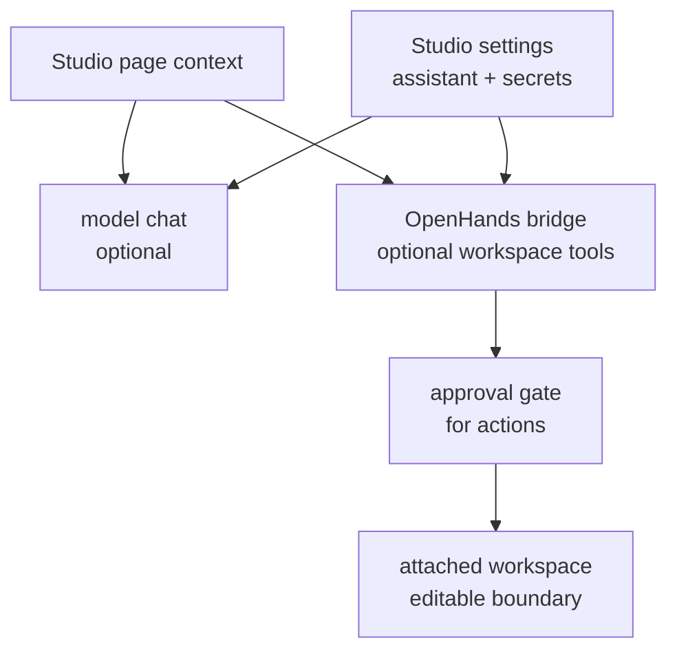

# OptPilot Assistant

OptPilot Assistant is the optional assistant panel in Studio. It helps users
inspect packages, edit workspace copies, draft configs, launch studies, and
understand run evidence.

The assistant is part of Studio, not the PyPI core package.

## Runtime Modes

Studio can run the assistant in several modes:

| Mode | What works | What it needs |
| --- | --- | --- |
| Disabled or unreachable | Studio keeps the local session and shows status, but no model/tool execution occurs. | No runtime. |
| Model chat | Chat-style answers grounded in the Studio context. | Configured model/API key, for example OpenRouter or an OpenAI-compatible chat-completions endpoint. |
| OpenHands agent server | Assistant tool execution through the Studio bridge. | OpenHands-compatible agent server plus model/API key. |
| Workspace tools | Read/write files, run shell commands, and open previews in attached workspaces. | OpenHands bridge and a workspace runtime. |

The OpenHands bridge has been checked with
`openhands-agent-server==1.29.0`. OpenHands currently expects Python 3.12, so
run it from a Python 3.12 environment when enabling tool execution.

Install the runtime packages in the source-checkout environment:

```bash
uv pip install -U openhands-sdk openhands-tools openhands-workspace openhands-agent-server
```

Start OpenHands:

```bash
OPENHANDS_SUPPRESS_BANNER=1 uv run --no-sync agent-server --host 127.0.0.1 --port 8781
```

Start Studio:

```bash
uv run optpilot ui --host 127.0.0.1 --port 8765
```

Configure the assistant in Studio Settings, or use environment variables:

```bash
OPTPILOT_OPENHANDS_URL=http://127.0.0.1:8781
OPTPILOT_OPENHANDS_SESSION_ENDPOINT=/api/conversations
OPTPILOT_OPENHANDS_MODEL=deepseek/deepseek-v4-flash
OPTPILOT_OPENHANDS_API_KEY=...
```

`OPTPILOT_OPENHANDS_API_KEY` can fall back to `LLM_API_KEY` or
`OPENAI_API_KEY`.



## Settings And Secrets

Studio settings have two scopes:

| Settings area | Purpose |
| --- | --- |
| Assistant | OpenHands URL, model, API key, assistant capabilities, and approval defaults. |
| Environment & Secrets | Platform-level environment variables that component configs may request through `envFromHost`. |

Secrets are write-only in the browser. Studio can show that a value is
configured, but it does not echo the secret value back into the page.

Components should declare the environment variables they need. For example, an
LLM method can declare `OPENROUTER_API_KEY` in its runtime environment
requirements, and Studio can inject the locally configured value only when that
name is requested.

For direct CLI runs, `envFromHost` reads from the shell process environment.
Studio settings are separate local values used only by Studio-managed setup,
interface launch, assistant, and study-launch paths.

## Workspace Access

The assistant works with attached workspaces.

It can inspect read-only context such as:

- visible Studio page state
- catalog entries
- study configs
- run summaries and evidence files
- OptPilot documentation

It can act on editable attached workspaces when allowed:

- read files
- write files
- run shell commands in the workspace runtime
- open workspace previews
- prepare catalog registrations
- draft or save study YAML

The assistant should not modify immutable catalog source directly. To edit or
execute package code, create an editable workspace copy first.

## Approvals

Higher-impact actions are approval-gated in Studio. This includes:

- writing files
- running shell commands
- launching studies
- stopping jobs
- applying catalog registrations

Approval records are stored under `.optpilot-ui/` with the local assistant
session state.

## When OpenHands Is Not Available

If OpenHands is disabled or unreachable, Studio still keeps local assistant
sessions and shows a clear status. Tool execution, workspace edits, shell
commands, and assistant-initiated study launches require the OpenHands-backed
tool path. Regular Studio **Launch Study** actions still use the local OptPilot
runner and do not require OpenHands.
