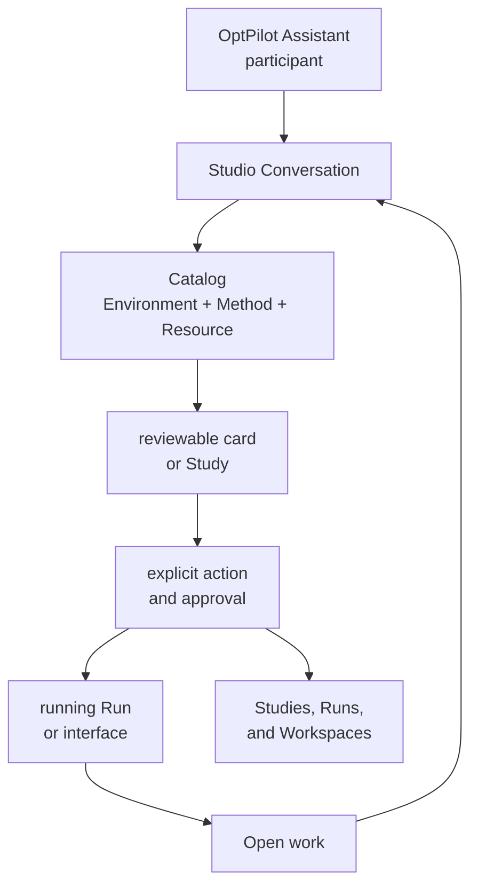

# OptPilot Assistant

OptPilot Assistant is the optional participant inside a Studio Conversation. A
Conversation is the durable discussion thread; the Assistant is not a separate
kind of conversation. It helps users understand what OptPilot can do, find
published Catalog capabilities,
prepare Studies, operate interfaces, work with editable Workspaces, and
understand Run evidence.

Conversation is the default Studio surface, not a permanent side panel. Users
can still open **Catalog** and choose components directly. When a simulator,
Run, Workspace, or other focused tool occupies the main area, **Ask from this page**
opens the currently selected Conversation as an overlay without restarting the
focused tool. Studio includes the visible page and selection as bounded,
read-only context. This action neither creates another Conversation nor grants
access to a Workspace.

The Assistant is part of Studio, not the PyPI core package.

## What A Conversation Coordinates

A Conversation can combine several existing OptPilot objects without becoming
their source of truth:

- exact Environment, Method, and Resource references from Catalog
- an OptPilot **Study**, which configures an Environment, Method, objective, and budget
- active and completed Runs
- editable Workspaces explicitly made available to the Conversation
- interactive interface launches
- generated outputs and Candidate evidence
- approvals and Assistant execution events

These objects remain usable without the Assistant. **Open work** is a narrow
process monitor for interfaces, Run setup launches, and running Runs. Durable
Studies, completed Runs, and editable Workspaces stay in their named
destinations, while Assistant activity and approvals stay with the
Conversation. Closing the Conversation view does not stop work.
Conversations, Workspaces, read-only viewers, saved Studies, completed Runs,
and ordinary Assistant messages do not appear in **Open work**.

The Conversation list uses one short topic title plus only useful state, such
as **Working**, **Needs approval**, or a nonzero Workspace count. A new
Conversation receives an immediate title from its first substantive request;
when the Assistant is available, the same Assistant turn may refine that title
and update it later only if the primary goal changes. Greetings, confirmations,
and “continue” do not rename a Conversation.

## Recommendations And Cards

The Assistant may recommend Catalog entries or propose a Run setup in a
structured card. Cards are rendered from a bounded Studio presentation contract
and carry exact object identities. Studio validates card actions against a
small allowlist before invoking existing launch, open, save, or review flows.

Ordinary model-authored Markdown is explanatory only. It cannot create a
privileged Studio action. Starting a Run, writing files, running commands, or
stopping work remains explicit and approval-aware.

For a Run setup, the Assistant can propose an Environment, a compatible Method,
an objective, and a budget. Users can edit these values or open the detailed
Study configuration. The visible UI calls this saved configuration a **Run
setup**, while the underlying `study` schema, API, route, and command-line
concept keep the `study` name.

## Runtime Modes

Studio can run the Assistant in several modes:

| Mode | What works | What it needs |
| --- | --- | --- |
| Disabled or unreachable | Studio keeps the local Conversation and shows status, but no model/tool execution occurs. | No runtime. |
| Model chat | Chat-style answers grounded in Studio context. | Configured model/API key, for example OpenRouter or an OpenAI-compatible chat-completions endpoint. |
| OpenHands agent server | Assistant tool execution through the Studio bridge. | OpenHands-compatible agent server plus model/API key. |
| Workspace tools | Read/write files, run shell commands, and open previews in Workspaces made available to the Conversation. | OpenHands bridge and a Workspace runtime. |

The OpenHands bridge has been checked with the OpenHands packages at `1.40.1`.
OpenHands currently expects Python 3.12, so
run it from a Python 3.12 environment when enabling tool execution. The only
native OpenHands tool enabled by OptPilot is `task_tracker`. Filesystem search,
inspection, editing, and terminal commands use OpenHands-compatible Studio
client-tool names. Studio executes those calls through Conversation
Workspace-access checks, editable-Workspace rules, runtime execution, and
approvals instead of letting OpenHands access the host filesystem or shell
directly.

Install the runtime packages in a Python 3.12 source-checkout environment. The
manual commands below use the default `.venv`. If you deliberately prepare the
environment elsewhere, use its Python path for installation and set
`OPTPILOT_DEV_VENV` when using the full-stack launcher:

```bash
uv venv --python 3.12 .venv
uv sync --all-packages --group examples --group docs
uv pip install --python .venv/bin/python -U \
  openhands-sdk==1.40.1 openhands-tools==1.40.1 \
  openhands-workspace==1.40.1 openhands-agent-server==1.40.1
```

Start OpenHands:

```bash
OPENHANDS_SUPPRESS_BANNER=1 uv run --no-sync agent-server \
  --host 127.0.0.1 \
  --port 8781 \
  --import-modules optpilot_studio.openhands_client_tools
```

The import module is required: it installs the client-tool acknowledgement that
keeps the Assistant processing Studio's result in the same turn.

Start Studio:

```bash
uv run optpilot ui --host 127.0.0.1 --port 8765
```

For the complete Docker, OpenHands, Studio, and workspace Code Server stack,
run `./scripts/start_services.sh`. It uses `.venv` by default and honors
`OPTPILOT_DEV_VENV` or `UV_PROJECT_ENVIRONMENT`; it does not depend on editor
launch settings or a machine-specific path.

Configure the Assistant in Studio Settings, or use environment variables:

```bash
OPTPILOT_OPENHANDS_URL=http://127.0.0.1:8781
OPTPILOT_OPENHANDS_SESSION_ENDPOINT=/api/conversations
OPTPILOT_OPENHANDS_MODEL=deepseek/deepseek-v4-flash
OPTPILOT_OPENHANDS_API_KEY=...
```

`OPTPILOT_OPENHANDS_API_KEY` can fall back to `LLM_API_KEY` or
`OPENAI_API_KEY`.


```mermaid
flowchart TB
  Conversation["Studio Conversation"]
  Assistant["OptPilot Assistant\nparticipant"]
  Catalog["Catalog\nEnvironment + Method + Resource"]
  Card["reviewable card\nor Study"]
  Approval["explicit action\nand approval"]
  Active["running Run\nor interface"]
  Durable["Studies, Runs,\nand Workspaces"]
  ActiveWork["Open work"]

  Assistant --> Conversation
  Conversation --> Catalog
  Catalog --> Card
  Card --> Approval
  Approval --> Active
  Approval --> Durable
  Active --> ActiveWork
  ActiveWork --> Conversation
```

## Settings And Local Variables

Studio settings have three areas:

| Settings area | Purpose |
| --- | --- |
| Assistant | OpenHands URL, model, and API key. Core OptPilot tools are built in; preview-only Skill, MCP, and custom-tool records are not editable in this release. |
| Permissions | Defaults for Assistant-proposed file, execution, publishing, launch, stop, Resource, and interface actions. |
| Local values | Project-scoped environment values that component configs may request through `envFromHost`. |

Values are write-only in the browser. Studio can show that a value is
configured, but it does not echo the value back into the page. They are stored
as plaintext in `<Studio start directory>/.optpilot-ui/settings.json`, with
mode `0600` where the platform supports it. If that project directory is
synchronized, the settings file may be synchronized too. It is not a secret
vault.

Components should declare the environment variables they need. For example, an
LLM Method can declare `OPENROUTER_API_KEY` in its runtime environment
requirements, and Studio can inject the locally configured value only when that
name is requested.

For direct CLI Runs, `envFromHost` reads from the shell process environment.
Studio settings are separate local values used only by Studio-managed setup,
interface launch, Assistant, and Study-launch paths.

## Workspaces In A Conversation

The Assistant works with editable Workspaces that the user explicitly makes
available to a Conversation. The Conversation's right-hand **Workspaces in this
conversation** panel lists those projects and is the single place to add, open,
choose the default, or remove a project from the Conversation. This grants file context without copying the
project or transferring ownership. Creating a Workspace or adding a local
folder from that panel makes it available to the current Conversation
immediately. Removing a Workspace from the Conversation does not delete it.

The visible page is separate from the Conversation's Workspaces. **Ask from this page** can include
the current Catalog item, Study, Run, Candidate, Workspace screen, or interface
as bounded read-only context with requests sent while that page is open. That does not let the Assistant
edit files. File editing and shell commands are available only for an editable
Workspace that the user explicitly makes available to the Conversation.

It can inspect read-only context such as:

- visible Studio selection and exact object coordinates
- available Workspace code through Studio-backed file and terminal tools
- Catalog entries
- Study configs
- Run summaries and evidence files
- OptPilot documentation

It can act on editable available Workspaces when allowed:

- read files
- write files
- run shell commands in the Workspace runtime
- open Workspace previews
- prepare package plans
- draft or save Study YAML

The Assistant should not modify immutable Catalog source directly. Editing
package code requires an editable Workspace. Launching a declared Catalog
interface is different: Studio keeps its source read-only and gives the process
private launch-scoped runtime and output storage.

## Approvals

File reads and writes are Workspace-scoped by default: the Conversation must
have an attached editable Workspace, and Studio still rejects control paths,
credential files, and escapes. In Settings, **File writes** can instead be set
to **Always request approval** or **Disabled**.

Execution and lifecycle actions are approval-gated in Studio. This includes:

- every shell command and smoke test
- launching Studies, interfaces, and Resource actions
- stopping jobs
- registering or updating packages
- file writes when **Always request approval** is selected

OpenHands-native tools are limited to `task_tracker` for planning. Studio
exposes OpenHands-compatible `optpilot_terminal` and `optpilot_file_editor` as
client tools so the model can search, inspect, edit, and run commands while
OptPilot keeps control of paths, Workspace runtime, and approvals.

Approval records are stored under `.optpilot-ui/` with the local Conversation
state. Pending approvals remain visible in their Conversation; the
top-level **Open work** shelf is reserved for interfaces and Runs.

## Per-Launch Inputs

A Run setup can declare `inputs` — per-launch values such as the plain-language
problem statement a one-shot solving Run setup expects. The Assistant reads the
declared names, types, and descriptions from the Run setup's validation and
passes their values when it launches, exactly as the Studio launch form does.

If a required input (one declared without a `default`) has no value, the launch
is blocked before any Realm work with the code `study_inputs_required`, which
names the unbound inputs so the Assistant can ask you for them rather than
guessing. Because input values are the problem payload and are retained in Run
evidence, the approval card shows the values themselves — you approve the exact
problem that will run. Never put a credential in an input; secrets belong in
Studio Settings environment values, which stay out of retained evidence.

## When OpenHands Is Not Available

If OpenHands is disabled or unreachable, Studio still keeps local Conversations,
Catalog browsing, Open work, and normal manual interfaces. It shows a clear
status instead of pretending that Assistant execution is available. Tool
execution, Workspace edits, shell commands, and Assistant-initiated Study
launches require the OpenHands-backed tool path. Regular Studio **Launch run**
actions still use the local OptPilot runner and do not require OpenHands.
