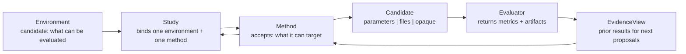
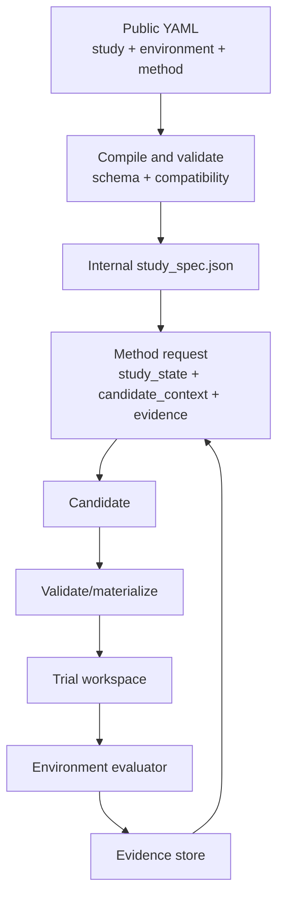

# Candidate Contracts

Candidate contracts are the center of OptPilot.

An environment does not call OR-Tools, Stable-Baselines, an LLM, or a Bayesian optimizer directly. It declares the candidates it can evaluate. A method does not need to know the evaluator internals. It declares which candidate formats and context fields it can use, then returns candidates in that contract.



## What Is A Candidate?

A candidate is the object the method proposes and the environment evaluates. OptPilot supports three formats.

| Format | Candidate contains | Typical methods |
| --- | --- | --- |
| `parameters` | JSON-like values under `spec` | random search, BO, RL policy rollouts, solver outputs, schedule bundles |
| `files` | generated or edited files with content references | LLM code editors, heuristic repositories, simulator config writers |
| `opaque` | a custom payload convention | integrations where both sides intentionally share a private format |

The environment owns the accepted candidate contract. The method owns how candidates are produced.

## Parameter Candidates

Parameter candidates are dictionaries. The environment declares a schema:

Candidate-contract fragment:

```yaml
candidate:
  format: parameters
  parameters:
    schema:
      x:
        valueType: float
        min: 0.0
        max: 1.0
      mode:
        valueType: categorical
        values: [safe, fast]
```

A matching method submits:

```json
{
  "candidate_id": "candidate-001",
  "format": "parameters",
  "spec": {"x": 0.42, "mode": "safe"}
}
```

A schema-general method can read `candidate.parameters.schema` and submit any
parameter shape the environment asks for.

## File Candidates

File candidates are generated file bundles. The environment declares which paths may be edited:

Candidate-contract fragment:

```yaml
candidate:
  format: files
  files:
    editable:
      - path: dispatch_rule.py
    required:
      - dispatch_rule.py
    allow:
      - dispatch_rule.py
  materialize:
    root: candidate
```

A method writes files into the candidate store and returns a manifest. Python methods can use `CandidateFileStore` to create that manifest.

```text
method writes generated files
runner validates paths and hashes
runner copies files into the trial workspace
environment evaluates the trial workspace
```

## Method Compatibility

`accepts` is required. It says what kind of environment surface the method
knows how to use.

Method compatibility fragment:

```yaml
accepts:
  formats: [parameters]
  requires:
    context:
      - candidate.parameters.schema
```

This example says: "I can work with parameter-candidate environments, but I need to see the parameter schema."

### A Small Example

Suppose an environment evaluates two tuning knobs:

Candidate-contract fragment:

```yaml
candidate:
  format: parameters
  parameters:
    schema:
      x:
        valueType: float
        min: 0.0
        max: 1.0
      mode:
        valueType: categorical
        values: [safe, fast]
```

A schema-general method can read this schema and return:

```json
{"x": 0.42, "mode": "safe"}
```

The same method could also work with a different environment that asks for
`learning_rate` and `batch_size`, because it discovers the field names and
types from `candidate.parameters.schema`.

A specific solver wrapper can still be method-specific. For example, a route
solver might always return:

```json
{"route": ["depot", "A", "B", "depot"]}
```

That method should list the candidate format and any needed context or
capabilities in `accepts`. During the run, OptPilot validates each submitted
candidate against the selected environment's candidate contract before
evaluation. The environment still does not know how the route was produced.

### Common Patterns

| Method kind | Example | Why |
| --- | --- | --- |
| Schema-general parameter method | Reads the environment's parameter names, types, and bounds, then chooses values for those fields. | Require `candidate.parameters.schema` in `accepts`. |
| Specific solver wrapper | Always returns one known field such as `route`, `assignment`, or `solutions`. | Require the environment capability or context it needs; candidate validation checks submitted values. |
| Trained policy rollout method | Uses a trained policy internally, but returns an environment-facing schedule or route. | Require method-readable cases or capabilities through `accepts`. |
| File editor | Reads `candidate.files.editable` and edits whichever files the environment exposes. | Require `candidate.files.editable` and optional `methodContext` entries. |
| Heuristic-search repository wrapper | Runs an upstream search repository and returns generated files such as `dispatch_rule.py`. | Rely on `accepts` and file validation against the environment candidate contract. |

## Context For Methods

Methods can receive three kinds of context.

| Source | What it is for | How methods access it |
| --- | --- | --- |
| `methodContext.instructions` | natural-language instructions or prompt files | `study_state["candidate_context"]` or command request `methodContext` |
| `methodContext.references` | read-only background files such as docs, CSV files, SQLite databases, data dictionaries, examples | resolved paths plus optional `type`, `description`, `mimeType` |
| `EvidenceView` | dynamic results from previous trials | `evidence_view.observations(...)`, `records(...)`, `artifacts(...)` |

Static material belongs in `methodContext`. Evaluation outputs created during a run belong in evidence.

## Runtime Path



The public YAML is for users. The internal `study_spec.json` is what the runner actually executed and is written into every run directory for auditability.

## Job-Shop Contract Matrix

The main tutorial uses one scheduling problem with several candidate contracts.

| Environment config | Candidate contract | Method examples |
| --- | --- | --- |
| `environment_rule_parameters.yaml` | weighted dispatch-rule parameters | fixed parameter baseline, schema-general parameter methods |
| `environment_schedule_solution.yaml` | `parameters.spec.solutions` keyed by validation case id | OR-Tools, simulated annealing, JobShopLib dispatching, Stable-Baselines rollout |
| `environment_dispatch_rule.yaml` | `files` containing `dispatch_rule.py` | baseline file copy, OpenAI file editor, future heuristic packages |
| `environment_solver_code.yaml` | `files` containing `solver.py` | solver-code writers |

The environment implementation and metrics stay stable. The candidate contract changes to let different method families connect cleanly.

One important limitation is visible here: `solutions` is declared as an object because case ids are environment-specific. The evaluator enforces the detailed schedule shape and feasibility during evaluation. Compatibility can check that the method produces a `solutions` parameter, but the full schedule semantics live in the evaluator.
