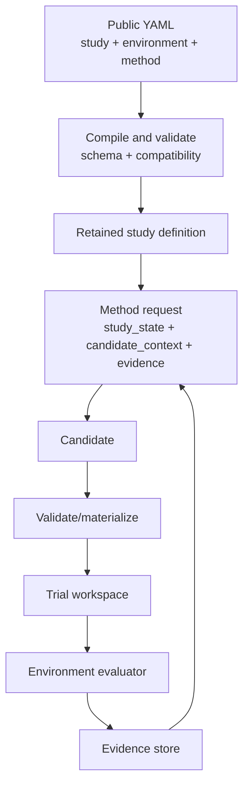

# Candidate Contracts

Candidate contracts are the center of OptPilot.

An environment does not call OR-Tools, Stable-Baselines, an LLM, or a Bayesian optimizer directly. It declares the candidates it can evaluate. A method does not need to know the evaluator internals. It declares which candidate formats and context fields it can use, then returns candidates in that contract.


```mermaid
flowchart LR
  Env["Environment\ncandidate: what can be evaluated"]
  Method["Method\naccepts: what it can target"]
  Study["Study\nbinds one environment + one method"]
  Candidate["Candidate\nparameters | files | opaque"]
  Runner["OptPilot Runner\nvalidate + materialize"]
  Eval["Evaluator\nreturns metrics + artifacts"]
  Evidence["EvidenceView\nprior results for next proposals"]

  Env --> Study
  Method --> Study
  Study --> Method
  Method --> Candidate
  Candidate --> Runner
  Runner --> Eval
  Eval --> Evidence
  Evidence --> Method
```

## What Is A Candidate?

A candidate is the object the Method proposes and the Environment evaluates.
The public schema admits three formats:

| Format | Candidate contains | Typical methods |
| --- | --- | --- |
| `parameters` | JSON-like values under `spec` | random search, BO, RL policy rollouts, solver outputs, schedule bundles |
| `files` | generated or edited files with content references | LLM code editors, heuristic repositories, simulator config writers |
| `opaque` | a custom payload convention | integrations where both sides intentionally share a private format |

The environment owns the accepted candidate contract. The method owns how candidates are produced.

The retained runner executes `parameters` and bounded `files` Candidates.
`opaque` remains a valid authoring contract but is not executable in this
release. Runtime and Method/Evaluator combinations have additional constraints;
see [Executable Capabilities](capabilities.md).

## Parameter Candidates

Parameter candidates are dictionaries. The environment declares a schema:

Candidate-contract fragment:

```yaml
candidate:
  format: parameters
  parameters:
    schema:
      x:
        valueType: float
        min: 0.0
        max: 1.0
      mode:
        valueType: categorical
        values: [safe, fast]
```

A matching method submits:

```json
{
  "candidate_id": "candidate-001",
  "format": "parameters",
  "spec": {"x": 0.42, "mode": "safe"}
}
```

A schema-general method can read `candidate.parameters.schema` and submit any
parameter shape the environment asks for.

## File Candidates

File candidates are generated file bundles. The environment declares which paths may be edited:

Candidate-contract fragment:

```yaml
candidate:
  format: files
  files:
    editable:
      - path: policy.py
    required:
      - policy.py
    allow:
      - policy.py
  materialize:
    root: candidate
```

A Python method writes or generates files, then stages the selected bundle with
`CandidateBundleStager`. The runtime supplies the generation-bound staging root
as `study_state["runtime_context"]["candidate_staging_dir"]`.

```python
from optpilot.candidate_staging import CandidateBundleStager


def propose_file_candidate(study_state, generated_file):
    staging = CandidateBundleStager(
        study_state["runtime_context"]["candidate_staging_dir"]
    )
    return staging.stage_file(
        generated_file,
        path="policy.py",
        candidate_id="policy-001",
        lineage={"parents": []},
        generator={"strategy": "my_editor"},
    )
```

`candidate_id` is an explicit semantic identity, not a storage path. The helper
returns a provisional, worker-local declaration. OptPilot validates the complete
method response, atomically freezes the selected staging subtree, seals it into
immutable content, and commits candidate admission, logical trials, budget, and
owner membership in one Realm transaction. Host paths and staging tokens are
removed before durable candidate identity or evidence is written.

```text
method stages generated files in one bounded inbox
worker freezes the complete proposal
runner seals and atomically admits immutable trees
attempt projects the selected tree into a fresh trial volume
environment evaluates the trial volume
```

The candidate is the final `replace` layer over any environment-owned trial
seeds. Each attempt receives a new writable upper layer, so evaluator edits do
not modify the retained candidate and retries start clean. The local provider
reuses the same immutable projection for materialization; it does not create a
disposable workspace or make a second candidate-tree copy. Native-process
filesystem enforcement is advisory, so this first slice is for trusted local
method, evaluator, and candidate code.

After admission, Studio can browse the same retained tree through **View files**,
execute an eligible Candidate once through **Try Candidate**, or create durable
editable work through **Edit in Workspace**. These are three capabilities over
one immutable selection: viewing creates no Workspace, trying gets a fresh
attempt runtime, and editing alone creates an independent persistent Workspace.

## Method Compatibility

`accepts` is required. It says what kind of environment surface the method
knows how to use.

Method compatibility fragment:

```yaml
accepts:
  formats: [parameters]
  requires:
    context:
      - candidate.parameters.schema
```

This example says: "I can work with parameter-candidate environments, but I need to see the parameter schema."

### A Small Example

Suppose an environment evaluates two tuning knobs:

Candidate-contract fragment:

```yaml
candidate:
  format: parameters
  parameters:
    schema:
      x:
        valueType: float
        min: 0.0
        max: 1.0
      mode:
        valueType: categorical
        values: [safe, fast]
```

A schema-general method can read this schema and return this candidate `spec`:

```json
{"x": 0.42, "mode": "safe"}
```

The same method could also work with a different environment that asks for
`learning_rate` and `batch_size`, because it discovers the field names and
types from `candidate.parameters.schema`.

A specific solver wrapper can still be method-specific. For example, a route
solver might always return this candidate `spec`:

```json
{"route": ["depot", "A", "B", "depot"]}
```

That method should list the candidate format and any needed context or
capabilities in `accepts`. During the run, OptPilot validates each submitted
candidate against the selected environment's candidate contract before
evaluation. The environment still does not know how the route was produced.

### Common Patterns

| Method kind | Example | Why |
| --- | --- | --- |
| Schema-general parameter method | Reads the environment's parameter names, types, and bounds, then chooses values for those fields. | Require `candidate.parameters.schema` in `accepts`. |
| Specific solver wrapper | Always returns one known field such as `route`, `assignment`, or `solutions`. | Require the environment capability or context it needs; candidate validation checks submitted values. |
| Trained policy rollout method | Uses training context and a policy internally, but returns an environment-facing schedule or route. | Require the method-visible references and capabilities it needs through `accepts`. |
| File editor | Reads `candidate.files.editable` and edits whichever files the environment exposes. | Require `candidate.files.editable` and optional `methodContext` entries. |
| Heuristic-search repository wrapper | Runs an upstream search repository and returns generated files such as `policy.py` or `solver.py`. | Rely on `accepts` and file validation against the environment candidate contract. |

## Context For Methods

Methods can receive three kinds of context.

| Source | What it is for | How methods access it |
| --- | --- | --- |
| `methodContext.instructions` | natural-language instructions or prompt files | `study_state["candidate_context"]` or command request `methodContext` |
| `methodContext.references` | read-only background files such as docs, CSV files, SQLite databases, data dictionaries, examples | resolved paths plus optional `type`, `description`, `mimeType` |
| `EvidenceView` | dynamic results from previous trials | Retained runs (the shipped path) pass a **static** view exposing only `evidence_view.decision_context()`. The richer `observations(...)` / `records(...)` / `artifacts(...)` API belongs to the legacy local runner; a method that calls it under the retained runner raises `AttributeError`. |

Static material belongs in `methodContext`. Evaluation outputs created during a run belong in evidence.

Two more environment declarations reach methods through the candidate
context:

- `context.capabilities` carries the environment's capability declarations.
  A capability with an environment-owned `callable` (for example
  `exact_seed_replay: evaluator:replay_candidate`) is resolvable by a method
  that requires it — the retained runner supplies the environment's import
  roots to that method's runtime.
- `context.policyValidation` carries the environment's static policy
  contract for generated candidate code. Code-editing methods apply it
  generically with `optpilot.policy_validation.validate_policy_sources`
  before submitting a candidate.

## Runtime Path


```mermaid
flowchart TD
  Public["Public YAML\nstudy + environment + method"]
  Compile["Compile and validate\nschema + compatibility"]
  Spec["Retained study definition"]
  Request["Method request\nstudy_state + candidate_context + evidence"]
  Candidate["Candidate"]
  Materialize["Validate/materialize"]
  Trial["Trial workspace"]
  Evaluate["Environment evaluator"]
  Evidence["Evidence store"]

  Public --> Compile --> Spec --> Request --> Candidate --> Materialize --> Trial --> Evaluate --> Evidence --> Request
```

The public YAML is for users. The runner captures the explicit package root and
retains an exact path-free study definition in the Realm. That definition and
its immutable content closure are the audit boundary; there is no public
`study_spec.json` run-directory contract.

For a concrete package that pairs one simulation environment with several
different candidate contracts, browse `catalog/production_agv_scheduling/` —
its methods span file candidates and parameter candidates against the same
environment.
