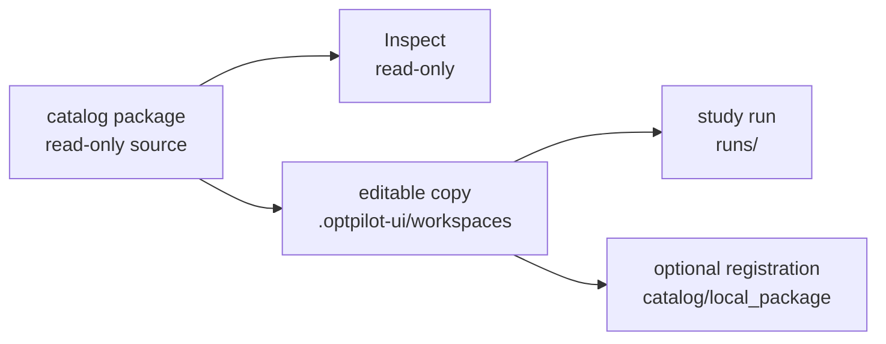

# Packages and Catalogs

A package is a reusable bundle of OptPilot-ready code and configs. It can
contain environments, methods, resources, studies, prompts, fixtures, and
package-specific docs.

A catalog is a collection of packages. In the source checkout, `catalog/` is the
default catalog root and each direct child is a package.

The repository ships one package:

```text
catalog/
  example_package/
```

The core CLI can validate a package folder:

```bash
optpilot package validate path/to/package
```

Package validation checks recognized OptPilot config files and their schemas.
It does not install dependencies or prove that every study can complete. For a
release-quality package, validate the package, validate the study files you
intend to advertise, and smoke-run at least one small study.

Studio scans packages under `catalog/` when launched from a source checkout:

```bash
uv run optpilot ui --open-browser
```

## Why Packages Matter

Packages are the bridge between the core CLI and Studio:

- With the core CLI, users validate and run package study files directly.
- With Studio, users browse package entries, inspect read-only source, create
  editable copies, launch interfaces, and launch studies.

The bundled job-shop tutorial is just one package:

```text
catalog/example_package/
```

It is useful as a template, but user packages should live beside it rather than
overwriting it.

## Where Things Are Stored

OptPilot keeps authored source, editable drafts, and generated evidence in
different places:

```text
catalog/example_package/     bundled package source
catalog/local_package/       user registrations created by Studio
catalog/my_package/          user-owned package source
.optpilot-ui/workspaces/     editable Studio draft copies
runs/                         study evidence from CLI or Studio launches
```

Do not write generated runs into catalog packages. Catalog folders should stay
reviewable source; run evidence belongs under `runs/` or another explicit
workspace-level output root.



## Catalog vs Package

A catalog is the collection of packages available to OptPilot. A package is one
folder inside that collection.

Adding a package should add a new sibling under `catalog/`; it should not
overwrite `example_package` or any user-created package:

```text
catalog/
  example_package/       # bundled runnable examples
  local_package/         # created on demand for user registrations
  scheduling_case_study/ # another package
  my_lab_project/        # user-owned package
```

This keeps packages removable, reviewable, and easy to update. If two packages
contain similar ids, keep both folders and resolve the conflict in the UI or by
renaming the entry inside one package.

## Adding A Package

Use a new package when you want to bring a project, case study, or team example
into OptPilot without mixing it into the bundled examples. Place the folder
under `catalog/`, validate it, or launch Studio with an extra catalog path:

```bash
uv run optpilot package validate catalog/my_package
```

```bash
uv run optpilot ui --catalog catalog/example_package --catalog path/to/my_package
```

A useful package usually includes:

- a short README that says what the package contains and which study to run first
- environment and method configs with the source files needed to run them
- study files that validate the package on small examples
- dependency files or setup commands for components that need installation
- small sample data; large or licensed data should have clear download instructions

Keep new packages additive. Do not copy them into `example_package` unless you
are intentionally editing the example package itself. One folder per package
makes it easy to inspect where entries came from, update or remove a package,
and keep user-owned work separate from bundled examples.

## First User Package Recipe

For a first local package:

1. Create `catalog/my_package/`.
2. Add one environment config under `environments/`.
3. Add one method config under `methods/`.
4. Add one study under `studies/` that binds them.
5. Run `uv run optpilot package validate catalog/my_package`.
6. Run `uv run optpilot validate catalog/my_package/studies/my_study.yaml`.
7. Run `uv run optpilot run catalog/my_package/studies/my_study.yaml`.
8. Confirm the summary reports completed trials, zero unexpected failures, and
   a `run_dir` you can inspect.
9. Launch Studio with the package visible:

```bash
uv run optpilot ui --catalog catalog/example_package --catalog catalog/my_package
```

Package validation proves that recognized config files are structurally valid.
The smoke run proves that dependencies, runtime setup, candidate generation,
and evaluation work together for at least one small study.

## Package Layout

```text
catalog/my_package/
  environments/
    my_environment/
      environment.yaml
      evaluator.py
      prompts/
      assets/
  methods/
    my_method/
      method.yaml
      method.py
      prompts/
      assets/
  resources/
    my_resource/
      README.md
      optpilot.resource.yaml
  studies/
    my_study.yaml
```

Environment and method directories own reusable implementation and reusable
config variants. Resources are reusable reference folders, simulator
interfaces, datasets, or launchable apps. Study YAML files are concrete run
plans that bind one environment, one method, objective, budget, and execution
policy.

## Local Package

The repo does not ship an empty user package. When Studio registers user-owned
files, it creates `catalog/local_package/` on demand and copies selected files
there.

If you create files manually, use normal Python import strings that match the
folder path. For example, if your evaluator lives at
`catalog/local_package/environments/my_environment/evaluator.py`, reference it
as:

```yaml
apiVersion: optpilot.io/v1
config: environment
id: my-environment

evaluator:
  python: evaluator:evaluate
  settings:
    target: 0.5

candidate:
  format: parameters
  parameters:
    schema:
      x:
        valueType: float
        min: 0.0
        max: 1.0

metrics:
  source: return
  keys: [score]
```

Minimal evaluator:

```python
def evaluate(candidate_runtime, context):
    target = context["settings"]["target"]
    return {
        "status": "success",
        "metric_values": {"score": 1.0 - abs(candidate_runtime["x"] - target)},
        "constraint_results": {},
        "output_files": [],
        "event_summary": {},
    }
```

If your method lives at `catalog/local_package/methods/my_method/method.py`,
reference it as:

```yaml
apiVersion: optpilot.io/v1
config: method
id: my-method

entrypoint:
  python: method:MyMethod
  protocol: batch

accepts:
  formats: [parameters]
  requires:
    context: [candidate.parameters.schema]
```

Minimal method:

```python
class MyMethod:
    def __init__(self, definition, study_spec, rng=None):
        self.definition = definition

    def propose(self, n_candidates, study_state):
        return [
            {
                "candidate_id": f"candidate-{index}",
                "format": "parameters",
                "spec": {"x": 1.0},
                "generator": {"method_id": self.definition["id"]},
            }
            for index in range(n_candidates)
        ]

    def observe(self, observations):
        return None
```

## Optional Interfaces

Some reusable components include a small web UI, simulator display, dashboard,
or demo app. Add an `interface` block to an environment or method config, or
add `optpilot.resource.yaml` to a resource folder.

For a resource:

```yaml
apiVersion: optpilot.io/v1
config: resource
id: my-resource
name: My Resource
tags: [frontend]

interface:
  label: Demo UI
  command: [python, -m, http.server, "5173", --bind, 0.0.0.0]
  port: 5173
  readyPath: /
  readyTimeoutSeconds: 60
```

Studio shows **Launch Interface** for catalog entries with this block. Clicking
it creates an editable draft copy, starts the command inside that workspace's
container runtime, shows preparation steps and recent command output while it
waits for the configured readiness path, and opens the port in the Preview
panel.

For the complete field-by-field schema, see [Configuration](configuration.md).
For the runtime sequence from candidate proposal to evidence files, see
[How a Run Works](how-it-works.md).
