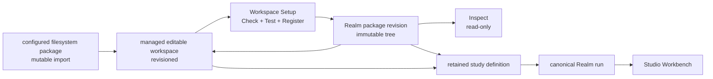

# Packages and Catalogs

A package is a reusable bundle of OptPilot-ready code and configs. It can
contain environments, methods, resources, studies, prompts, fixtures, and
package-specific docs.

A catalog is a collection of packages. Studio can show both immutable packages
published in the Realm and mutable filesystem packages configured as import
sources. In the source checkout, `catalog/` supplies the default configured
packages.

The repository ships one package:

```text
catalog/
  production_agv_scheduling/
```

The core CLI can validate a package folder:

```bash
optpilot package validate path/to/package
```

By default, package validation checks recognized OptPilot config files and
their schemas. Use the deeper checks before publishing or using a package
made from an external codebase:

```bash
optpilot package validate path/to/package \
  --check-source \
  --check-setup-files \
  --check-imports
```

These checks verify public source paths, setup files, and Python callable
imports under the portable package layout. Public source paths must resolve
inside the package; a path that only works because the original external
workspace is still on your machine is not portable package source.

These checks still do not install dependencies or prove that every study can
complete. For a release-quality package, validate the package, validate the
study files you intend to advertise, and smoke-run at least one small study.

### Undeclared Run-Time Dependencies

Validation always reads the Python sources reachable from a component's
declared entry points and reports the imports that no declared dependency
layer provides. This runs by default and never imports or executes authored
code, so imports deferred inside `propose` are seen too:

```text
Warnings:
- methods/ortools_cpsat_solver/method.yaml
  - dependency_host_provisioned: job_shop_lib is imported by
    methods/ortools_cpsat_solver/method.py but no declared runtime provides it
```

An import counts as declared when it is the Python standard library, source
retained inside the package (including a vendored source tree), a top-level
module of a wheel named by the component's `runtime.setup` requirements lock,
or OptPilot's own dependency closure. Everything else resolves only because
the authoring machine happens to have the package installed, and it will be
missing wherever the package travels.

This is reported as the `dependency_host_provisioned` capability code and as a
per-component warning; it does not make the package invalid, because a
component may be knowingly host-provisioned. The job-shop methods used in
OptPilot's own test material are:
they need native `ortools` and `torch` closures and are installed through the
`examples` dependency group. To resolve a warning, vendor the dependency into
the component's locked runtime, retain it as package source, or document the
component as host-provisioned. Pass `--no-dependency-check` to skip the scan.

If a package declares component `runtime.setup` or interface
`runtime.setup`, check the setup
files first:

```bash
optpilot package setup-check path/to/package
```

Execute setup only when you explicitly want OptPilot to run those declarations:

```bash
optpilot package setup-check path/to/package --run-setup
```

For a package with a small study, run a smoke check:

```bash
optpilot package smoke path/to/package --study studies/smoke.yaml
```

Studio scans packages under `catalog/` when launched from a source checkout:

```bash
uv run optpilot ui --open-browser
```

## Why Packages Matter

Packages are the bridge between the core CLI and Studio:

- With the core CLI, users validate and run package study files directly.
- With Studio, users browse exact package entries, inspect read-only published
  versions, edit eligible work in Workspaces, open interfaces,
  draft studies, and launch studies.

The packages that ship are just packages:

```text
catalog/production_agv_scheduling/
```

It is useful as a template, but user packages should live beside it rather than
overwriting it.

## Where Things Are Stored

OptPilot separates authored imports, immutable published packages, editable
workspaces, and canonical runs:

```text
catalog/production_agv_scheduling/  bundled configured filesystem import
catalog/my_package/          optional user-authored filesystem import
private per-user Realm       package revisions, workspace revisions,
                             retained study definitions, canonical runs,
                             and private runtime storage
.optpilot-ui/                 Studio settings and local coordination records
```

Filesystem packages should stay reviewable source. They are mutable imports,
not immutable catalog revisions. `optpilot run` captures an explicit package
root into the private Realm; it does not write a run folder back into the
catalog or project. In Studio, a configured source uses **Link local folder**;
other editable projects use **Edit in Workspace** or **Save as Workspace**.
Their shared **Workspace Setup** flow performs **Check files to register**,
**Run optional test** or **Run required test** when applicable, and **Register
checked version**. Registering produces an immutable Realm package revision.
Any filesystem checkout used to display or run that revision is a rebuildable
projection, not publication authority.


```mermaid
flowchart LR
  Import["configured filesystem package\nmutable import"]
  Package["Realm package revision\nimmutable tree"]
  Inspect["Inspect\nread-only"]
  Draft["managed editable workspace\nrevisioned"]
  Setup["Workspace Setup\nCheck + Test + Register"]
  Definition["retained study definition"]
  Run["canonical Realm run"]
  Workbench["Studio Workbench"]

  Import --> Draft
  Draft --> Setup
  Setup --> Package
  Package --> Inspect
  Package --> Draft
  Package --> Definition
  Definition --> Run
  Run --> Workbench
  Draft --> Definition
```

## Catalog vs Package

A catalog is the collection of packages available to OptPilot. A package is one
folder inside that collection.

For source-controlled filesystem imports, add a new sibling under `catalog/`;
do not overwrite a bundled package or another user package:

```text
catalog/
  production_agv_scheduling/ # bundled flagship package
  scheduling_case_study/ # another package
  my_lab_project/        # user-owned package
```

This keeps authored imports removable, reviewable, and easy to update. Realm
publication uses a package id and immutable revision history instead of creating
a special generated folder. If two packages contain similar entry ids, use the
qualified exact entry shown by Studio rather than relying on a bare id.

## Adding A Package

Use a new package when you want to bring a project, case study, or team example
into OptPilot without mixing it into the bundled examples. Place the folder
under `catalog/`, validate it, or launch Studio with an extra catalog path:

```bash
uv run optpilot package validate catalog/my_package
```

```bash
uv run optpilot ui --catalog catalog/production_agv_scheduling --catalog path/to/my_package
```

A useful package usually includes:

- a short README that says what the package contains and which study to run first
- environment and method configs with the source files needed to run them
- study files that validate the package on small examples
- dependency files or setup commands for components that need installation
- small sample data; large or licensed data should have clear download instructions

Keep new packages additive. Do not copy them into a bundled package unless you
are intentionally editing that package itself. One folder per package
makes it easy to inspect where entries came from, update or remove a package,
and keep user-owned work separate from bundled examples.

## First User Package Recipe

For a first local package:

1. Create `catalog/my_package/`.
2. Add one environment config under `environments/`.
3. Add one method config under `methods/`.
4. Add one study under `studies/` that binds them.
5. Run `uv run optpilot package validate catalog/my_package`.
6. Run `uv run optpilot validate catalog/my_package/studies/my_study.yaml`.
7. Run `uv run optpilot run catalog/my_package/studies/my_study.yaml --package-root catalog/my_package`.
8. Confirm the summary reports `run_status: succeeded`, zero unexpected final
   logical failures, and a canonical `run_id` you can inspect in Studio.
9. Launch Studio with the package visible:

```bash
uv run optpilot ui --catalog catalog/production_agv_scheduling --catalog catalog/my_package
```

10. In Catalog, find the package under **Configured sources** and choose **Open
    local folder**. Studio reuses that folder as one connected Workspace and
    opens **Workspace Setup**.
11. Choose **Check files to register**, choose **Run optional test** or **Run
    required test** when offered, then choose **Register checked version**.
    After registration, open the stable Catalog item to view source, edit it in
    a Workspace, use it in a Study, or open its declared interface.

Schema-only package validation proves that recognized config files are
structurally valid. The deeper package checks catch missing public source
paths, setup files, and import targets. A retained run is still the proof that
the package is inside the current executable parameter-or-file/Python/process/batch
slice and that candidate generation and evaluation work together
for at least one small study.

## Registering A Configured Source

Studio lists configured filesystem packages as separate mutable source cards,
even when a registered Realm package has the same entry ids. Choose **Open
local folder** to connect or reopen that existing folder as one editable
Workspace without copying it. Workspace Setup preserves the configured package
identity and existing Catalog-head authority, checks the exact files to
register, and uses the same **Register checked version** action as every other
editable project.

The browser submits only an opaque source id. It does not receive or submit the
host path, expected Realm head, publisher id, content ref, or capture policy.
Core binds the current Realm head, source identity, and effective hard capture
and validation limits before Studio resolves the mutable folder. Studio
reauthorizes the opaque configured-source capability immediately before each
read. When the package already exists, Core separately reauthorizes current
Realm package ADMIN authority before publication and again before reporting
success.

The elected request leader captures the complete authored package once as one
immutable Core tree under entry, depth, total-size, and per-file limits. Studio
omits a fixed set of machine-local generated directories such as `.git`,
`.venv`, `node_modules`, dependency/Python/test caches, hidden interface runtime
directories, `runs`, and OptPilot runtime state.
It does not broadly omit `build` or `dist`, because those can be intentional
runtime inputs. Static validation
runs against a projection of those exact frozen bytes: it checks recognized
OptPilot configs plus portable source and setup-file references, but it does not
import Python or execute setup. Before normal YAML loading, a hard event-count
and nesting-depth preflight rejects aliases; reported facts do not expose file
paths. This is deliberately whole-package ingress; it
does not select a subtree or rewrite paths. Use the Workspace Setup
**Configure** step when curation or a different portable layout is required.

Publication then uses the same exact-head Realm service as every Workspace
**Register checked version** operation.
If the source's owned tree already matches the current revision, the result is
unchanged; otherwise one new immutable revision is committed. Ownership derives
from both the package id and configured source identity, so another same-named
source cannot silently replace its claims. One durable leader performs the
capture while followers recover its result. Recovery reuses a successfully
frozen capture instead of rereading a source that may have changed. Capture or
validation rejection and head or ownership conflicts are typed outcomes, and
temporary capture ownership remains cleanup debt until retired.

After success, Studio opens or refreshes the registered Catalog item while
keeping the mutable source card visible for future updates. The normal
exact-version **View source**, **Edit in Workspace**, Study, and interface
actions then work on the immutable Realm revision.

## Under The Hood: Package Preparation

Workspace Setup internally maintains a package plan. This is an implementation
record, not another user workflow or button. **Configure** classifies the
Workspace as environment-only, method-only, environment-plus-method,
resource-only, or not yet classifiable.

Validation seals the normalized package plan and selected source into one exact
retained artifact, then records its artifact reference and plan digest. Smoke
and Register project that same artifact rather than recapturing mutable
Workspace paths. Register rejects changed live source or stale Check/Test
results, collision-checks publisher-owned paths, and preserves unrelated
publisher claims in the package. It then invokes the Realm catalog publication
service. The returned package id, revision, and manifest digest are the durable
result; refreshing Studio's read-only Catalog projection is a separate
rebuildable step.

Publication is retry-safe and head-fenced. The Realm binds the semantic request,
uses a leased provisional attempt, retains a publication/composition proof, and
atomically commits the new revision and completion receipt. A crash after the
commit cannot turn the publication back into a failed operation merely
because its local projection has not refreshed yet.

The external project does not need to already contain `environments/`,
`methods/`, or `resources/` folders. The package plan defines that portable
layout inside the registered package artifact; Register does not need a special
filesystem staging package.

Package-plan readiness has four practical states:

- **schema-valid**: the YAML files have the right shape.
- **component-ready**: source paths, setup files, and imports resolve for a
  one-sided environment or method package.
- **resource-ready**: resource manifests and interface files resolve.
- **run-ready**: a paired environment-method package has passed at least one
  smoke study.

## Package Layout

```text
catalog/my_package/
  environments/
    my_environment/
      environment.yaml
      evaluator.py
      prompts/
      assets/
  methods/
    my_method/
      method.yaml
      method.py
      prompts/
      assets/
  resources/
    my_resource/
      README.md
      optpilot.resource.yaml
  studies/
    my_study.yaml
```

Environment and method directories own reusable implementation and reusable
config variants. Resources are reusable reference folders, simulator
interfaces, datasets, or launchable apps. Study YAML files are concrete run
plans that bind one environment, one method, objective, budget, and execution
policy.

## Published Realm Packages And Exact Entry Refs

Realm package revisions are immutable and retain history. Studio identifies an
environment, method, resource, or study with an exact catalog entry ref that
includes the package id, revision, manifest digest, entry kind/id, and portable
focus path. Catalog detail, compatibility, **View source**, **Edit in
Workspace**, interface launch, and Study launch each reauthorize that ref and
create their own short-lived projection of the named revision. Advancing the
package head or restarting Studio does not silently retarget an already
selected historical ref.

Realm schema v28 also provides one actor-bound Create Workspace command over
exact selections. **Edit in Workspace** is its one-selection Candidate/Catalog
GUI form: one distinct complete project is adopted directly. A multi-selection
caller such as Study Builder can combine complete roots in the same content
store by publishing one new manifest without copying their file blobs. Shared
directories merge, but any file overlap, file/directory conflict, or case-fold
collision rejects the request. The command binds and checks recovery before
reading sources, and the composed path uses a leased internal attempt, proof,
atomic final Workspace commit, and bounded startup cleanup. Finalization
independently recompiles the exact source manifests. One operation has one live
composer; matching concurrent requests wait only for a bounded interval and
then recover or retry that same operation. Source/focus counts and the encoded
request/lineage size are rejected before binding. Studio's GUI sends a
browser-generated request UUID for each Workspace-creation action so Core can
bind and replay it safely. Combining different stores requires a future
explicit import/transfer; Studio never silently copies between them.

The `path` shown in the browser is a logical `catalog://...` label. It is not a
host path and is not accepted as immutable action authority. Packages supplied
with `--catalog` remain configured filesystem imports: Studio can browse them,
but they have no immutable revision/digest guarantee before publication.
Choose **Link local folder** and complete Workspace Setup to register the
complete folder, or use **Configure** when its contents need curation.
Exact-version features such as Catalog **Edit in Workspace** and Study Builder
use the registered revision, not the mutable source card.

## Study Builder

Study Builder accepts exact Realm environment and method refs. Studio supplies
their complete package selections and component focus paths to one Create
Workspace request. Entries from one package root take the direct-adoption path;
entries from different Realm package revisions in the same store work when the
complete roots do not conflict. Studio writes the new study under `studies/`
and uses ordinary relative `environmentConfig` and `methodConfig` values in the
YAML. Draft lineage keeps the exact source selections and component refs.

Saving an existing draft requires its expected workspace revision. Launch first
commits the live checkout under the same optimistic fence, then validates and
plans from a read-only projection of that exact committed workspace revision.
It does not copy either package into a second disposable workspace for launch.
If complete roots overlap at a file, disagree on file-versus-directory shape, or
collide after case folding, Save Config fails visibly instead of choosing an
overwrite order.

## Portable Package Imports

If you create a source-controlled package manually, use normal Python import
strings that match its portable folder layout.

For example, if your evaluator lives at
`catalog/my_package/environments/my_environment/evaluator.py`, reference it as:

```yaml
apiVersion: optpilot.io/v1
config: environment
id: my-environment

evaluator:
  python: evaluator:evaluate
  settings:
    target: 0.5

candidate:
  format: parameters
  parameters:
    schema:
      x:
        valueType: float
        min: 0.0
        max: 1.0

metrics:
  source: return
  keys: [score]
```

Minimal evaluator:

```python
def evaluate(candidate_runtime, context):
    target = context["settings"]["target"]
    return {
        "status": "success",
        "metric_values": {"score": 1.0 - abs(candidate_runtime["x"] - target)},
        "constraint_results": {},
        "output_files": [],
        "event_summary": {},
    }
```

If your method lives at `catalog/my_package/methods/my_method/method.py`,
reference it as:

```yaml
apiVersion: optpilot.io/v1
config: method
id: my-method

entrypoint:
  python: method:MyMethod
  protocol: batch

accepts:
  formats: [parameters]
  requires:
    context: [candidate.parameters.schema]
```

Minimal method:

```python
class MyMethod:
    def __init__(self, definition, study_spec, rng=None):
        self.definition = definition

    def propose(self, n_candidates, study_state):
        return [
            {
                "candidate_id": f"candidate-{index}",
                "format": "parameters",
                "spec": {"x": 1.0},
                "generator": {"method_id": self.definition["id"]},
            }
            for index in range(n_candidates)
        ]

    def observe(self, observations):
        return None
```

## Optional Interfaces

Some reusable components include a small web UI, simulator display, dashboard,
or demo app. Add an `interface` block to an environment or method config, or
add `optpilot.resource.yaml` to a resource folder.

For a resource:

```yaml
apiVersion: optpilot.io/v1
config: resource
id: my-resource
name: My Resource
purpose: viewer
tags: [frontend]

interface:
  label: Demo UI
  command: [python, -m, http.server, "5173", --bind, 0.0.0.0]
  grants: {network: disabled, envFromHost: [], secretsFromHost: []}
  presentation:
    kind: web
    port: 5173
    readyPath: /
    readyTimeoutSeconds: 60
  accepts: {selectionKinds: [workspace]}
```

`purpose` is optional and must be one of `generator`, `viewer`, `template`, or
`reference`. Studio uses it only as declared presentation metadata; when it is
omitted, the Catalog labels the entry **Resource**. It never guesses a purpose
from the resource's name, tags, files, or launch command.

A resource may also declare optional typed `inputs`, using the same parameter
definition as `candidate.parameters.schema`:

```yaml
inputs:
  specification:
    valueType: string
    description: Natural-language description of the system to generate.
  horizon:
    valueType: int
    min: 1
    default: 100
    unit: steps
```

`inputs` documents what the resource consumes and is validated like any other
parameter declaration. Typed inputs are the basis for rendering a simple input
form for a resource that has no custom interface, and for letting the
Assistant collect the required values before operating the resource.

## Resource Actions

A resource may declare named **actions** — registered commands with their own
typed inputs, runnable headlessly without launching the resource's web
interface. This is how a generator resource exposes a batch mode ("spec file
in, bundle out") to the CLI and to automation:

```yaml
actions:
  - id: generate
    label: Generate simulator bundle
    description: Batch generation from a written system specification.
    command: [python, generate.py, --spec, "{input:specification}"]
    inputs:
      specification:
        valueType: string
        description: Natural-language description of the system to generate.
      seed:
        valueType: int
        default: 7
    grants:
      envFromHost: [DEVS_INTERFACE_MODEL_ID]
      secretsFromHost: [OPENROUTER_API_KEY]
    timeoutSeconds: 900
```

The execution contract:

- Validated input values (declared defaults applied) are written to a JSON
  file named by `OPTPILOT_RESOURCE_ACTION_INPUTS_FILE`; results belong under
  the directory named by `OPTPILOT_RESOURCE_ACTION_OUTPUT_ROOT`.
- Command tokens may reference `{inputs_file}`, `{output_root}`, and
  `{input:<key>}` — the latter substitutes one validated scalar input value
  as a single argv token. Placeholder references are checked against the
  declared inputs at validation time; structured (array/object) values are
  only available through the inputs file.
- A `python` / `python3` command head means "the interpreter running
  optpilot" (the same mapping the retained command-method contract uses), so
  actions work without a python on PATH and see the same user-provisioned
  dependencies as the host installation — unless the action declares its own
  Python runtime, in which case that interpreter wins (below).
- `grants.envFromHost` / `grants.secretsFromHost` name host environment
  values passed through to the command; a missing name fails the run before
  anything executes. In Studio, granted names resolve through Studio
  Settings environment variables first, then the Studio process environment.
- An `envFromHost` entry may carry a default, for values your package knows a
  working answer to. A model id is the usual case: the package can name one, so
  only someone who wants a different model has to set anything.

  ```yaml
  grants:
    envFromHost:
      - name: MY_MODEL_ID
        default: openrouter/openai/gpt-5.4
        description: Model used for generating.
      - MY_REQUIRED_VALUE        # a plain name is still required
    secretsFromHost: [MY_API_KEY]
  ```

  A default is a fallback, never an override: a value set in Studio Settings or
  exported still wins. Only entries with no default can fail the run.

  **Secrets never take a default.** `secretsFromHost` stays a plain list of
  names, because a default secret is either useless or a credential written
  into a settings file. Ask for it instead.

  Defaults are not retained in the evidence record. That record says which
  authorities a component was granted; which value satisfied one is resolution
  detail, exactly as it already is for a value read from the host.
- An optional `runtime` block (process sandbox) may declare `setup` steps;
  the local headless path runs them in the resource root before the command,
  so setup scripts should be idempotent. Container runtimes are not
  executable by this path.
- A setup step that builds a Python environment (`python-venv` or `uv`) owns
  the action's dependency closure: a `python` / `python3` command head then
  resolves to *that* interpreter instead of the one running optpilot, and its
  bin directory is prepended to `PATH`. An action whose declared interpreter
  is missing — typically `--skip-setup` before the runtime was ever built —
  fails closed with a fixable message instead of silently importing whatever
  the host installation provides. This is how an action states its
  dependencies explicitly when its closure contains native wheels and
  therefore cannot use the offline pure-wheel lock that environments and
  methods use.
- One invocation is bounded by the action's `timeoutSeconds` (max one day).

Run actions from the CLI:

```bash
optpilot resource list path/to/optpilot.resource.yaml
```

```bash
optpilot resource run path/to/optpilot.resource.yaml generate --input specification="a barbershop with two barbers" --output-dir ./generated-bundle
```

`--input` repeats per key (YAML-scalar parsed), `--inputs-file` supplies a
YAML mapping (`--input` wins on conflicts), and `--output-dir` must be a
fresh directory — the run summary lists every file the action produced there.

Actions differ from interface `outputs.actions`: an interface output action
runs against one sealed output tree of a live interface launch, while a
resource action is a standalone headless operation of the resource itself.

The interface declaration is the portable contextual-interface contract for
grants, resources, readiness, and accepted selections. Current catalog launch
supports process-declared profiles through Studio's managed authoring runtime
over read-only source; it does not independently enforce every per-profile
policy field yet, and unsupported runtime/profile combinations fail closed.
A component that needs several independent launch policies can use complete
named `interface.launchProfiles`; see the configuration reference for that
form.

An interface with `runtime.setup.cache: prepared` has two deliberately separate
phases. Studio runs setup once with a private writable prepared root and
`OPTPILOT_PREPARED_RUNTIME_ACCESS=build`, then seals the result. Every launch
mounts that exact result read-only and supplies
`OPTPILOT_PREPARED_RUNTIME_ACCESS=read-only`. Setup is therefore the only place
that may install dependencies or update cache markers. Launch code should only
validate required files and start processes; dependency freshness must use
content fingerprints, not source or marker timestamps, because immutable source
projections can have newer filesystem times without different bytes. A missing
or stale prepared artifact should fail immediately and ask Studio to rebuild the
cache.

`HOST`, `PORT`, and Studio's private interface and prepared-runtime environment
handles are reserved. Declare the listening port once in
`presentation.port`; Studio supplies the matching process environment and
launch-scoped paths. Studio rejects attempts to override these handles while it
loads the Catalog, so configuration mistakes fail before setup or Preview. If a process
still exits during startup, Studio reports the exit separately from a live
process that merely missed its readiness deadline and shows one redacted final
diagnostic above the bounded launch log.

While running, any Environment, Method, or Resource interface can report a
completed file or folder through the shared interface-output protocol. Outputs
are runtime results, not paths declared in the Catalog YAML, and reporting them
does not require the component to import OptPilot. For example, the DEVS
Generator reports its complete generated simulator folder and Studio adds an
output card automatically.

If a completed folder has no card, **Output missing?** provides a manual
recovery path while the Catalog or editable-Workspace interface launch is live.
The picker lists only a bounded set of portable directories inside that
launch's dedicated output area and does not follow links. The browser sends
only a label and canonical relative path; Studio chooses the trusted root,
mints the output id, reauthorizes the live session, and captures it through the
same output lifecycle.

A completed folder becomes **Ready to save · Temporary**; a completed file
becomes **Ready · Temporary**. Either can become **Failed**, with **Retry** when
appropriate. **View result** opens a file or folder in the bounded read-only
viewer while the interface is live. Choose **Save as Workspace** before
stopping if a folder should remain editable. A successful save creates exactly
one durable Workspace and changes the card actions to **Open Workspace** and
**Set up for Catalog**. The latter opens that same Workspace's ordinary Setup
flow, where
the user can configure an Environment, Method, Generator, Viewer, or other
resource; **Check files to register**; run the optional or required test when
shown; and **Register checked version**. Studio does not assume that arbitrary
generated source is already an Environment. Only a complete folder can become
a Workspace; a file output is temporary and read-only.

For a generated simulator that declares `devs.simulation.v1`, choosing
**Environment** creates
`optpilot_configs/environment.template.yaml.disabled` and
`optpilot_configs/optpilot_adapter.py`. Studio prefills typed Candidate inputs,
the simulator files to seed into each trial, and its locked Python runtime. The
user still chooses the domain semantics: review the Candidate ranges, make the
adapter's `metric_values` names match `metrics.keys`, then rename the template
to `environment.yaml` and choose **Detect project** again. Saving is durable
editing; this explicit Check/Test/Publish sequence is what adds the Environment
to Catalog.

The DEVS Generator treats generated Python as untrusted while it is still being
designed or inspected. Both the generation agent's checks and the student's
**Run** tab select the same registered interface-output action. That action is
not repeated on the generic output card because the Generator already provides
the relevant parameters, progress, event trace, and results in its own UI.
Studio executes it in a new sibling Docker or Podman container from the
Generator's exact immutable image and prepared runtime—not inside Studio and
not inside the live credential-bearing Generator container. The sibling has
network access disabled, a read-only source snapshot, bounded CPU, memory,
processes, time, logs, and results, and no interface credentials. The action
fails closed if that boundary is unavailable; it never silently falls back to
running generated code beside the model credential. After a user deliberately
saves, reviews, and publishes the simulator as an Environment, ordinary
Studies and Runs use the same Catalog code trust and execution policy as every
other published Environment.

For the complete field-by-field schema, see [Configuration](configuration.md).
For the runtime sequence from candidate proposal to evidence files, see
[How a Run Works](how-it-works.md).
