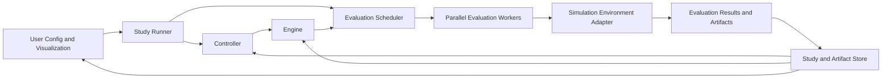

# OptPilot: Core Abstractions and System Design

Historical note: this file captures broader requirements and design thinking.
The current release-facing config contract is documented in
[`config_files_v3alpha.md`](config_files_v3alpha.md).

## 1. Goal

OptPilot is a platform for AI-assisted iterative optimization over measured
objectives. In many important cases, that means repeatedly evaluating
candidates against simulation environments, benchmark harnesses, or other
target systems. The platform supports multiple optimization paradigms,
including LLM-guided code evolution, deep reinforcement learning, and
classical search methods such as Bayesian optimization and meta-heuristics.
The system treats these methods as interchangeable strategies over a
common execution and data model rather than as separate products.

The core design requirement is this: given a simulation environment, OptPilot
repeatedly generates candidate solutions, evaluates them against one or more
task instances, collects the resulting metrics and artifacts, and uses the
collected evidence to guide future search.

## 2. Design Principles

The design follows these principles:

1. A simulation environment sits behind a stable interface, regardless of
	 whether the user-owned method is evolving code, tuning parameters, or
	 training a policy.
2. Optimization logic is decoupled from simulation execution. Controllers and
	 engines decide what to try; the execution layer evaluates it.
3. All outputs of an evaluation, not just the final score, are treated as
	 first-class artifacts.
4. The system supports different visibility levels into the environment, from
	 black-box access to full source-code inspection.
5. Parallel evaluation is a core capability rather than an afterthought.
6. Optimization steps are reproducible, inspectable, and resumable.
7. Users can define optimization targets over either a fixed instance or a
	 distribution of instances using the same conceptual model.

## 3. Core Conceptual Model

The platform is organized around six primary abstractions.

### 3.1 Simulation Environment

A `SimulationEnvironment` is the immutable target system being optimized. It is
not the candidate solution itself; it is the world in which candidate
solutions are evaluated.

Each environment defines:

- `environment_id`: stable unique identifier.
- `environment_version`: version or hash for reproducibility.
- `interface_type`: how the environment is invoked, for example Python
	callable, CLI command, service endpoint, Gym-like environment, or custom
	adapter.
- `instance_schema`: parameters that define a concrete task instance.
- `output_schema`: metrics, event traces, and artifact types the environment
	may produce.
- `visibility_policy`: what information a controller, engine, or LLM-assisted
	method is allowed to inspect.
- `execution_contract`: runtime limits, required dependencies, and sandbox
	requirements.

The environment exposes a single evaluation entrypoint conceptually
equivalent to:

```python
evaluate(candidate, instance, budget, context) -> EvaluationResult
```

The exact programming interface may vary by adapter, but the abstraction
remains the same.

### 3.2 Task Scope

A `TaskScope` defines what is being optimized against.

There are two supported modes:

- `FixedInstanceScope`: optimize for one specific simulation instance.
- `DistributionScope`: optimize for performance over a distribution of
	instances.

This distinction is important because a candidate that performs well on a fixed
instance may overfit, while a candidate that performs well over a distribution
is more generalizable. The platform does not encode these as different product
modes. They are simply different evaluation aggregations over the same
underlying environment.

### 3.3 Candidate Solution

A `Candidate` is the object being optimized. Different engines may operate on
different candidate types, but they share a common metadata model.

Candidate types may include:

- `ParameterCandidate`: numeric, categorical, or structured parameters.
- `CodeCandidate`: Python code or a patch applied to a candidate-owned module.
- `PolicyCandidate`: a policy checkpoint, policy architecture, or training
	configuration.
- `HybridCandidate`: a combination of code, parameters, and learned assets.

Every candidate contains:

- `candidate_id`
- `candidate_type`
- `spec`: structured definition of the candidate
- `parent_ids`: lineage for evolutionary or iterative optimization
- `generator_metadata`: which engine, prompt, or training run produced it
- `materialization_rule`: how the candidate is turned into something
	executable by the environment

The key design rule is that the environment evaluates a materialized
candidate, not how it was generated.

### 3.4 Controller And Engine

In the current OptPilot abstraction, the optimization method is split into a
`Controller` and one or more `Engine` implementations.

A `Controller` decides what happens next based on study state and prior
evidence. An `Engine` produces or updates candidates and consumes observations.

Conceptually:

```python
decide(study_state, engines, evidence_view) -> ControllerDecision
propose(n_candidates, study_state) -> list[Candidate]
observe(evaluation_results) -> None
```

This split is more precise than a single top-level search abstraction:

- the controller owns study-level decisions such as engine selection,
	batch size, and stop or continue behavior
- the engine owns the candidate-generation strategy and any method-specific
	internal state
- both consume normalized evidence rather than raw environment-specific output

Representative engine families include:

1. LLM-guided code-evolution engines
	 - Propose new `CodeCandidate` objects.
	 - Use prior candidates, metrics, and artifacts as context.
	 - Are similar to AlphaEvolve-style mutation and selection loops.

2. RL training engines
	 - Produce or update `PolicyCandidate` objects.
	 - May launch long-running training jobs and asynchronous rollout workers.
	 - Treat policy checkpoints and learning curves as artifacts.

3. Search engines
	 - Cover Bayesian optimization, evolutionary strategies, CMA-ES,
		 simulated annealing, and similar methods.
	 - Usually work on `ParameterCandidate` or structured `HybridCandidate`
		 objects.

LLMs are not a top-level OptPilot abstraction. They are one mechanism a
user-owned engine may use to generate or refine candidates.

### 3.5 Evaluation Result

An `EvaluationResult` is the canonical output of running a candidate in an
environment.

It includes:

- `trial_id`
- `candidate_id`
- `environment_id`
- `instance_id` or sampled instance description
- `status`: success, failure, timeout, invalid, partial
- `primary_metric`: the optimization target
- `secondary_metrics`: any additional numeric outputs
- `artifacts`: paths or handles to files produced by the run
- `trace_summary`: condensed execution summary
- `resource_usage`: runtime, memory, GPU, number of rollouts, and cost if
	applicable
- `provenance`: seed, environment version, candidate version, controller or
	engine state version

This object is the shared language between the execution layer and all
controllers and engines.

### 3.6 Study and Trial Lineage

A `Study` is a top-level optimization session with a fixed objective,
environment, and method configuration.

A `Trial` is one concrete evaluation of one candidate on one instance or batch
of instances.

The system explicitly stores lineage:

- study lineage: resumed or branched from earlier studies
- candidate lineage: mutation, recombination, fine-tuning ancestry
- trial lineage: retries, replications, aggregated evaluations

This lineage is essential for LLM-guided optimization because the model needs
to retrieve selected prior attempts and modify them rather than operating
on a flat list of historical runs.

## 4. Information Visibility and Permission Model

One of the core requirements is that different optimization methods may have
different access to the environment. OptPilot formalizes this as a
`VisibilityPolicy` rather than handling it informally.

Supported visibility levels include:

1. `BlackBox`
	 - The controller and engine see only the task description, allowed actions,
		 and evaluation results.

2. `SchemaAware`
	 - The controller and engine also see input and output schemas, parameter
		 definitions, and structured metadata about the environment.

3. `TraceAware`
	 - The controller and engine can inspect runtime traces, event logs, CSV
		 outputs, SQL outputs, and other intermediate artifacts.

4. `CodeAwareReadOnly`
	 - The controller, engine, or LLM can inspect the environment source code but
		 cannot modify it.

5. `EditableCandidateOnly`
	 - The engine may modify candidate-owned code or policy definitions but not
		 the protected environment implementation.

This permission model is important for safety, reproducibility, and clean
separation between the benchmark environment and the evolving solution
artifact.

## 5. Execution Architecture

The system architecture separates orchestration, evaluation,
candidate-generation logic, and storage.



### 5.1 Study Runner And Controller

The study runner owns the lifecycle of a study and coordinates the controller,
selected engines, scheduler, and evidence store.

Responsibilities:

- initialize study metadata
- build study state and evidence context
- ask the controller what happens next
- request new candidates from the selected engine
- schedule evaluations
- aggregate results over fixed instances or sampled distributions
- stop according to budget, convergence, or policy

### 5.2 Evaluation Scheduler

The `EvaluationScheduler` decides how and where trials run.

Responsibilities:

- queue trials
- dispatch parallel workers
- apply resource limits and priorities
- handle retries and failure modes
- support synchronous short evaluations and asynchronous long-running RL jobs

The scheduler does not contain controller-specific or engine-specific logic.

### 5.3 Evaluation Worker

An `EvaluationWorker` materializes a candidate, executes the environment,
captures all outputs, and emits a normalized `EvaluationResult`.

Responsibilities:

- prepare runtime workspace
- materialize candidate assets
- invoke environment adapter
- collect files, logs, traces, and metrics
- validate schema compliance
- publish trial outputs to storage

### 5.4 Environment Adapter

Each environment is wrapped by an adapter implementing the platform contract.

Adapters may include:

- `PythonEnvironmentAdapter`
- `CLIEnvironmentAdapter`
- `ServiceEnvironmentAdapter`
- `GymEnvironmentAdapter`

This prevents the rest of the platform from depending on environment-specific
execution details.

## 6. Storage and Artifact Model

Logging is not a side concern. It is part of the platform's reasoning loop.

The system separates two storage layers.

### 6.1 Metadata Store

The metadata store records structured entities:

- environments
- studies
- controllers
- engines
- candidates
- trials
- aggregated evaluations
- lineage edges
- prompt records
- visibility policies

This layer is queryable and versioned. A relational database is a natural fit.

### 6.2 Artifact Store

The artifact store holds large or semi-structured outputs:

- stdout and stderr logs
- CSV outputs
- SQL database snapshots or exports
- plots and dashboards
- checkpoints
- generated code files
- prompts and completions if retained
- rollout traces

Each artifact has metadata including:

- artifact type
- producing trial
- schema or parser if known
- retention policy
- digest or content hash

The platform makes artifacts accessible both programmatically and through
user-facing inspection tools.

## 7. Unifying the Three Optimization Styles

The major design challenge is supporting three different optimization styles
without building three incompatible systems. The unifying abstraction is:

`Controller reads Evidence -> Engine produces Candidate -> Evaluator runs Candidate in Environment -> Result becomes Observation for Controller and Engine`

### 7.1 LLM-Guided Code Evolution

For code evolution, the candidate is code owned by the optimization process.
The environment remains protected and read-only.

Flow:

1. Retrieve selected ancestor candidates and their evaluation summaries.
2. Build an LLM context using metrics, traces, and artifacts permitted by the
	 visibility policy.
3. Generate a new `CodeCandidate`.
4. Validate syntax, interface compatibility, and sandbox rules.
5. Evaluate the candidate.
6. Store the new candidate, result, and ancestry.

### 7.2 Reinforcement Learning

For RL, the candidate is a policy or training specification.

Flow:

1. Define environment adapter and rollout interface.
2. Train or update a `PolicyCandidate`.
3. Run evaluation episodes on fixed instances or sampled distributions.
4. Store checkpoints, episode traces, and summary metrics.
5. Allow the controller or another engine to alter training configuration or
	 policy structure between training rounds.

### 7.3 Bayesian Optimization and Meta-Heuristics

For classical search, the candidate is typically a parameter vector or
structured configuration.

Flow:

1. Sample or propose parameter candidates.
2. Evaluate each candidate, potentially in parallel.
3. Update surrogate model or search state.
4. Repeat until budget is exhausted.

The platform treats these flows as specializations of one
controller-and-engine loop rather than separate workflows.

## 8. Parallelism Model

Parallel execution is a first-class requirement.

There are two different kinds of parallelism the system supports:

1. `Candidate parallelism`
	- Evaluate multiple candidates simultaneously.
	- Important for evolutionary search and Bayesian optimization.

2. `Rollout parallelism`
	- Run multiple episodes or environment instances for the same candidate.
	- Important for RL and robust evaluation over distributions.

The scheduler supports both explicitly. They are not collapsed into one generic
worker pool without tracking intent, because rollout aggregation and candidate
comparison are semantically different.

## 9. User-Facing Configuration Model

Users configure studies declaratively through `StudyConfig`, together with
`EnvironmentConfig` and `MethodConfig`.

Together, these configs define:

- target environment
- visibility policy
- task scope: fixed instance or distribution
- optimization objective
- controller and engine configuration
- evaluation budget and stopping criteria
- parallelism settings
- artifact retention policy
- reproducibility settings such as random seeds and version pins

The user experience lets users express questions like:

- find the best policy for this exact plant configuration
- find a strategy that generalizes across a range of demand profiles
- evolve control code while keeping the simulator itself read-only
- compare Bayesian optimization against LLM-guided search on the same benchmark

This means any future UI can be built on top of the same study config model,
without inventing a separate ad hoc configuration pathway.

## 10. Reproducibility and Auditability Requirements

Every result in the system is reproducible in principle.

This requires recording:

- environment version and dependency snapshot
- candidate definition and materialized assets
- controller and engine implementation, config, and any persisted state
- prompt version and retrieved context for LLM-generated candidates
- task instances or sampling seeds
- evaluation budget and runtime settings

Without this, the platform would produce interesting outputs but not reliable
scientific or engineering evidence.

## 11. Recommended Internal Module Boundaries

A natural module split for the codebase is:

- `optpilot.environment`
	- environment contracts and adapters
- `optpilot.artifacts`
	- candidate definitions and materialization logic
- `optpilot.controllers`
	- controller interfaces and decision logic
- `optpilot.engines`
	- user-owned engine interfaces and reference engines
- `optpilot.execution`
	- scheduler, workers, runtime sandboxing, resource management
- `optpilot.models`
	- evaluation result schemas and aggregation logic
- `optpilot.storage`
	- metadata persistence and artifact persistence
- `optpilot.runner`
	- study lifecycle orchestration
- `optpilot.config` and `optpilot.spec`
	- user-facing config compilation and internal study specification loading

This split follows ownership boundaries rather than implementation convenience.

## 12. Design Summary

OptPilot is a general optimization platform with a stable execution core and
pluggable search strategies. The most important abstraction is not the LLM
itself, but the boundary between environment, candidate, controller, engine,
evaluator, and stored evidence.

If these abstractions are respected, the platform can support:

- code evolution without allowing the engine to mutate the protected simulator
- RL training with scalable rollout execution
- Bayesian optimization and meta-heuristics on the same execution substrate
- optimization for either fixed instances or distributions of instances
- retrieval of prior attempts and artifacts as context for future search

That abstraction boundary is what makes the system extensible instead of
becoming a collection of one-off optimization scripts.
