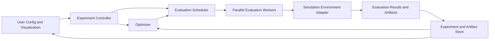

# OptPilot: Core Abstractions and System Design

Historical note: this file captures broader requirements and design thinking.
The current release-facing config contract is documented in
[`config_files_v3alpha.md`](config_files_v3alpha.md).

## 1. Goal

OptPilot is a platform for automatically optimizing industrial engineering simulation tasks. The platform should support multiple optimization paradigms, including LLM-guided code evolution, deep reinforcement learning, and classical search methods such as Bayesian optimization and meta-heuristics. The system should treat these methods as interchangeable strategies over a common execution and data model rather than as separate products.

The core design requirement is this: given a simulation environment, OptPilot must repeatedly generate candidate solutions, evaluate them against one or more task instances, collect the resulting metrics and artifacts, and use the collected evidence to guide future search.

## 2. Design Principles

The design should satisfy the following principles:

1. A simulation environment must be wrapped behind a stable interface, regardless of whether the optimizer is evolving code, tuning parameters, or training a policy.
2. Optimization logic must be decoupled from simulation execution. An optimizer proposes candidates; the execution layer evaluates them.
3. All outputs of an evaluation, not just the final score, must be captured as first-class artifacts.
4. The system must support different visibility levels into the environment, from black-box access to full source-code inspection.
5. Parallel evaluation must be a core capability rather than an afterthought.
6. All optimization steps must be reproducible, inspectable, and resumable.
7. The user should define optimization targets over either a fixed instance or a distribution of instances using the same conceptual model.

## 3. Core Conceptual Model

The platform should be organized around six primary abstractions.

### 3.1 Simulation Environment

A `SimulationEnvironment` is the immutable target system being optimized. It is not the candidate solution itself; it is the world in which candidate solutions are evaluated.

Each environment should define:

- `environment_id`: stable unique identifier.
- `environment_version`: version or hash for reproducibility.
- `interface_type`: how the environment is invoked, for example Python callable, CLI command, service endpoint, Gym-like environment, or custom adapter.
- `instance_schema`: parameters that define a concrete task instance.
- `output_schema`: metrics, event traces, and artifact types the environment may produce.
- `visibility_policy`: what information an optimizer or LLM is allowed to inspect.
- `execution_contract`: runtime limits, required dependencies, and sandbox requirements.

The environment must expose a single evaluation entrypoint conceptually equivalent to:

```python
evaluate(candidate, instance, budget, context) -> EvaluationResult
```

The exact programming interface may vary by adapter, but the abstraction should remain the same.

### 3.2 Task Scope

A `TaskScope` defines what is being optimized against.

There should be two supported modes:

- `FixedInstanceScope`: optimize for one specific simulation instance.
- `DistributionScope`: optimize for performance over a distribution of instances.

This distinction is important because a candidate that performs well on a fixed instance may overfit, while a candidate that performs well over a distribution is more generalizable. The platform should not encode these as different product modes. They are simply different evaluation aggregations over the same underlying environment.

### 3.3 Candidate Solution

A `Candidate` is the object being optimized. Different optimizers operate on different candidate types, but they should share a common metadata model.

Candidate types may include:

- `ParameterCandidate`: numeric, categorical, or structured parameters.
- `CodeCandidate`: Python code or a patch applied to a candidate-owned module.
- `PolicyCandidate`: a policy checkpoint, policy architecture, or training configuration.
- `HybridCandidate`: a combination of code, parameters, and learned assets.

Every candidate should contain:

- `candidate_id`
- `candidate_type`
- `spec`: structured definition of the candidate
- `parent_ids`: lineage for evolutionary or iterative optimization
- `generator_metadata`: which optimizer, prompt, or training run produced it
- `materialization_rule`: how the candidate is turned into something executable by the environment

The key design rule is that the environment should evaluate a materialized candidate, not care how it was generated.

### 3.4 Optimizer

An `Optimizer` is a stateful search strategy that proposes new candidates based on previous evidence.

It should implement a conceptual contract like:

```python
propose(observation_context, n_candidates) -> list[Candidate]
observe(evaluation_results) -> None
save_state() -> OptimizerState
load_state(state) -> None
```

Three optimizer families should be supported through the same contract:

1. `LLMCodeEvolutionOptimizer`
	- Proposes new `CodeCandidate` objects.
	- Uses prior candidates, metrics, and artifacts as context.
	- Similar to AlphaEvolve-style mutation and selection.

2. `RLTrainingOptimizer`
	- Produces or updates `PolicyCandidate` objects.
	- May launch long-running training jobs and asynchronous rollout workers.
	- Treats policy checkpoints and learning curves as artifacts.

3. `SearchOptimizer`
	- Covers Bayesian optimization, evolutionary strategies, CMA-ES, simulated annealing, and similar methods.
	- Usually works on `ParameterCandidate` or structured `HybridCandidate` objects.

The platform should not special-case LLMs as the top-level abstraction. LLMs are one mechanism by which an optimizer generates candidates.

### 3.5 Evaluation Result

An `EvaluationResult` is the canonical output of running a candidate in an environment.

It should include:

- `trial_id`
- `candidate_id`
- `environment_id`
- `instance_id` or sampled instance description
- `status`: success, failure, timeout, invalid, partial
- `primary_metric`: the optimization target
- `secondary_metrics`: any additional numeric outputs
- `artifacts`: paths or handles to files produced by the run
- `trace_summary`: condensed execution summary
- `resource_usage`: runtime, memory, GPU, number of rollouts, and cost if applicable
- `provenance`: seed, environment version, candidate version, optimizer state version

This object is the shared language between the execution layer and all optimizers.

### 3.6 Experiment and Trial Lineage

An `Experiment` is a top-level optimization session with a fixed objective, environment, and optimizer configuration.

A `Trial` is one concrete evaluation of one candidate on one instance or batch of instances.

The system must explicitly store lineage:

- experiment lineage: resumed or branched from earlier experiments
- candidate lineage: mutation, recombination, fine-tuning ancestry
- trial lineage: retries, replications, aggregated evaluations

This lineage is essential for LLM-guided optimization because the model must be able to retrieve selected prior attempts and modify them rather than operating on a flat list of historical runs.

## 4. Information Visibility and Permission Model

One of the core requirements is that different optimization methods may have different access to the environment. This should be formalized as a `VisibilityPolicy` rather than handled informally.

Supported visibility levels should include:

1. `BlackBox`
	- The optimizer sees only the task description, allowed actions, and evaluation results.

2. `SchemaAware`
	- The optimizer also sees input and output schemas, parameter definitions, and structured metadata about the environment.

3. `TraceAware`
	- The optimizer can inspect runtime traces, event logs, CSV outputs, SQL outputs, and other intermediate artifacts.

4. `CodeAwareReadOnly`
	- The optimizer or LLM can inspect the environment source code but cannot modify it.

5. `EditableCandidateOnly`
	- The optimizer may modify candidate-owned code or policy definitions but not the protected environment implementation.

This permission model is important for safety, reproducibility, and clean separation between the benchmark environment and the evolving solution artifact.

## 5. Execution Architecture

The system architecture should separate orchestration, evaluation, optimization, and storage.



### 5.1 Experiment Controller

The `ExperimentController` owns the lifecycle of an experiment.

Responsibilities:

- initialize experiment metadata
- build optimizer context
- request new candidates from the optimizer
- schedule evaluations
- aggregate results over fixed instances or sampled distributions
- stop according to budget, convergence, or policy

### 5.2 Evaluation Scheduler

The `EvaluationScheduler` decides how and where trials run.

Responsibilities:

- queue trials
- dispatch parallel workers
- apply resource limits and priorities
- handle retries and failure modes
- support synchronous short evaluations and asynchronous long-running RL jobs

The scheduler should not contain optimizer-specific logic.

### 5.3 Evaluation Worker

An `EvaluationWorker` materializes a candidate, executes the environment, captures all outputs, and emits a normalized `EvaluationResult`.

Responsibilities:

- prepare runtime workspace
- materialize candidate assets
- invoke environment adapter
- collect files, logs, traces, and metrics
- validate schema compliance
- publish trial outputs to storage

### 5.4 Environment Adapter

Each environment should be wrapped by an adapter implementing the platform contract.

Adapters may include:

- `PythonEnvironmentAdapter`
- `CLIEnvironmentAdapter`
- `ServiceEnvironmentAdapter`
- `GymEnvironmentAdapter`

This prevents the rest of the platform from depending on environment-specific execution details.

## 6. Storage and Artifact Model

Logging is not a side concern. It is part of the platform's reasoning loop.

The system should separate two storage layers.

### 6.1 Metadata Store

The metadata store records structured entities:

- environments
- experiments
- optimizers
- candidates
- trials
- aggregated evaluations
- lineage edges
- prompt records
- visibility policies

This should be queryable and versioned. A relational database is a natural fit.

### 6.2 Artifact Store

The artifact store holds large or semi-structured outputs:

- stdout and stderr logs
- CSV outputs
- SQL database snapshots or exports
- plots and dashboards
- checkpoints
- generated code files
- prompts and completions if retained
- rollout traces

Each artifact should have metadata including:

- artifact type
- producing trial
- schema or parser if known
- retention policy
- digest or content hash

The platform must make artifacts accessible both programmatically and through user-facing inspection tools.

## 7. Unifying the Three Optimization Styles

The major design challenge is supporting three different optimization styles without building three incompatible systems. The unifying abstraction should be:

`Optimizer produces Candidate -> Evaluator runs Candidate in Environment -> Result becomes Observation for Optimizer`

### 7.1 LLM-Guided Code Evolution

For code evolution, the candidate is code owned by the optimization process. The environment remains protected and read-only.

Flow:

1. Retrieve selected ancestor candidates and their evaluation summaries.
2. Build an LLM context using metrics, traces, and artifacts permitted by the visibility policy.
3. Generate a new `CodeCandidate`.
4. Validate syntax, interface compatibility, and sandbox rules.
5. Evaluate the candidate.
6. Store the new candidate, result, and ancestry.

### 7.2 Reinforcement Learning

For RL, the candidate is a policy or training specification.

Flow:

1. Define environment adapter and rollout interface.
2. Train or update a `PolicyCandidate`.
3. Run evaluation episodes on fixed instances or sampled distributions.
4. Store checkpoints, episode traces, and summary metrics.
5. Allow the LLM or search optimizer to alter training configuration or policy structure between training rounds.

### 7.3 Bayesian Optimization and Meta-Heuristics

For classical search, the candidate is typically a parameter vector or structured configuration.

Flow:

1. Sample or propose parameter candidates.
2. Evaluate each candidate, potentially in parallel.
3. Update surrogate model or search state.
4. Repeat until budget is exhausted.

The platform should treat these flows as specializations of one optimization loop rather than separate workflows.

## 8. Parallelism Model

Parallel execution is a first-class requirement.

There are two different kinds of parallelism the system must support:

1. `Candidate parallelism`
	- Evaluate multiple candidates simultaneously.
	- Important for evolutionary search and Bayesian optimization.

2. `Rollout parallelism`
	- Run multiple episodes or environment instances for the same candidate.
	- Important for RL and robust evaluation over distributions.

The scheduler should support both explicitly. They should not be collapsed into one generic worker pool without tracking intent, because rollout aggregation and candidate comparison are semantically different.

## 9. User-Facing Configuration Model

Users should configure experiments declaratively through an `ExperimentSpec`.

An `ExperimentSpec` should define:

- target environment
- visibility policy
- task scope: fixed instance or distribution
- optimization objective
- optimizer type and optimizer configuration
- evaluation budget and stopping criteria
- parallelism settings
- artifact retention policy
- reproducibility settings such as random seeds and version pins

The user experience should let users express questions like:

- find the best policy for this exact plant configuration
- find a strategy that generalizes across a range of demand profiles
- evolve control code while keeping the simulator itself read-only
- compare Bayesian optimization against LLM-guided search on the same benchmark

This means the UI should be built on top of the same internal `ExperimentSpec`, not invent a separate ad hoc configuration pathway.

## 10. Reproducibility and Auditability Requirements

Every result in the system should be reproducible in principle.

This requires recording:

- environment version and dependency snapshot
- candidate definition and materialized assets
- optimizer version and state
- prompt version and retrieved context for LLM-generated candidates
- task instances or sampling seeds
- evaluation budget and runtime settings

Without this, the platform would produce interesting outputs but not reliable scientific or engineering evidence.

## 11. Recommended Internal Module Boundaries

The codebase should eventually be split into the following modules:

- `optpilot.environments`
  - environment contracts and adapters
- `optpilot.candidates`
  - candidate definitions and materialization logic
- `optpilot.optimizers`
  - LLM, RL, and search optimizers behind a common interface
- `optpilot.execution`
  - scheduler, workers, runtime sandboxing, resource management
- `optpilot.results`
  - evaluation result schemas and aggregation logic
- `optpilot.storage`
  - metadata persistence and artifact persistence
- `optpilot.experiments`
  - experiment controller and lifecycle logic
- `optpilot.ui`
  - configuration, browsing, visualization

This split follows ownership boundaries rather than implementation convenience.

## 12. Design Summary

OptPilot should be designed as a general optimization platform with a stable execution core and pluggable search strategies. The most important abstraction is not the LLM itself, but the boundary between environment, candidate, optimizer, evaluator, and stored evidence.

If these abstractions are respected, the platform can support:

- code evolution without allowing the optimizer to mutate the protected simulator
- RL training with scalable rollout execution
- Bayesian optimization and meta-heuristics on the same execution substrate
- optimization for either fixed instances or distributions of instances
- retrieval of prior attempts and artifacts as context for future search

That abstraction boundary is what makes the system extensible instead of becoming a collection of one-off optimization scripts.
