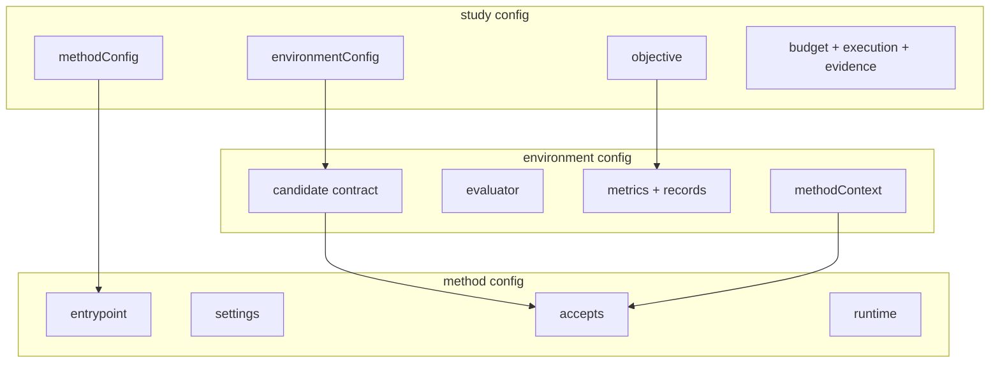

# OptPilot Core

OptPilot Core is the schema, runner, runtime, and evidence layer. It is the part
installed by the PyPI `optpilot` package and used by both the CLI and Studio.

Use this page for the mental model. For installation choices, start with
[Installation](installation.md). For every YAML field, use
[Configuration Reference](configuration.md).

OptPilot is built around one loop:

```text
method proposes a candidate
OptPilot validates and materializes it
environment evaluates it
OptPilot records evidence
method can use the evidence in the next proposal
```

The method and the environment stay user-owned. OptPilot owns the contract,
orchestration, workspace preparation, and evidence around them.



## Three Configs You Author

Most OptPilot projects start with three public config files.

| Config role | Main job | Reusable? |
| --- | --- | --- |
| `environment` | Define what can be evaluated and how metrics are returned. | Yes |
| `method` | Define how candidates are proposed and which environment contracts the method can use. | Yes |
| `study` | Bind one environment to one method for a concrete run. | No, it is a run plan |

Environment and method configs are reusable components. Study configs are
concrete decisions: which two components to pair, which metric to optimize,
how many trials to run, and how evidence should be stored.

### Environment

An environment is anything that can evaluate a candidate and produce metrics.
It may wrap:

- a Python evaluator
- a command-line simulator
- a dataset benchmark
- a service or external runtime
- an existing codebase with a small adapter

The environment config declares:

- the accepted candidate contract
- the evaluator entrypoint
- metric names and optional record streams
- files copied into trial workspaces
- output files to collect
- optional context that methods may read

The environment should not care which method produced a candidate. It should
validate and score candidates according to its own contract.

### Method

A method proposes candidates. It may be:

- random search, Bayesian optimization, or a metaheuristic
- an RL training loop or policy rollout
- an LLM code editor or agent workflow
- a wrapper around an existing optimization repository
- a small deterministic baseline

The method config declares the method entrypoint and the environment surface it
can use. A method can be general, such as a parameter tuner that reads any
parameter schema, or specific, such as a solver wrapper that always emits one
known candidate shape.

### Study

A study is the place where reusable pieces become one run.

The study chooses:

- the environment config
- the method config
- the primary objective metric and whether lower or higher is better
- budget and stopping policy
- parallelism, timeout, and retry behavior
- evidence level and reproducibility seed

The objective direction matters because OptPilot uses it to rank trial results,
write summaries, and expose the current best result to methods. A method may
also read the objective and use it while proposing candidates.

## The Candidate Contract

The candidate is the object that crosses from method to environment. This is
the main boundary in OptPilot.

The environment declares what it can evaluate:

```yaml
candidate:
  format: parameters
  parameters:
    schema:
      x:
        valueType: float
        min: 0.0
        max: 1.0
```

The method declares what it can target:

```yaml
accepts:
  formats: [parameters]
  requires:
    context:
      - candidate.parameters.schema
```

OptPilot checks compatibility before the run and validates every submitted
candidate before evaluation.

Candidate formats:

| Format | Use it for |
| --- | --- |
| `parameters` | JSON-like decisions: numeric parameters, discrete choices, schedules, simulator controls, search spaces, or action bundles. |
| `files` | Generated or edited files: source code, policy scripts, config files, data files, or heuristic programs. |
| `opaque` | A private payload convention shared by a matching method and environment. |

The format is only the top level. The full contract also includes schemas,
editable file paths, materialization rules, required context, capabilities, and
evaluator behavior. See [Candidate Contracts](candidate-contracts.md) for the
detailed model.

## Where Information Belongs

Most design confusion comes from putting information in the wrong place. Use
this table as the default rule.

| Information | Put it in | Why |
| --- | --- | --- |
| Evaluation inputs such as cases, scenarios, datasets, query specs, or simulator arguments | `environment.evaluator.settings` | The evaluator owns how those inputs are interpreted. |
| What a method is allowed to submit | `environment.candidate` | The environment owns the accepted candidate shape. |
| What environment context a method needs to read before proposing | `environment.methodContext` | The environment can expose read-only instructions and references without giving up evaluation ownership. |
| Method knobs such as model name, search depth, temperature, seed, or internal solver settings | `method.settings` | The method owns its algorithm choices. |
| Which metric matters for this run, how long to run, and how much evidence to keep | `study` | The study is the concrete run plan. |
| Results created during a run | Evidence | Runtime outputs should be read through `EvidenceView`, not copied back into static config. |

For Python evaluators, `evaluator.settings` is available as
`context["settings"]`. OptPilot stores and transports those settings, but the
evaluator decides their domain meaning.

If the method also needs read-only access to files listed in evaluator settings,
expose them through `methodContext.references`. Keep method-owned prompts,
models, solver parameters, and search knobs in `method.settings`.

## What OptPilot Creates at Runtime

Users author configs and source inside one package. The retained runner captures
that package and creates semantic Realm records plus provider-owned temporary
realizations:

```text
package root
  -> immutable package snapshot
  -> retained study definition
  -> canonical Realm run
  -> candidates -> logical trials -> attempts -> observations/artifacts
  -> summary, bounded Workbench pages, exact-head timeline
  -> optional immutable Review Collection revisions over exact selections
```

Important runtime concepts:

| Runtime concept | Purpose |
| --- | --- |
| Retained study definition | Exact environment, method, objective, policy, and content closure used by a run. |
| RunLedger | Canonical controller, candidate, trial, attempt, evidence, method-exchange, and terminal state. |
| Projection | Leased realization of exact immutable inputs for a reader or process. |
| Writable volume | Fresh provider-owned attempt/control/state space with explicit lifetime. |
| Workbench projection | Read-only bounded summary/pages/timeline and complete-plan candidate results derived from one exact Realm head. |
| Review Collection | Realm-owned immutable decision revisions containing an ordered shortlist, notes, frozen bounded run and terminal inspection evidence, bounded history navigation, and no-copy memberships to retained candidate/artifact content that survive source-run retirement. It is not a workspace or runtime. |

`trialWorkspace` expresses environment-owned input mappings into each attempt's
logical workspace. It does not select a copy strategy or grant broad project/
Realm access.

In the current retained local-process slice, those mappings are executable for
parameter and file candidates: they alias files/directories in the sealed
package and initialize a fresh writable trial volume for every attempt. A file
candidate is sealed independently and applied as the final immutable layer over
those seeds; evaluator writes remain in the fresh private upper.

## Evidence

Evidence is the canonical retained history of a run. It lets operators inspect
what happened and lets methods receive filtered prior results without parsing
arbitrary workspace files.

A Realm run records the exact definition, candidate and logical-trial identity,
attempt/retry lifecycle, observations, artifacts, method exchanges, ordered
events, run policy, and terminal summary. Studio reads bounded projections of
those records.

Candidate and artifact selections can also back a bounded read-only content
view. The view reuses retained immutable bytes and safe relative paths; it is
not a workspace and grants no edit authority. Keeping an eligible tree is a
separate explicit derivation that creates the independent editable owner.

Methods receive a filtered evidence view; operator-only diagnostics, secrets,
host paths, and unrelated artifacts are excluded. See [Runs and
Evidence](evidence.md).

## Core Is Separate From Studio

The core CLI can validate packages and run studies without the Studio UI:

```bash
optpilot package validate path/to/package
optpilot run path/to/package/studies/my_study.yaml \
  --package-root path/to/package
```

Studio uses the same core model, but adds a browser interface, managed editable
workspaces, Code Server, the Realm Run Workbench, and the optional assistant. A
package may validate for authoring while still using features outside the
current retained execution slice.

The split is intentional:

| Surface | What it should be used for |
| --- | --- |
| Core CLI/SDK | Validate configs, run studies, and integrate packages in your own project or CI. |
| Studio | Browse packages, create editable copies, launch studies through forms, inspect runs, and manage local workspace/assistant workflows. |

## What To Read Next

- Read [Candidate Contracts](candidate-contracts.md) when designing the
  method/environment boundary.
- Read [Methods](methods.md) when writing a candidate-producing method.
- Read [Packages and Catalogs](catalog.md) when organizing reusable code.
- Read [How a Run Works](how-it-works.md) when you need the runtime sequence.
- Read [Configuration](configuration.md) when you need allowed fields and YAML
  examples.
- Read [Job-Shop Environment](job-shop-environment.md) for the main tutorial
  example that uses one environment with several candidate contracts.
