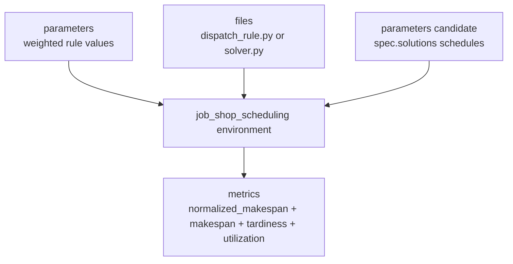

# Job-Shop Tutorial Map

!!! note "OpenAI editor setup"

    Four dependency-free studies run through the retained CLI: two parameter
    studies plus the dispatch-rule and solver-code file baselines. After the
    optional example dependencies are installed, the three JobShopLib solver
    studies and the Stable-Baselines study run through it too. The
    OpenAI-compatible editor is launchable after `OPENROUTER_API_KEY` is added
    under Studio Settings → Local environment variables, or exported for a CLI
    launch.


`catalog/example_package/` is the built-in tutorial package. It is a normal
OptPilot package: it contains reusable environment configs, method configs,
small case data, and study files.

The package teaches one idea: keep the environment boundary clear, then connect
different method families through explicit candidate contracts.

After [First Job-Shop Run](getting-started.md), use this page to understand how
the package is organized and choose the next tutorial track.

## Shared Job-Shop Comparison Set

The main example is job-shop scheduling. Most studies reuse the same small
validation cases and objective:

- validation cases: `ft06_small.yaml`, `la01_tiny.yaml`, and `ft06_standard.yaml`
- objective: minimize `normalized_makespan`
- secondary metrics: `makespan`, `tardiness`, and `utilization`

The studies differ in candidate contract and method implementation. That lets
you compare a parameter tuner, generated file candidates, JobShopLib solver
wrappers, OR-Tools CP-SAT, simulated annealing, reinforcement learning, and an
OpenAI-compatible file editor without changing the evaluation problem.

`normalized_makespan` is the average per-case ratio between the schedule
makespan and the case reference bound. The tutorial minimizes it; smaller values
mean better schedules relative to the reference cases.



## What Each Page Teaches

| Page | Main lesson | Start here when |
| --- | --- | --- |
| [Job-Shop Environment](job-shop-environment.md) | One environment can expose several candidate contracts for the same metrics. | You want the full example map. |
| [Dispatching Rule Methods](dispatching-rule-methods.md) | Baselines, schema-driven parameter tuning, file candidates, and a JobShopLib rule wrapper. | You want a dependency-free optimizer first. |
| [Simulated Annealing Methods](simulated-annealing-methods.md) | Wrap an existing metaheuristic as a method that returns schedule solutions. | You have an external search library. |
| [OR-Tools CP-SAT Methods](cp-sat-methods.md) | Wrap a constraint solver without coupling the evaluator to the solver. | You have a solver implementation. |
| [Reinforcement Learning Methods](reinforcement-learning-methods.md) | Train or load a policy inside the method and return schedules for validation cases. | You need method-side training or policy rollout. |
| [LLM Code-Writing Methods](llm-code-methods.md) | Use file candidates when the candidate itself is source code. | You want an agent to write `dispatch_rule.py` or `solver.py`. |

## Readiness

| Track | Retained-launchable? | Extra setup |
| --- | --- | --- |
| Fixed weighted-rule baseline | Yes; current retained smoke | None |
| Tune weighted-rule parameters | Yes; current retained multi-trial smoke | None |
| Baseline file candidates | Yes; current retained file slice | None |
| OpenAI-compatible file editor | Yes | `OPENROUTER_API_KEY` in Studio Settings, or exported for CLI |
| JobShopLib dispatching rule | Yes | `uv sync --all-packages --group examples` |
| Simulated annealing | Yes | `uv sync --all-packages --group examples` |
| OR-Tools CP-SAT | Yes | `uv sync --all-packages --group examples` |
| Stable-Baselines3 RL | Yes | `uv sync --all-packages --group examples` and a working PyTorch stack |

## Built-In Studies

Dependency-free retained studies:

```text
catalog/example_package/studies/job_shop_rule_parameters_baseline.yaml
catalog/example_package/studies/job_shop_tune_dispatch_weights.yaml
catalog/example_package/studies/job_shop_dispatch_rule_baseline.yaml
catalog/example_package/studies/job_shop_solver_code_baseline.yaml
```

Retained studies that require the optional example dependencies:

```text
catalog/example_package/studies/job_shop_lib_dispatching_rule.yaml
catalog/example_package/studies/job_shop_simulated_annealing.yaml
catalog/example_package/studies/job_shop_ortools_cpsat.yaml
catalog/example_package/studies/job_shop_rl_stable_baselines.yaml
```

Retained file-candidate Study that needs a local provider value:

```text
catalog/example_package/studies/job_shop_openai_dispatch_rule.yaml
```

For the solver, RL, file-baseline, and OpenAI-editor studies, OptPilot captures the
package-backed, environment-owned `methodContext.references` and projects them
read-only into the retained method worker. The file Methods use template
references as input, stage their proposals through the same bounded
candidate-staging seam, and evaluate each sealed candidate as a final layer in
a fresh trial volume.

## Package Layout

The tutorial uses the same package layout recommended for user packages:

```text
catalog/example_package/
  environments/
    job_shop_scheduling/
  methods/
    baseline_file_copy/
    fixed_rule_parameters/
    job_shop_lib_dispatching_rule/
    job_shop_lib_simulated_annealing/
    job_shop_rl_stable_baselines/
    openai_file_editor/
    ortools_cpsat_solver/
    tune_dispatch_weights/
  studies/
    job_shop_*.yaml
```

Environment and method directories own reusable implementation code and config
variants. Study files are concrete run plans: each study chooses one
environment config, one method config, objective, budget, and execution policy.
See [Packages and Catalogs](catalog.md) for the general package model.

## Adapting An Example

When adapting an example to your own project:

1. Create a named source-controlled package under `catalog/`, or adapt the
   pattern in an editable Workspace and register it through **Workspace Setup**.
2. Keep evaluator inputs in `environment.evaluator.settings`.
3. Expose files the method must read through `environment.methodContext`.
4. Keep algorithm knobs in `method.settings`.
5. Run `uv run optpilot validate path/to/study.yaml`.
6. Inspect the Workbench Candidates/Observations pages and correlated method
   exchanges in the timeline after a retained run.

**Register checked version** publishes an immutable Realm revision; it does not
copy the result into a special local Catalog folder. When using Study Builder,
select exact registered Environment and Method versions. They can share one
package root or come from non-conflicting complete package roots in different
Realm revisions in the same content store. OptPilot creates one managed
Workspace by adopting a single root or unioning multiple manifests without
copying file blobs. Any file overlap, file/directory conflict, or case-fold
collision rejects instead of overwriting. The Workspace stores exact
source/focus lineage plus portable relative config references and launches from
an exact committed Workspace revision. Cross-store transfer remains a future
explicit import.

For package layout guidance, see [Packages and Catalogs](catalog.md). For field-level
details, see [Configuration](configuration.md). For runtime storage and
evidence, see [How a Run Works](how-it-works.md) and [Evidence](evidence.md).
