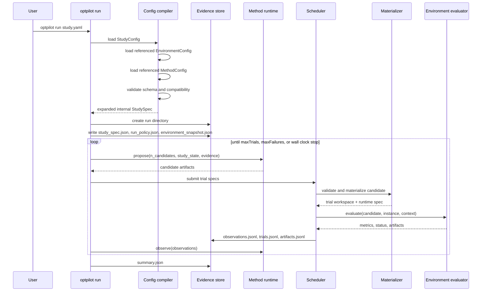

# How A Run Works

This page explains what happens after you run:

```bash
uv run optpilot run examples/studies/sa_baseline.yaml
```

The short version is: OptPilot loads a `StudyConfig`, loads the referenced `EnvironmentConfig` and `MethodConfig`, validates that the method can produce candidates for the environment, then repeats a propose-evaluate-record loop until the budget stops the study.

## End-To-End Flow



## What The Config Compiler Does

The public YAML files are authoring configs. The runner does not execute them directly. It first compiles them into an internal `StudySpec`.

During compilation OptPilot:

- Resolves `StudyConfig.environment` and `StudyConfig.method` relative to the study file.
- Checks `apiVersion: optpilot.io/v1` and the expected `kind`.
- Validates allowed enum values such as `candidate.type`, `implementation.type`, `metrics.source`, and `execution.backend`.
- Resolves relative paths in environment workspace, exposure, evaluator Python paths, instance files, and evidence output.
- Checks method/environment compatibility:
  - `compatibility.candidateTypes` must include `environment.candidate.type`.
  - `compatibility.artifactKinds`, when present, must include `environment.candidate.artifactKind`.
  - `compatibility.requiredContext` must be present in the environment's candidate context.
  - `compatibility.requiredCapabilities` must match environment interface capabilities.
- Checks that `StudyConfig.objective.metric` is declared in `EnvironmentConfig.metrics.keys`, when keys are provided.

The expanded spec is written to each run directory as `study_spec.json`.

## What Runs In The Method Runtime

The method side is responsible for proposing candidates. It can be implemented in two ways:

| Method implementation | Where code comes from | How OptPilot calls it |
| --- | --- | --- |
| `implementation.type: python` | `implementation.callable: python:module:Class` | OptPilot imports the class, constructs it with `(method_definition, study_spec, rng)`, then calls `propose(...)`, lifecycle methods, or `run(session)` depending on protocol. |
| `implementation.type: command` | `implementation.command: [...]` | OptPilot starts the command, sends a JSON request through stdin or `{input_file}`, and reads a JSON response from stdout or `{output_file}`. |

Method code receives:

- The current `study_state`, including best metric so far and completed trial count.
- `candidate_context`, compiled from the environment candidate contract.
- An evidence view with previous observations, artifacts, trials, method calls, and extracted records.
- A per-call method workspace for command methods.
- Method-specific `config` from `MethodConfig.config`.

The method returns candidate artifacts. For parameter candidates this is usually an artifact with a `spec` object:

```json
{
  "artifact_id": "candidate-001",
  "artifact_kind": "parameter_spec",
  "spec": {
    "x": 4.2,
    "mode": "balanced"
  }
}
```

For file candidates, the artifact references generated files by `contentRef` and `sha256`; source code is not embedded inline:

```json
{
  "artifact_id": "candidate-001",
  "artifact_kind": "code_bundle",
  "spec": {
    "bundleRef": "/path/to/run/artifacts/candidate-001/files",
    "files": [
      {
        "path": "devs_project/StrategicAirlift_D0_libs/Aircraft_libs/MissionController.py",
        "contentRef": "/path/to/generated/MissionController.py",
        "sha256": "..."
      }
    ]
  }
}
```

The helper `optpilot.code_artifacts.CodeArtifactStore` can create this file-artifact shape for methods.

## What Runs In The Environment Evaluator

The environment side is responsible for evaluating one materialized candidate on one instance.

For the common configured environment path, `EnvironmentConfig.evaluate` chooses one of:

| Evaluator type | How it runs | Metric source options |
| --- | --- | --- |
| `python` | Import and call `module:function` with `(artifact_spec, instance, context)`. | Usually `metrics.source: return`, but file, SQLite, and custom extraction are also supported. |
| `command` | Start a subprocess command after formatting placeholders such as `{workspace}`, `{candidate_file}`, `{metrics_file}`, and `{instance_file}`. | Usually `file`, `stdout`, or `sqlite`. |
| `custom` | Use a custom target adapter `python:module:Class`. | The adapter returns the normalized target result directly. |

The evaluator returns or writes:

- `status`, defaulting to `success`.
- `metric_values`, or a flat metric object that can be interpreted as metric values.
- Optional `constraint_results`.
- Optional artifact records.
- Optional `event_summary`.

The configured adapter normalizes that into an observation.

## Trial Workspaces

Each candidate trial gets its own workspace under the run directory.

For `candidate.type: parameters`, materialization is simple: the candidate `spec` is passed to the evaluator as the runtime spec.

For `candidate.type: files`, OptPilot:

1. Copies every `workspace.copy` entry into the trial workspace.
2. Validates the candidate artifact against required files, allow patterns, deny patterns, hashes, and content references.
3. Copies the candidate's generated files into `candidate.files.root`.
4. Writes `workspace_manifest.json`.
5. Passes the workspace and candidate root to the evaluator.

This is why file environments declare both:

- What source tree or fixtures must be copied into a trial workspace.
- Which candidate files the method may edit.

## Parallelism And Sandboxes

`StudyConfig.execution.backend` controls where environment evaluation runs:

| Backend | What it means |
| --- | --- |
| `local` | Run trials in local Python threads in the current process. |
| `local_subprocess` | Run each trial in a separate `python -m optpilot.worker` process. |
| `container` | Run each trial worker through Docker, Podman, or a compatible CLI. |
| `custom` | Use a user-provided backend component. |

`StudyConfig.execution.parallelism` controls how many candidate trials can be evaluated at once.

Method runtime is configured separately from environment execution. A command method can run in its own container through `MethodConfig.runtime.type: container`, while environment evaluation can run locally, or the reverse. This separation is useful when the method and environment need different dependencies.

## Evidence Files

Every run directory records enough information to inspect and reproduce the study:

| File | Purpose |
| --- | --- |
| `study_spec.json` | The compiled internal spec used by the runner. |
| `summary.json` | Final run summary: best trial, best metric, counts, timestamps. |
| `observations.jsonl` | One normalized result record per evaluated trial. |
| `trials.jsonl` | Trial inputs: artifact, resource profile, backend metadata. |
| `artifacts.jsonl` | Candidate artifact validation and materialization records. |
| `method_calls.jsonl` | Method runtime calls and lifecycle events. |
| `method_events.jsonl` | Optional events emitted by methods. |
| `scheduler_events.jsonl` | Trial scheduling events. |
| `environment_snapshot.json` | Snapshot of relevant project/environment state. |
| `run_policy.json` | Runtime policy compiled from the study. |
| `run_lineage.json` | Whether this was a new run, resumed run, or branch from another run. |

The UI reads these files to show current and previous studies.
