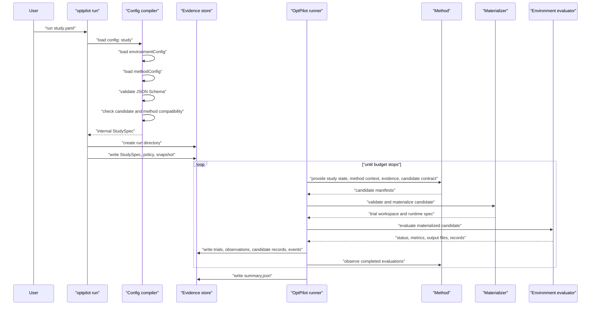

# How A Run Works

This page follows what happens after:

```bash
uv run optpilot run examples/studies/sa_baseline.yaml
```

OptPilot loads a study config, loads the referenced environment and method configs, validates compatibility, compiles an internal `StudySpec`, then runs a propose-evaluate-record loop until the budget is exhausted.

## End-To-End Procedure



The method proposes candidates. The runner does not invent candidates; it only gives the method the state and evidence needed to propose them.

## Config Compilation

The public YAML files are authoring configs. The runner executes the compiled internal `StudySpec`.

Compilation performs these steps:

- Load `config: study`.
- Resolve `environmentConfig` and `methodConfig` relative to the study file.
- Validate all three files with the packaged JSON Schemas.
- Resolve relative paths in instances, trial workspace seeds, method context files, Python paths, and container build contexts.
- Check that `method.accepts.formats` includes `environment.candidate.format`.
- Check that `method.accepts.requires.context` exists in the compiled candidate and method context.
- Check that `method.accepts.requires.capabilities` is provided by `environment.capabilities`.
- Check that `study.objective.metric` is declared in `environment.metrics.keys` when keys are provided.

The compiled spec is written to:

```text
run_dir/study_spec.json
```

## Method Execution

The method owns the search algorithm. It can be random search, Bayesian optimization, RL training, an LLM workflow, a metaheuristic, or an existing agent process.

Python method config:

```yaml
entrypoint:
  python: user_catalog.methods.my_method.method:MyMethod
  protocol: batch
```

Command method config:

```yaml
entrypoint:
  command: [python, my_method.py, "{input_file}", "{output_file}"]
  protocol: batch
```

For each proposal request, OptPilot provides:

- `study_state`: completed trials, best metric, recent failures, and related run state.
- `candidate`: the environment candidate contract.
- `methodContext`: instructions and references declared by the environment.
- `evidence`: previous observations, candidate records, trials, records, method calls, and events.
- `settings`: the free object from `method.settings`.
- `runtime_context`: per-call paths, including the method workspace and candidate store.

The method returns candidates. Parameter candidates usually look like:

```json
{
  "candidate_id": "candidate-001",
  "format": "parameters",
  "spec": {"x": 4.2, "mode": "balanced"},
  "generator": {"method_id": "my-method"}
}
```

File candidates reference files generated by the method:

```json
{
  "candidate_id": "candidate-001",
  "format": "files",
  "spec": {
    "bundleRef": "/path/to/run/candidates/candidate-001/files",
    "files": [
      {
        "path": "devs_project/StrategicAirlift_D0_libs/Aircraft_libs/MissionController.py",
        "contentRef": "/path/to/run/candidates/candidate-001/files/MissionController.py",
        "sha256": "..."
      }
    ]
  },
  "generator": {"method_id": "my-method"}
}
```

`optpilot.candidate_files.CandidateFileStore` creates this file-candidate shape for Python methods.

## Trial Workspace

Each candidate evaluation gets its own trial workspace under the run directory. The trial workspace is the evaluator's working copy for that trial.

For parameter candidates:

- No environment source tree is required unless the evaluator itself needs copied files.
- The candidate `spec` is passed directly as the runtime output_file spec.

For file candidates:

1. OptPilot creates a fresh trial workspace.
2. It copies every `environment.trialWorkspace` entry into that workspace.
3. It validates the method's candidate file manifest.
4. It copies the method-generated files into `candidate.materialize.root`.
5. It writes `workspace_manifest.json`.
6. It calls the evaluator with the workspace and candidate root.

The method can only modify the environment through the candidate files it returns. It may read any information exposed through the request, method context, evidence view, its own method workspace, and any files its own runtime can access. The evaluator reads the materialized trial workspace.

## Candidate Store And Evidence Output files

The run directory contains two distinct file areas:

| Location | Purpose |
| --- | --- |
| `run_dir/candidates/` | Method handoff files. A file-producing method writes candidate bundles here so the materializer can copy them into trial workspaces. |
| `run_dir/trials/` | Per-trial workspaces used by evaluators. |
| `run_dir/evidence_files/` | Optional retained copies of evaluator output files when `evidence.outputFileStorage: copy` is enabled. |

The trial workspace is what gets evaluated. The candidate store is the handoff area used before materialization. The evidence output_file area stores copies of output files after evaluation when the study requests copied evidence instead of path references.

## Environment Evaluation

The environment config chooses one evaluator mode:

```yaml
evaluator:
  python: user_catalog.environments.my_environment.evaluator:evaluate
```

or:

```yaml
evaluator:
  command: [python, evaluate.py, "{workspace}", "{metrics_file}"]
```

or:

```yaml
evaluator:
  adapter: user_catalog.environments.my_environment.adapter:MyAdapter
```

The evaluator receives the materialized candidate and one instance. It returns or writes status, metrics, optional output-file descriptors, and optional record streams. The configured adapter normalizes those into observations.

## Parallelism And Runtimes

Study execution controls environment trials:

```yaml
execution:
  backend: local          # local | local_subprocess
  parallelism: 2
  runtime:
    sandbox: host         # host | container
```

Current runner support:

| Setting | Status |
| --- | --- |
| `backend: local` with `sandbox: host` | Implemented. |
| `backend: local_subprocess` with `sandbox: host` | Implemented. |
| `backend: local` with `sandbox: container` | Implemented for Docker/Podman-compatible CLIs. |
Method runtime is separate from environment execution:

```yaml
runtime:
  sandbox: container
  container:
    image: my-method-image:latest
    executable: docker
```

Use a method runtime container when the optimizer or agent needs different dependencies from the environment evaluator.

## Evidence Files

Every run directory records:

| File | Purpose |
| --- | --- |
| `study_spec.json` | Compiled internal spec used by the runner. |
| `summary.json` | Final run summary. |
| `observations.jsonl` | One normalized evaluation result per trial. |
| `trials.jsonl` | Trial inputs, backend metadata, and statuses. |
| `candidates.jsonl` | Candidate validation and materialization records. |
| `method_calls.jsonl` | Method proposal, lifecycle, and observe calls. |
| `method_events.jsonl` | Events emitted by methods. |
| `scheduler_events.jsonl` | Scheduling and backend events. |
| `environment_snapshot.json` | Python/platform/dependency snapshot. |
| `run_policy.json` | Runtime policy compiled from the study. |
| `run_lineage.json` | New, resumed, or branched run metadata. |

The UI reads these files to show current and previous studies.
