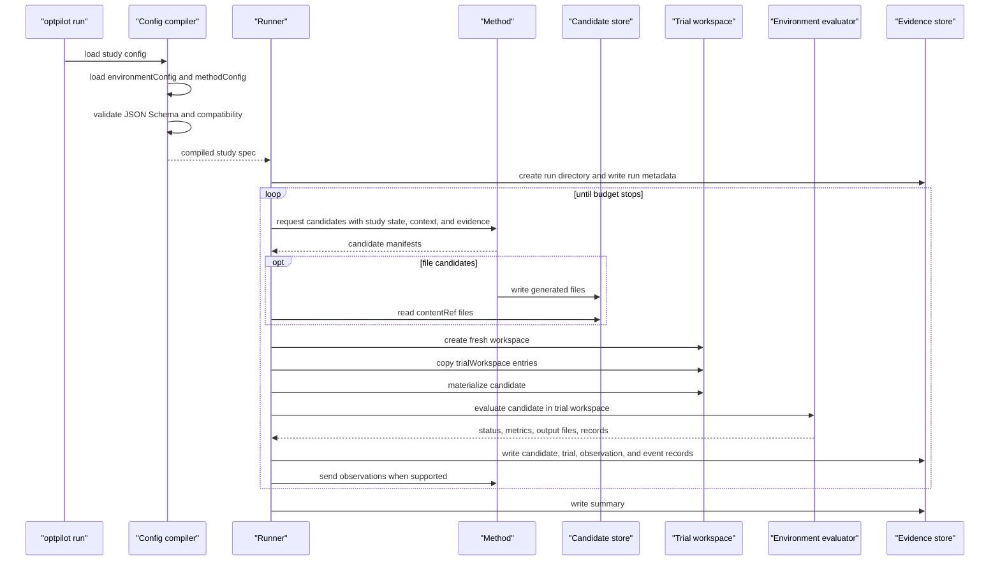

# How A Run Works

This page explains the runtime sequence after you already have one successful OptPilot run. For the recommended first walkthrough, use [Getting Started](getting-started.md).

This page follows what happens after:

```bash
uv run optpilot run catalog/example_package/studies/job_shop_rule_parameters_baseline.yaml
```

At a high level, OptPilot loads the study config, resolves the referenced environment and method configs, validates compatibility, compiles an internal run spec, and runs the propose-evaluate-record loop until the study budget stops.

## Runtime Sequence



The method proposes candidates. The runner does not invent them. The runner supplies the method with the study state, method context, candidate contract, and evidence that the method is allowed to rely on.

## Config Compilation

The public YAML files are authoring configs. The runner executes a compiled internal spec.

Compilation performs these checks:

- load `config: study`
- resolve `environmentConfig` and `methodConfig` from the study file
- validate all three files against JSON Schema
- resolve config-relative paths
- check that the method accepts the environment candidate format
- check required method context paths and capabilities
- check that the study objective metric is declared by the environment when metric keys are provided

The compiled spec is written to:

```text
run_dir/study_spec.json
```

Users normally do not edit this file. It is evidence for what OptPilot actually ran.

Some field names change during compilation because public YAML is optimized for authoring while the internal spec is optimized for execution.

| Public authoring field | Internal runtime field | Why it changes |
| --- | --- | --- |
| `objective.metric` | `objective.primaryMetric.name` | Runtime can also hold secondary metrics and aggregation details. |
| `objective.direction` | `objective.primaryMetric.direction` | The runner compares metrics using the compiled primary metric. |
| `budget.maxTrials` | `stopping.maxTrials` | Budget becomes a stopping policy. |
| `evaluator.settings` | `environment.adapter.config.evaluate.config` | Environment-owned inputs remain attached to the evaluator. |
| `method.settings` | `method.config` and `method.settings` | Method implementations read runtime config; original settings remain available for audit. |
| `environment.candidate` | `candidate.context.candidate` plus validation/materialization specs | The runner needs both the public contract and executable validation/materialization rules. |

When in doubt, treat public YAML as the source you edit and `study_spec.json` as the exact run record you inspect.

Environment evaluator inputs are normal configuration, carried as `evaluator.settings` in public YAML and passed to Python evaluators as `context["settings"]`. OptPilot does not interpret those settings beyond validation and path resolution. An evaluator may run one fixed case, use settings as simulator arguments, or loop over multiple benchmark cases internally and return aggregated metrics plus per-case records.

## Method Execution

The method owns the search algorithm. It can be a small Python class, a command-line optimizer, an LLM agent, or a wrapper around a full upstream repository.

For each proposal request, OptPilot provides:

- `study_state`: completed trials, failure count, best metric, and related run state
- `candidate_context`: the environment candidate contract and method-visible context
- `evidence`: previous observations, candidates, trials, records, calls, and events
- `settings`: the free object from the method config
- `runtime_context`: per-call paths, including method workspace and candidate store

For Python methods, the canonical path is `study_state["candidate_context"]` plus the optional `evidence_view` argument. For command methods, the request JSON also breaks out `candidate`, `methodContext`, and `candidate_context` for convenience; they describe the same environment-provided contract.

Parameter candidates look like:

```json
{
  "candidate_id": "candidate-001",
  "format": "parameters",
  "spec": {"x": 4.2, "mode": "balanced"},
  "generator": {"method_id": "my-method"}
}
```

File candidates reference files generated by the method:

```json
{
  "candidate_id": "candidate-001",
  "format": "files",
  "spec": {
    "bundleRef": "/path/to/run/candidates/candidate-001/files",
    "files": [
      {
        "path": "src/policy.py",
        "contentRef": "/path/to/run/candidates/candidate-001/files/src/policy.py",
        "sha256": "..."
      }
    ]
  },
  "generator": {"method_id": "my-method"}
}
```

`optpilot.candidate_files.CandidateFileStore` creates this file-candidate shape for Python methods.

## Candidate Store And Trial Workspace

The run directory contains distinct storage areas:

| Location | Purpose |
| --- | --- |
| `run_dir/candidates/` | Durable method-produced candidate files before evaluation. |
| `run_dir/method_calls/` | Per-call method request, response, stdout, and stderr files. |
| `run_dir/trials/` | Per-trial workspaces used by evaluators. |
| `run_dir/evidence_files/` | Optional copies of evaluator output files when `evidence.outputFileStorage: copy` is enabled. |

For file candidates, materialization has one extra handoff:

```text
method writes generated files to candidate store
method returns candidate manifest with contentRef and sha256
runner validates the manifest
runner copies contentRef files into the trial workspace
evaluator reads the trial workspace
```

The trial workspace is what gets evaluated. The candidate store is a handoff area before evaluation. The evaluator normally reads the trial workspace, not the candidate store.

## Trial Workspace Preparation

Each candidate evaluation gets a fresh workspace under `run_dir/trials/`.

For parameter candidates:

- the candidate `spec` is passed directly as runtime input
- no environment source tree is required unless the evaluator itself needs copied files

The job-shop parameter baseline from [Getting Started](getting-started.md) follows this simpler path.

For file candidates:

1. OptPilot creates a fresh trial workspace.
2. It copies every `environment.trialWorkspace` entry into that workspace.
3. It validates the method's file manifest.
4. It copies method-generated files into `candidate.materialize.root`.
5. It writes `workspace_manifest.json`.
6. It calls the evaluator with the workspace and candidate root.

The SA example copies a complete simulator source tree because the evaluator runs the simulator from inside the trial workspace after candidate edits are applied. If an evaluator uses an installed package, a prebuilt image, an external service, or only JSON input files, it does not need to copy the complete environment implementation.

File-candidate tracks such as Strategic Airlift add this materialization step on top of the same base loop. The method still proposes candidates, the environment still evaluates them, and OptPilot still records the evidence.

## Environment Evaluation

The environment config chooses one evaluator mode:

Evaluator field fragment:

```yaml
evaluator:
  python: evaluator:evaluate
```

Alternative evaluator field fragment:

```yaml
evaluator:
  command: [python, evaluate.py, "{candidate_json}", "{settings_file}", "{metrics_file}"]
```

Alternative evaluator field fragment:

```yaml
evaluator:
  adapter: adapter:MyAdapter
  pythonPath: [.]
```

The evaluator receives the materialized candidate and `context["settings"]`. It returns or writes:

- status
- metric values
- optional constraint results
- optional output-file descriptors
- optional record streams

The configured adapter normalizes those values into observations.

## Parallelism And Runtimes

Study execution controls the experiment loop:

Study `execution` fragment:

```yaml
execution:
  parallelism: 2
```

Environment and method runtime belongs to the component configs:

```yaml
runtime:
  sandbox: process        # process | container
```

`process` runs component code in local subprocess workers. `container` runs it
through a Docker/Podman-compatible runtime when the component declares a
container image or build.

Method runtime is separate from environment execution:

Method `runtime` fragment:

```yaml
runtime:
  sandbox: container
  container:
    image: my-method-image:latest
    executable: docker
```

Use a method runtime container when the optimizer or agent needs different dependencies from the evaluator.

## Evidence

Every run directory records the compiled spec, trial results, candidate records, method calls, scheduler events, output files, and final summary.

Use [Evidence](evidence.md) for the run file catalog and resume/branch behavior.
