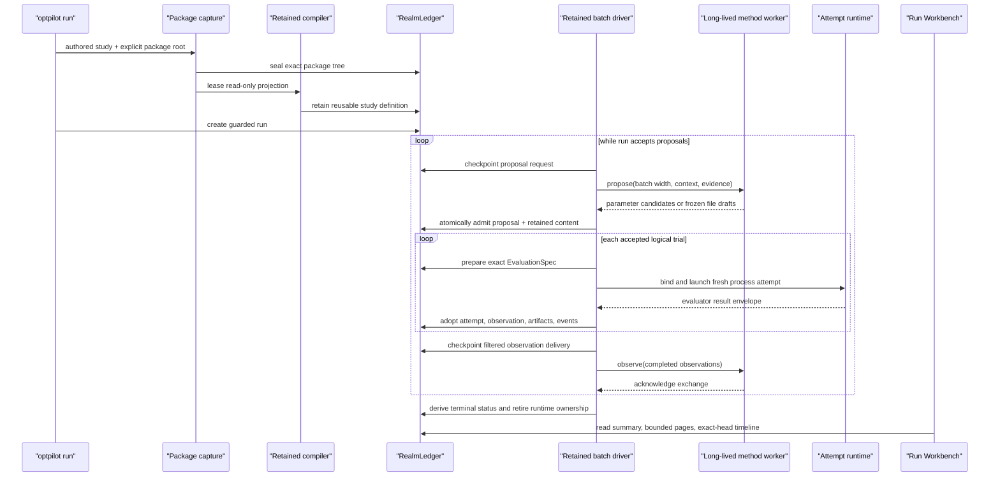

# How a Run Works

An OptPilot study connects one method to one environment through a candidate
contract:

```text
method proposes a candidate
environment evaluates that candidate
OptPilot owns admission, execution, evidence, and recovery
```

The current public runner implements this model for a bounded retained batch
slice.

## Launch sequence


```mermaid
sequenceDiagram
  participant CLI as "optpilot run"
  participant Capture as "Package capture"
  participant Compiler as "Retained compiler"
  participant Realm as "RealmLedger"
  participant Driver as "Retained batch driver"
  participant Method as "Long-lived method worker"
  participant Runtime as "Attempt runtime"
  participant Studio as "Run Workbench"

  CLI->>Capture: authored study + explicit package root
  Capture->>Realm: seal exact package tree
  Capture->>Compiler: lease read-only projection
  Compiler->>Realm: retain reusable study definition
  CLI->>Realm: create guarded run

  loop while run accepts proposals
    Driver->>Realm: checkpoint proposal request
    Driver->>Method: propose(batch width, context, evidence)
    Method-->>Driver: parameter candidates or frozen file drafts
    Driver->>Realm: atomically admit proposal + retained content

    loop each accepted logical trial
      Driver->>Realm: prepare exact EvaluationSpec
      Driver->>Runtime: bind and launch fresh process attempt
      Runtime-->>Driver: evaluator result envelope
      Driver->>Realm: adopt attempt, observation, artifacts, events
    end

    Driver->>Realm: checkpoint filtered observation delivery
    Driver->>Method: observe(completed observations)
    Method-->>Driver: acknowledge exchange
  end

  Driver->>Realm: derive terminal status and retire runtime ownership
  Studio->>Realm: read summary, bounded pages, exact-head timeline
```

## 1. Capture one package

`optpilot run` requires `--package-root`. OptPilot captures that root into
immutable content before compiling the study. Environment and method config
paths, Python import roots, and source-backed callables must resolve inside the
captured package.

The environment and method remain different semantic roles, but they can refer
to the same retained package snapshot. OptPilot does not make separate source
copies for each role or each run.

## 2. Retain an exact study definition

The compiler loads the authored study, environment, and method configs from a
leased read-only projection. It validates their candidate compatibility and
builds a path-free `RunDefinitionManifest` containing:

- environment and method revisions
- candidate contract and evaluation template
- objective, budget, retry, evidence, and reproducibility policy
- logical runtime scopes, optional ordered `trialWorkspace` input layers, and
  required retained content
- prepared-runtime and execution requirements

The reusable study definition is retained independently of the mutable package
directory. Run creation loads that definition; a caller cannot resubmit or
replace its semantics during launch.

## 3. Create a canonical Realm run

A run id names a Realm ledger namespace, not a directory. The first transaction
creates the run owner, definition reference, controller generation, control
manifest, and revision zero.

The Realm then owns all durable changes:

- candidate admission
- logical-trial lifecycle
- attempt binding, launch, reconciliation, and cleanup
- observations and retained artifacts
- method request/response checkpoints
- stopping, finalization, and retirement
- ordered timeline events

The controller is the only canonical writer.

## 4. Propose and admit a batch

The retained Python worker stays alive across proposal rounds. Before each
callback, the driver records the request. A proposal is normalized and checked
as one unit; an oversized or invalid proposal is rejected without partially
consuming budget.

One accepted candidate can back multiple logical trials. A logical trial is the
budget identity. A retry creates another attempt under that logical trial rather
than another budget slot.

For file candidates, the method receives one generation-bound staging inbox.
The worker validates the complete response and atomically moves the selected
exchange from writable to frozen state. The run authority then seals each tree
under a retry-scoped provisional owner change. One transaction commits the
immutable content membership, candidate records, logical trials, budget change,
method-exchange completion, and run revision. A lost commit response is recovered
from that exact historical receipt before another capture begins; an aborted
capture can be retried without poisoning the stable exchange coordinate.

## 5. Bind and execute an attempt

Canonical attempt preparation derives an immutable `EvaluationSpec` from the
retained environment closure and exact candidate. The runtime compiler turns it
into a path-free portable spec, then the local provider creates:

- an exact read-only input realization
- fresh bounded writable trial/control volumes; when declared, the trial volume
  is initialized from ordered immutable `trialWorkspace` lowers that alias the
  same retained package snapshot
- for a file candidate, one final `replace` layer mapping its exact immutable
  tree under the environment-owned candidate root
- a token-bound process launch
- durable binding, launch, heartbeat, and cleanup authority

Provider paths, process ids, leases, and volume ids are operational. They do not
enter candidate, evaluation, or run identity.

The local provider validates candidate bytes against the sealed declaration and
exposes that already-realized layer in place; it does not copy the candidate a
second time for materialization. Every attempt still gets a new writable upper,
so evaluator mutation is private and retries start from the retained bytes.
The current process provider has advisory read-only enforcement, so native
attempts receive private realizations and all local code must be trusted. A
future enforcing provider may safely share immutable lower layers without
changing the public model.

## 6. Adopt evidence transactionally

An evaluator returns a bounded result envelope. The controller atomically adopts
the terminal attempt, observation, retained artifacts, logical transition,
owner membership, revision, and events. A failed worker cannot append evidence
directly.

Methods receive a filtered observation view. Operator-only diagnostics,
secrets, backend identity, host paths, and unrelated artifacts are excluded.

## 7. Recover from exact checkpoints

Schema v16 introduced durable execution launch/cleanup, lost-attempt
reconciliation, and ordered method exchanges. Schema v17-v20 add durable
Operator Jobs, hard-stop cleanup evidence, shared operator capacity, and
interface-output sessions. After interruption, recovery checks the schema-v20
durable prefix:

- completed exchanges can be replayed and verified
- an unacknowledged response is delivered again without duplicating its effect
- prepared or launched work is reconciled from its binding/launch authority
- stale controllers and process identities are fenced
- missing or divergent method responses fail closed

Recovery never infers progress from a partial output file.

## 8. Read the run

The CLI prints an immutable summary projection. Studio reads the same Realm and
shows the generic Run Workbench:

- status, stop code, objective, budget, counts, and the best single-trial
  observation
- candidate aggregates and matching-plan ranks derived from final logical-trial
  evidence at one exact head
- bounded candidate, logical-trial, attempt, observation, and artifact pages
- one exact-head correlated timeline

Candidate aggregation is a read projection, not new run authority. It includes
only final-attempt observations and publishes a value only for a fully terminal,
successful, finite evaluation plan. Active, failed, missing, and non-finite
evidence stays explicit. The browser neither joins observations nor computes a
leaderboard from a partial page.

Selecting a Run opens that recorded evidence directly. Runs are never listed as
editable Workspaces and require no intermediate “Open as Workspace” step.

## Candidate inspection

OptPilot resolves a selected Candidate together with the exact retained
evaluation closure and compiles the same `EvaluationSpec` used by canonical
attempts. Studio presents the available modes under **Try Candidate**:
**Run headless** executes a noninteractive inspection, while **Open interactive
interface** opens the Environment's live interface when the retained profile and provider
support it. Under the hood, both execute as durable, noncanonical Operator
Jobs.

Content inspection uses the same immutable selection but a smaller operation.
**Inspect** reads semantic inputs without launching. **View files**
reauthorizes the exact Run head, then serves a bounded project page or file/blob
byte range through a short-lived opaque handle. Neither derives an owner,
starts a runtime, exposes a provider path, or materializes a Workspace.
Viewability and editability are separate capabilities: a retained file is
viewable, while **Edit in Workspace** is offered only for an eligible complete
project.

For presentation, Studio resolves content, derivable-tree, and candidate-target
facts for all bounded first-page selections in one actor-bound exact-head
batch. These facts only explain which buttons are currently available; the
actual View, Edit, and Try paths reauthorize independently.

These actions never consume source-run budget or alter its observations.
Studio reports exact capability reasons for ineligible selections.

**Compare** follows the same exact-head rule without minting execution or byte
authority. Core reads one authorized snapshot, validates two distinct candidate
selections, and returns independently eligible outcome and candidate-input
sections. Outcome rows cover the primary objective and authored secondary
metrics for every candidate format, but Core emits a numeric relation only when
both operands have complete, matching evaluation plans. Boolean constraint rows
report exact satisfied/violated coverage and rank only feasible versus
infeasible when both sides are complete. Input presenters provide a bounded
contract-first parameter diff, a path-free sealed-file-manifest diff, or
bounded/redacted opaque top-level metadata. Studio does not expose file hashes/
content refs, infer domain semantics, or calculate comparison facts in the
browser. File comparison begins with the manifest so it does not eagerly read
candidate trees. **View text diff** then reauthorizes the two exact retained
selections and reads only the selected relative path. Core returns a complete
bounded unified diff for strict UTF-8 files up to 48 KiB and 4,000 lines per
side, or an explicit unavailable reason; it never returns a silently truncated
patch or creates a disposable workspace.

The Overview separately visualizes metrics and boolean constraints from its
bounded loaded observation page. Its metric selector, chart, and coverage text
name that partial scope and exact Realm head; loading more observation pages
extends the visible evidence without changing canonical candidate aggregation.

The same run-head read model provides conservative environment-evaluation and
objective fingerprints with a structured reproducibility report. It records
which dimensions are identified, not assessed, or unverified and keeps
automatic cross-run ranking ineligible. A matching digest is therefore a useful
filter, not proof that two runs are reproducibly comparable. Eligible candidates
from sealed terminal runs can be re-evaluated through a canonical methodless
child using their exact parent seed/repetition plan.

**Save to Shortlist** records a human decision inside the source Run without
making a Workspace. Notes, order, and membership are edited as one draft;
**Save changes** commits them together, while **More** contains bounded saved
history, export, and **Delete Shortlist**. A terminal Try result can be saved
with its Candidate through **Save Candidate and inspection** or attached later
through **Save inspection to Shortlist**. Neither action retains a live runtime
or presentation endpoint.

Under the hood, the first save creates a Realm-owned `decision` Review
Collection, freezes bounded Candidate/evidence/comparability facts, and retains
already-sealed Candidate and artifact content by adding memberships to the same
CAS refs. Each save creates an immutable revision; its dedicated owner continues
retaining those refs if the source Run retires. Deleting the Shortlist uses an
exact revision/digest fence, removes that revision chain, retires only its
dedicated owner, and releases only that owner's memberships. It does not delete
the source Run or shared CAS content.
Runnable closure retention, cross-run collections, and broader follow-up/branch
presets remain future work.

## Current executable boundary

The retained runner currently supports parameter and bounded file candidates,
source-backed Python batch methods and evaluators, package-owned
`methodContext`, optional `trialWorkspace` seeds, bounded vendored and
hash-locked pure-Python dependencies, and local process runtime. It rejects
opaque candidates, command/session methods, arbitrary setup/build execution,
Environment/backend host-derived values, containers, and other unsupported
combinations rather than falling back to the removed execution path. A process
Method may receive only its declared `runtime.envFromHost` values as
launch-scoped operational input. A Studio Run retains the declared names and
opaque local Settings revisions, never the values. The values travel to a new
Method worker through a transient provider channel and are excluded from the
durable process request and semantic Run records. Changing a saved value creates
a revision for later Runs; an older Run waits rather than silently rebinding if
its original revision is no longer available. The file slice currently relies
on trusted native code and a locally available common content store for the
environment, seeds, and candidate layers.
