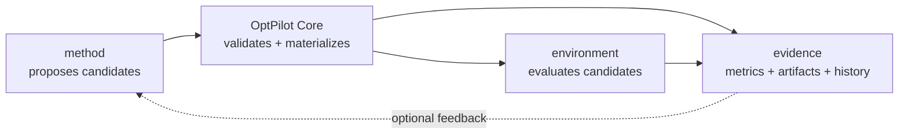
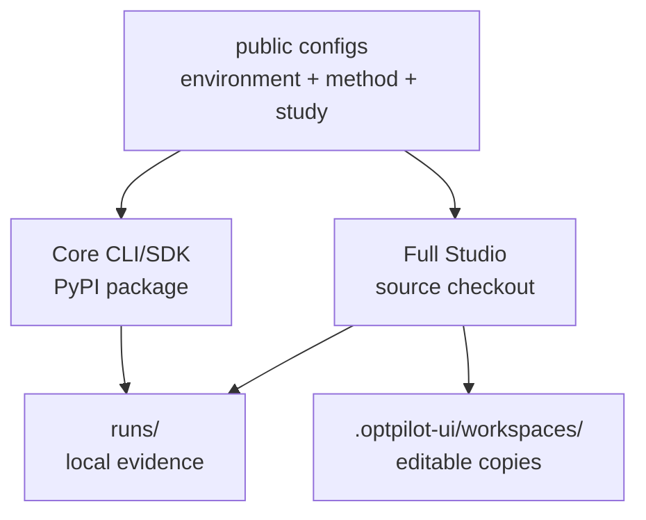

# OptPilot

OptPilot is an orchestration layer for iterative optimization studies. It lets
you connect a user-owned **method** to a user-owned **environment**, run
candidate solutions, collect objective metrics, and keep the evidence needed to
inspect, compare, and reproduce a study.

OptPilot does not replace your simulator, solver, benchmark, RL trainer, LLM
workflow, or metaheuristic. Those pieces stay in your code. OptPilot supplies
the public contract, runtime loop, and evidence model around them.

## The Core Idea

Every run follows the same loop:

The three public config roles map onto that loop:

| Config role | Question it answers |
| --- | --- |
| `environment` | What can be evaluated, what candidate shape is valid, and how are metrics returned? |
| `method` | How are candidates proposed, and which environment contracts can the method use? |
| `study` | Which environment and method should run together, with which objective, budget, and execution policy? |

Environment and method configs are reusable. Study configs are concrete run
plans.

## Two Ways To Use OptPilot

OptPilot has two installation modes:

- **Core CLI/SDK**: install from PyPI when you want to validate packages and run
  studies in your own project without the GUI.
- **Source checkout for tutorial and Studio**: clone the repository when you
  want the local Studio UI, workspace management, assistant integration, and
  bundled tutorial package.

Start with [Installation](installation.md) to choose the right mode.

## Supported Today

OptPilot currently provides:

- JSON Schema validation for public environment, method, and study configs,
  plus optional catalog resource manifests
- package validation for folders containing OptPilot configs
- parameter, file, and opaque candidate contracts
- Python and command evaluators
- Python and command methods, including batch-style and session-style method
  protocols
- local process and Docker/Podman-compatible runtime execution where configs
  declare it
- local evidence stores with summaries, observations, candidates, trial records,
  method calls, scheduler events, and retained output files
- a full source-checkout Studio for browsing packages, launching studies,
  managing editable workspace copies, inspecting runs, and optionally using an
  assistant

OptPilot intentionally does not provide a production optimizer, remote cluster
backend, hosted multi-user service, automatic dependency inference, or a generic
replacement for domain-specific solvers and simulators.

## Documentation Map

Read the docs in this order if you are new:

1. [Installation](installation.md): choose Core CLI/SDK or full Studio.
2. [First Job-Shop Run](getting-started.md): complete one small run and inspect
   its evidence.
3. [OptPilot Core](concepts.md): learn environments, methods, studies,
   candidates, runtime workspaces, and evidence.
4. [Packages and Catalogs](catalog.md): understand how reusable environments,
   methods, resources, and studies are organized.
5. [Job-Shop Tutorial Map](examples.md): run the built-in example package and see
   several method families target the same evaluation problem.
6. [OptPilot Studio](ui.md): use the local GUI, workspace manager, and assistant.

Use [Configuration Reference](configuration.md) when you need the allowed YAML
fields and [How a Run Works](how-it-works.md) when you need the runtime sequence.

## What Ships Where?

The PyPI core package contains the CLI, SDK, schemas, runner, runtime helpers,
evidence store, and package validation command.

The source checkout also contains:

- `catalog/example_package/`: the built-in job-shop tutorial package
- `studio/`: the OptPilot Studio UI package
- docs, tests, and contributor tooling

A package that works with the core CLI can be dropped into a Studio catalog root
later. That is the intended path: integrate with the schema first, then use
Studio for browsing, editing copies, launching studies, and inspecting runs.
