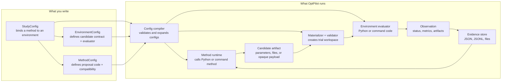

# OptPilot

OptPilot is a lightweight orchestration layer for iterative optimization studies.
It lets you connect a user-owned method to a user-owned environment, run candidate solutions, collect objective metrics, and keep the complete evidence trail for inspection or reuse.

The project is deliberately small in scope:

- OptPilot does not own your simulator, dataset, evaluator, LLM agent, Bayesian optimizer, RL loop, or metaheuristic.
- OptPilot owns the contract between those pieces: how a method proposes a candidate, how an environment evaluates it, how results are recorded, and how a study is repeated.

## The Core Idea

Most optimization projects have the same shape:

1. A method proposes something to try.
2. An environment evaluates that candidate.
3. The measured result is recorded.
4. The method uses prior evidence to propose the next candidate.

OptPilot makes that loop explicit and reproducible.

## The Three Public Configs

OptPilot users normally author three YAML files:

| Config | Purpose | Points to code? |
| --- | --- | --- |
| `EnvironmentConfig` | Describes what a valid candidate looks like, how to evaluate it, where metrics come from, and what files or records should be saved. | Yes. `evaluate.callable`, `evaluate.command`, custom metric extractors, and optional interfaces point to environment-side implementation. |
| `MethodConfig` | Describes a method that proposes candidates and declares which environments it can work with. | Yes. `implementation.callable` or `implementation.command` points to method-side implementation. |
| `StudyConfig` | Chooses one environment config, one method config, objective, instances, budget, execution backend, and evidence settings. | Usually no direct code. It mostly references environment and method config files. |

The most important distinction is this:

- Environment configs define the candidate contract and evaluator.
- Method configs declare compatibility with that contract.
- Study configs bind one concrete pair and decide how long and where to run it.

## Where To Start

- Follow [Getting Started](getting-started.md) to run the strategic-airlift example.
- Read [How A Run Works](how-it-works.md) to understand the runtime procedure.
- Use [Configuration](configuration.md) when writing YAML files.
- Use [User Catalog](user-catalog.md) when adding your own environments and methods.
- Use [UI](ui.md) when browsing compatible methods, launching studies, and inspecting runs.
