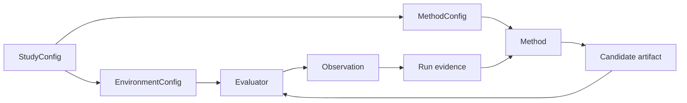

# OptPilot

OptPilot is an orchestrator for AI-assisted iterative optimization over measured objectives.
It standardizes how studies connect optimization methods to evaluation environments, run candidates, record evidence, and preserve reproducibility.

OptPilot is intentionally not an optimizer, simulator, reinforcement-learning framework, or LLM agent framework. Those remain user-owned. OptPilot provides the protocol and runtime that let those components run as repeatable studies.

## What You Author

Every study is built from three public config kinds:

- `EnvironmentConfig`: how an environment evaluates candidates and reports metrics.
- `MethodConfig`: how a user-owned method proposes candidates.
- `StudyConfig`: which environment and method to bind, plus objective, instances, budget, and runtime settings.

## Quick Links

- Start with [Getting Started](getting-started.md).
- Learn the model in [Concepts](concepts.md).
- Use the full [Configuration Reference](configuration.md).
- Add your own integrations with [User Catalog](user-catalog.md).
- Browse and launch studies with the [UI](ui.md).

## Current Surface

- CLI commands: `optpilot run`, `optpilot ui`
- Python entrypoint: `optpilot.runner.run_study`
- Local evidence store: JSON, JSONL, and file-backed run directories
- Local process, subprocess, and Docker/Podman-compatible execution backends
- Python and command method runtimes
- Batch and Python session method protocols
