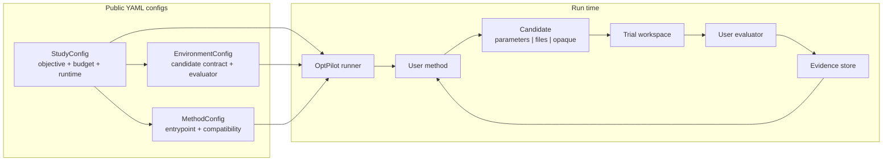

# OptPilot

OptPilot is a lightweight orchestration layer for iterative optimization studies.
It connects a user-owned optimization method to a user-owned evaluation environment, runs candidate solutions, records objective results, and keeps the evidence needed to inspect, resume, compare, or reproduce a study.

OptPilot does not try to become your simulator, dataset evaluator, LLM agent, Bayesian optimizer, RL trainer, or metaheuristic. Those pieces stay in your code. OptPilot provides the contract and runtime around them:

- what a method must return
- how the environment evaluates it
- how each trial workspace is prepared
- how metrics, records, output files, and provenance are stored
- how compatible environments and methods are discovered and launched

## Core Loop

Every OptPilot run follows the same loop:

```text
method proposes candidate
runner validates and materializes candidate
environment evaluates materialized candidate
runner records evidence
```

That loop supports parameter search, file/code evolution, simulator control, metaheuristics, Bayesian optimization, LLM agents, LLM-assisted methods, and coarse-grained wrappers around existing search repositories.



## Three Files Users Write

OptPilot users normally write three public YAML configs.

| Config | What it answers |
| --- | --- |
| `config: environment` | What can be evaluated? What candidate format is valid? Which evaluator code runs? Where do metrics and output files come from? |
| `config: method` | How is the method invoked? Which candidate formats and environment context fields can it work with? |
| `config: study` | Which environment and method are paired? What objective, instances, budget, runtime, and evidence policy are used for this run? |

The split is intentional. Environment and method configs are reusable components; study configs are concrete run plans.

## Start Here

1. Run the first example with [Getting Started](getting-started.md).
2. Read [Concepts](concepts.md) for the mental model.
3. Read [Methods](methods.md), [How A Run Works](how-it-works.md), and [Evidence](evidence.md) when you want the runtime model.
4. Use [Examples](examples.md) and [Job-Shop Environment](job-shop-environment.md) to choose a method track.
5. Use [Configuration](configuration.md) and [User Catalog](user-catalog.md) when you start writing your own YAML files.

For personal or team use, put your own integrations under `user_catalog/`; the UI scans both `examples/` and `user_catalog/` automatically.
