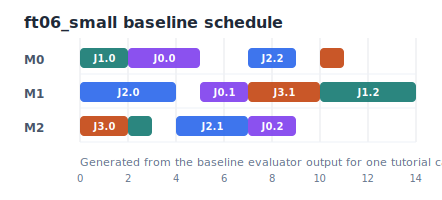
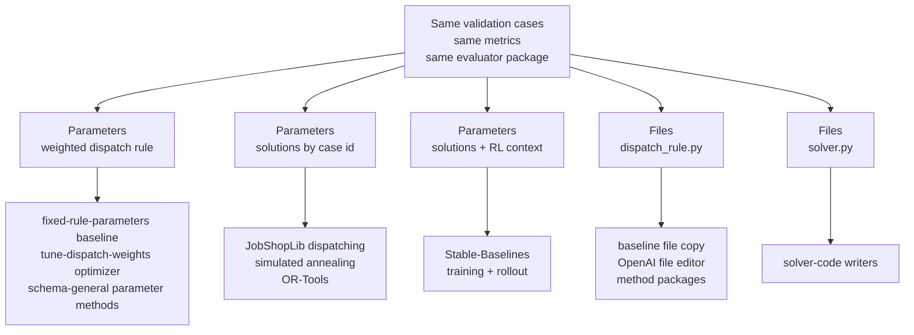

# Job-Shop Environment

The job-shop scheduling example is the main cross-method tutorial environment.
It demonstrates the core OptPilot idea: keep evaluation stable, then connect
different methods by changing only the candidate contract.

## Shared Comparison Setup

The runnable job-shop studies are designed as a comparison set. Where the candidate contract allows it, they use the same:

- validation cases: `ft06_small.yaml`, `la01_tiny.yaml`, and `ft06_standard.yaml`
- objective: minimize `normalized_makespan`
- secondary metrics: `makespan`, `tardiness`, and `utilization`
- budget: baseline studies use `maxTrials: 1`; the dependency-free tuning study uses `maxTrials: 12`
- execution policy: local study orchestration, usually with `parallelism: 1`; the tuning study uses `parallelism: 3`

The study file is the binding point. Each study chooses one environment config,
one method config, the objective, budget, execution policy, evidence level, and
seed. Validation cases live in each environment config's
`evaluator.settings`.

## What It Evaluates

A job-shop instance contains jobs, operations, machine assignments, and processing times. A candidate produces either:

- weighted dispatch-rule parameters
- complete schedule solutions
- a generated `dispatch_rule.py`
- a generated `solver.py`

The evaluator converts each candidate into a schedule, or validates schedules
that the candidate already contains. It returns:

- `makespan`
- `normalized_makespan`
- `tardiness`
- `utilization`
- `feasible`
- `operation_count`

The primary tutorial objective is:

Study `objective` fragment:

```yaml
objective:
  metric: normalized_makespan
  direction: minimize
```

For each case:

```text
normalized_makespan = makespan / reference bound
```

The evaluator reports numeric metrics as the arithmetic mean across the cases
listed in `evaluator.settings.cases`. Lower `normalized_makespan` is better.



The figure is generated from the baseline evaluator output for one tutorial
case. The docs use it only as a visual cue: the actual run evidence is written
under each run's `trials/<trial-id>/attempt-1/` directory.

## Job-Shop Contract Matrix

The same environment implementation has reusable config variants. They keep the
same job-shop problem and metrics, but expose different candidate contracts so
different method families can connect cleanly.

| Environment config | Candidate contract | Method examples |
| --- | --- | --- |
| `environment_rule_parameters.yaml` | weighted dispatch-rule `parameters` | fixed parameter baseline, tune-dispatch-weights, schema-general parameter methods |
| `environment_schedule_solution.yaml` | `parameters.spec.solutions` keyed by validation case id | JobShopLib dispatching, simulated annealing, OR-Tools CP-SAT |
| `environment_schedule_solution_rl.yaml` | same schedule-solution candidate, plus RL training references | Stable-Baselines training and rollout |
| `environment_dispatch_rule.yaml` | `files` containing `dispatch_rule.py` | baseline file copy, OpenAI file editor, method packages that write priority rules |
| `environment_solver_code.yaml` | `files` containing `solver.py` | solver-code writers |



The environment configs are not method-specific solver adapters. They are
contracts for the same evaluation problem.

One limitation is intentional: `solutions` is declared as an object because
case ids are environment-specific. OptPilot checks the top-level candidate
shape and required context paths. The evaluator enforces the detailed schedule
shape, case ids, and feasibility.

## What Methods Can See

The environment exposes information to methods only when it is useful before
proposal time:

- `environment_rule_parameters.yaml` exposes the parameter schema through the
  compiled candidate context and the validation cases through
  `methodContext.references`.
- `environment_schedule_solution.yaml` exposes validation cases through
  `methodContext.references`.
- `environment_schedule_solution_rl.yaml` exposes validation cases, RL training
  cases, and the RL adapter through `methodContext.references`.
- `environment_dispatch_rule.yaml` and `environment_solver_code.yaml` expose
  prompt instructions through `methodContext.instructions` and validation cases
  through `methodContext.references`.

The evaluator still owns the cases and scoring logic. Methods may read the
allowed context, but they do not own the environment inputs.

## JobShopLib Method Families

[JobShopLib](https://github.com/Pabloo22/job_shop_lib/tree/main/job_shop_lib) exposes several useful job-shop method families. OptPilot connects them on the method side:

| JobShopLib area | What it provides | OptPilot connection |
| --- | --- | --- |
| `dispatching.rules` | `DispatchingRuleSolver` and built-in priority rules such as shortest processing time, first-come first-served, most work remaining, and random operation. | Turnkey `job-shop-lib-dispatching-rule` method emits schedule-solution candidates. |
| `metaheuristics` | `SimulatedAnnealingSolver`, annealing helpers, neighbor generators, and objective helpers. | Turnkey `job-shop-lib-simulated-annealing` method emits schedule-solution candidates. |
| `constraint_programming` | `ORToolsSolver` for CP-SAT based job-shop solving. | Turnkey `job-shop-lib-ortools-cpsat` method emits schedule-solution candidates. |
| `reinforcement_learning` | Gymnasium-style single-instance and multi-instance graph environments, reward observers, and rollout utilities. | Runnable Stable-Baselines3 method emits schedule-solution candidates. |

The environment does not import JobShopLib and does not know which of these
produced a schedule. JobShopLib imports live in
`catalog/example_package/methods/...`, and each wrapper translates the
JobShopLib schedule into the neutral `solutions` candidate expected by the
schedule-solution environment config it targets.

## Connect Another Schedule Method

Use `environment_schedule_solution.yaml` when the method can produce a complete
schedule from validation-case references alone. Use
`environment_schedule_solution_rl.yaml` when the method also needs
environment-owned RL training cases and the Gymnasium adapter. The method
wrapper should:

1. read job-shop case references from `methodContext.references`
2. convert each case payload into the solver's preferred representation
3. run the solver, rule, metaheuristic, or policy rollout
4. convert the result into `solutions.<case_id>.operations`
5. return a `parameters` candidate with `spec: {solutions: ...}`

The bundled wrappers share this shape through `catalog/example_package/methods/job_shop_lib_solvers.py`:

```python
solutions = solve_job_shop_cases(study_state, lambda: MyJobShopLibSolver(...))
return [{
    "candidate_id": "...",
    "format": "parameters",
    "spec": {"solutions": solutions},
}]
```

That is the main OptPilot boundary. A CP-SAT model, simulated annealer,
dispatching rule, trained RL policy, Gurobi model, or LLM-controlled search can
all connect this way as long as the final candidate is a valid schedule
solution.

## Where To Run Each Method

Start with the dependency-free parameter baseline:

```bash
uv run optpilot validate catalog/example_package/studies/job_shop_rule_parameters_baseline.yaml
uv run optpilot run catalog/example_package/studies/job_shop_rule_parameters_baseline.yaml
```

Then use the method pages for the track you want: [Dispatching Rule Methods](dispatching-rule-methods.md), [Simulated Annealing Methods](simulated-annealing-methods.md), [OR-Tools CP-SAT Methods](cp-sat-methods.md), [Reinforcement Learning Methods](reinforcement-learning-methods.md), or [LLM Code-Writing Methods](llm-code-methods.md). Dependency-free baseline and tuning studies run from a fresh checkout. JobShopLib, CP-SAT, simulated annealing, and Stable-Baselines examples require `uv sync --all-packages --group examples`.

## Weighted-Rule Parameter Contract

`environment_rule_parameters.yaml` accepts a parameter candidate:

Candidate-contract fragment:

```yaml
candidate:
  format: parameters
  parameters:
    schema:
      remaining_work_weight:
        valueType: float
        min: -5.0
        max: 5.0
      processing_time_weight:
        valueType: float
        min: -5.0
        max: 5.0
```

The evaluator converts these weights into a priority dispatching rule. The
fixed-rule baseline emits one parameter setting. The `tune-dispatch-weights`
method reads the same schema from the candidate context, proposes several
bounded settings from a deterministic grid, and keeps the environment
unchanged. It is intentionally simple: the improvement comes from evaluating
multiple valid parameter candidates through OptPilot, not from a hidden solver
inside the method.

## Schedule-Solution Contract

`environment_schedule_solution.yaml` accepts complete schedules keyed by validation case id:

Candidate-contract fragment:

```yaml
candidate:
  format: parameters
  parameters:
    schema:
      solutions:
        valueType: object
        properties: {}
```

For `parameters` candidates, `schema` is a map from parameter name to parameter definition. Here `solutions` is the single top-level parameter. Its value is an object that contains one schedule per validation case. Other environments might define different top-level parameters such as `rule`, `weights`, or `solver_settings`; this environment chooses `solutions` because a schedule-producing method submits a bundle of finished schedules.

Candidate proposal `spec` payload fragment produced by a schedule-solving
method:

```yaml
solutions:
  ft06_small:
    operations:
      - job: 0
        operation: 0
        machine: 0
        start: 0
        end: 3
  la01_tiny:
    operations:
      - job: 0
        operation: 0
        machine: 0
        start: 0
        end: 2
  ft06_standard:
    operations:
      - job: 0
        operation: 0
        machine: 0
        start: 0
        end: 1
```

The keys `ft06_small`, `la01_tiny`, and `ft06_standard` come from the environment config's case ids. The environment also exposes those case files to methods through `methodContext.references`, so a solver method can solve the exact benchmark set used by the evaluator.

During evaluation, OptPilot passes the proposal `spec` into the evaluator as
candidate runtime data. For this environment, the evaluator reads the
top-level `solutions` object from that runtime data.

This contract is suitable for any method that produces finished schedules: JobShopLib, OR-Tools, Gurobi, a trained RL policy, or an internal company solver. The environment only validates and scores schedules. It does not know which method or library produced them.

Schedule-producing methods declare the format and context they need, and may
require the environment capability that says complete schedule solutions are
accepted:

Method compatibility fragment:

```yaml
accepts:
  formats: [parameters]
  requires:
    context:
      - candidate.parameters.schema
      - methodContext.references
    capabilities:
      - schedule-solution-candidate
```

The important part is that the environment owns the accepted candidate schema.
The method can come from OR-Tools, JobShopLib simulated annealing,
Stable-Baselines, Gurobi, or something else; OptPilot validates the submitted
candidate against the environment contract during the run.

## Dispatch-Rule File Contract

`environment_dispatch_rule.yaml` accepts one editable file:

Candidate-contract fragment:

```yaml
candidate:
  format: files
  materialize:
    root: candidate
  files:
    editable:
      - path: dispatch_rule.py
```

The generated file must define:

```python
def score(operation, machine, state):
    ...
```

Higher scores are scheduled first.

## Solver-Code File Contract

`environment_solver_code.yaml` accepts one editable file:

Candidate-contract fragment:

```yaml
candidate:
  format: files
  materialize:
    root: candidate
  files:
    editable:
      - path: solver.py
```

The generated file must define:

```python
def solve(instance, time_limit_seconds, context):
    ...
```

The evaluator independently validates the returned schedule. A generated solver does not get credit for an infeasible schedule.

Use this file contract when the candidate itself is code. For example, an LLM code-writing method may produce a new `solver.py`; a JobShopLib wrapper should normally produce schedule solutions instead.

## Wrapper Principle

The job-shop example is written as a thin wrapper. `simulator.py` represents the environment-facing scheduling API; `evaluator.py` is the OptPilot boundary.

For your own environment, follow the same pattern:

1. use the existing Python API, CLI, output files, or database
2. write a small evaluator wrapper beside it
3. define a candidate contract
4. keep method code outside the environment

## Next: Choose A Method Track

After you understand the environment configs, choose the method page that matches the optimizer you want to connect:

- [Dispatching Rule Methods](dispatching-rule-methods.md)
- [Simulated Annealing Methods](simulated-annealing-methods.md)
- [OR-Tools CP-SAT Methods](cp-sat-methods.md)
- [Reinforcement Learning Methods](reinforcement-learning-methods.md)
- [LLM Code-Writing Methods](llm-code-methods.md)
- [Packages and Catalogs](catalog.md)
