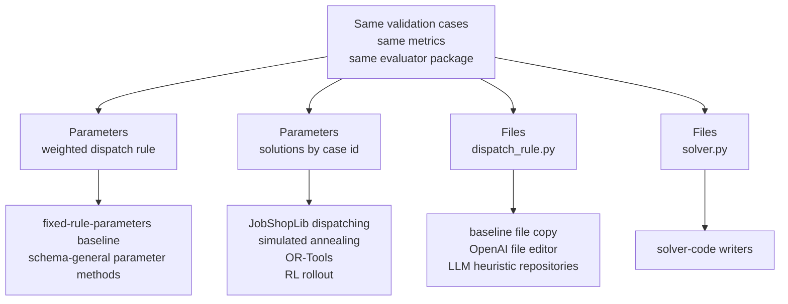

# Job-Shop Environment

The job-shop scheduling example is the main cross-method tutorial environment.

It demonstrates the core OptPilot idea: keep the environment boundary stable, then connect very different methods through candidate contracts.

## Shared Comparison Setup

The runnable job-shop studies are designed as a comparison set. Where the candidate contract allows it, they use the same:

- validation cases: `ft06_small.yaml` and `la01_tiny.yaml`
- objective: minimize `normalized_makespan`
- secondary metrics: `makespan`, `tardiness`, and `utilization`
- budget: `maxTrials: 1`
- runtime: local execution with `parallelism: 1`

The study file is the binding point. Each study chooses one environment config, one method config, the objective, budget, execution runtime, evidence level, and seed. The validation cases live in each environment config's `evaluator.settings`.

## What It Evaluates

A job-shop instance contains jobs, operations, machine assignments, and processing times. A candidate produces either:

- weighted dispatch-rule parameters
- complete schedule solutions
- a generated `dispatch_rule.py`
- a generated `solver.py`

The evaluator simulates or validates the resulting schedule and returns:

- `makespan`
- `normalized_makespan`
- `tardiness`
- `utilization`
- `feasible`
- `operation_count`

The primary tutorial objective is:

Study `objective` fragment:

```yaml
objective:
  metric: normalized_makespan
  direction: minimize
```

## Environment Config Variants

The same environment implementation has four reusable config variants.

| Config | Candidate format | Intended methods |
| --- | --- | --- |
| `environment_rule_parameters.yaml` | `parameters` | Dependency-free weighted [dispatching rules](dispatching-rule-methods.md) |
| `environment_schedule_solution.yaml` | `parameters` with `solutions` | External solvers and policies, including JobShopLib [dispatching rules](dispatching-rule-methods.md), [simulated annealing](simulated-annealing-methods.md), [OR-Tools CP-SAT](cp-sat-methods.md), and [reinforcement learning](reinforcement-learning-methods.md) |
| `environment_dispatch_rule.yaml` | `files` with `dispatch_rule.py` | [Dispatching rules](dispatching-rule-methods.md), [LLM code-writing methods](llm-code-methods.md), curated method packages |
| `environment_solver_code.yaml` | `files` with `solver.py` | [LLM code-writing methods](llm-code-methods.md) and user-provided solver-code methods |

This is intentional: the problem and metrics stay the same, while the candidate contract changes.



The environment configs are not method-specific solver adapters. They are candidate contracts for the same evaluation problem.

## JobShopLib Method Families

[JobShopLib](https://github.com/Pabloo22/job_shop_lib/tree/main/job_shop_lib) exposes several useful job-shop method families. OptPilot connects them on the method side:

| JobShopLib area | What it provides | OptPilot connection |
| --- | --- | --- |
| `dispatching.rules` | `DispatchingRuleSolver` and built-in priority rules such as shortest processing time, first-come first-served, most work remaining, and random operation. | Turnkey `job-shop-lib-dispatching-rule` method emits schedule-solution candidates. |
| `metaheuristics` | `SimulatedAnnealingSolver`, annealing helpers, neighbor generators, and objective helpers. | Turnkey `job-shop-lib-simulated-annealing` method emits schedule-solution candidates. |
| `constraint_programming` | `ORToolsSolver` for CP-SAT based job-shop solving. | Turnkey `job-shop-lib-ortools-cpsat` method emits schedule-solution candidates. |
| `reinforcement_learning` | Gymnasium-style single-instance and multi-instance graph environments, reward observers, and rollout utilities. | Runnable Stable-Baselines3 method emits schedule-solution candidates. |

The environment does not import JobShopLib and does not know which of these produced a schedule. JobShopLib imports live in `catalog/example_package/methods/...`, and each wrapper translates the JobShopLib schedule into the neutral `solutions` candidate expected by `environment_schedule_solution.yaml`.

## Connect Another JobShopLib Method

Use `environment_schedule_solution.yaml` when the method can produce a complete schedule. The method wrapper should:

1. read job-shop case references from `methodContext.references`
2. convert each case payload into the solver's preferred representation
3. run the solver, rule, metaheuristic, or policy rollout
4. convert the result into `solutions.<case_id>.operations`
5. return a `parameters` candidate with `spec: {solutions: ...}`

The bundled wrappers share this shape through `catalog/example_package/methods/job_shop_lib_solvers.py`:

```python
solutions = solve_job_shop_cases(study_state, lambda: MyJobShopLibSolver(...))
return [{
    "candidate_id": "...",
    "format": "parameters",
    "spec": {"solutions": solutions},
}]
```

That is the main OptPilot boundary. A CP-SAT model, simulated annealer, dispatching rule, trained RL policy, Gurobi model, or LLM-controlled search can all connect this way as long as the final candidate is a valid schedule solution.

## Run The Baselines

Parameter baseline:

```bash
uv run optpilot validate catalog/example_package/studies/job_shop_rule_parameters_baseline.yaml
uv run optpilot run catalog/example_package/studies/job_shop_rule_parameters_baseline.yaml
```

File dispatch-rule baseline:

```bash
uv run optpilot validate catalog/example_package/studies/job_shop_dispatch_rule_baseline.yaml
uv run optpilot run catalog/example_package/studies/job_shop_dispatch_rule_baseline.yaml
```

Solver-code baseline:

```bash
uv run optpilot validate catalog/example_package/studies/job_shop_solver_code_baseline.yaml
uv run optpilot run catalog/example_package/studies/job_shop_solver_code_baseline.yaml
```

JobShopLib dispatching rule:

```bash
uv sync --extra examples
uv run optpilot validate catalog/example_package/studies/job_shop_lib_dispatching_rule.yaml
uv run optpilot run catalog/example_package/studies/job_shop_lib_dispatching_rule.yaml
```

Simulated annealing:

```bash
uv sync --extra examples
uv run optpilot validate catalog/example_package/studies/job_shop_simulated_annealing.yaml
uv run optpilot run catalog/example_package/studies/job_shop_simulated_annealing.yaml
```

OR-Tools CP-SAT:

```bash
uv sync --extra examples
uv run optpilot validate catalog/example_package/studies/job_shop_ortools_cpsat.yaml
uv run optpilot run catalog/example_package/studies/job_shop_ortools_cpsat.yaml
```

Reinforcement learning policy rollout:

```bash
uv sync --extra examples
uv run optpilot validate catalog/example_package/studies/job_shop_rl_stable_baselines.yaml
uv run optpilot run catalog/example_package/studies/job_shop_rl_stable_baselines.yaml
```

OpenAI-compatible file editor:

```bash
uv run optpilot validate catalog/example_package/studies/job_shop_openai_dispatch_rule.yaml
uv run optpilot run catalog/example_package/studies/job_shop_openai_dispatch_rule.yaml
```

The baseline studies run from a fresh checkout without API keys or provider credentials. The OpenAI-compatible file-editor study is also executable without provider credentials at `maxTrials: 1` because it emits the baseline file candidate first. The JobShopLib dispatching-rule, simulated annealing, CP-SAT, and Stable-Baselines RL studies additionally require the optional `examples` dependency.

## Weighted-Rule Parameter Contract

`environment_rule_parameters.yaml` accepts a parameter candidate:

Candidate-contract fragment:

```yaml
candidate:
  format: parameters
  parameters:
    schema:
      remaining_work_weight:
        valueType: float
        min: -5.0
        max: 5.0
      processing_time_weight:
        valueType: float
        min: -5.0
        max: 5.0
```

The evaluator converts these weights into a priority dispatching rule.

## Schedule-Solution Contract

`environment_schedule_solution.yaml` accepts complete schedules keyed by validation case id:

Candidate-contract fragment:

```yaml
candidate:
  format: parameters
  parameters:
    schema:
      solutions:
        valueType: object
        properties: {}
```

For `parameters` candidates, `schema` is a map from parameter name to parameter definition. Here `solutions` is the single top-level parameter. Its value is an object that contains one schedule per validation case. Other environments might define different top-level parameters such as `rule`, `weights`, or `solver_settings`; this environment chooses `solutions` because a schedule-producing method submits a bundle of finished schedules.

Candidate `spec` payload fragment produced by a schedule-solving method:

```yaml
solutions:
  ft06_small:
    operations:
      - job: 0
        operation: 0
        machine: 0
        start: 0
        end: 3
  la01_tiny:
    operations:
      - job: 0
        operation: 0
        machine: 0
        start: 0
        end: 2
```

The keys `ft06_small` and `la01_tiny` come from the environment config's case ids. The environment also exposes those case files to methods through `methodContext.references`, so a solver method can solve the exact benchmark set used by the evaluator.

This contract is suitable for any method that produces finished schedules: JobShopLib, OR-Tools, Gurobi, a trained RL policy, or an internal company solver. The environment only validates and scores schedules. It does not know which method or library produced them.

Schedule-producing methods declare the same output shape on their side:

Method compatibility fragment:

```yaml
accepts:
  formats: [parameters]
  requires:
    context:
      - candidate.parameters.schema

produces:
  format: parameters
  parameters:
    schema:
      solutions:
        valueType: object
        properties: {}
```

The important part is the structural match: the method produces a `solutions` parameter shaped like the environment's accepted candidate schema. The environment does not need to know whether that schedule came from OR-Tools, JobShopLib simulated annealing, Stable-Baselines, Gurobi, or something else.

## Dispatch-Rule File Contract

`environment_dispatch_rule.yaml` accepts one editable file:

Candidate-contract fragment:

```yaml
candidate:
  format: files
  materialize:
    root: candidate
  files:
    editable:
      - path: dispatch_rule.py
```

The generated file must define:

```python
def score(operation, machine, state):
    ...
```

Higher scores are scheduled first.

## Solver-Code File Contract

`environment_solver_code.yaml` accepts one editable file:

Candidate-contract fragment:

```yaml
candidate:
  format: files
  materialize:
    root: candidate
  files:
    editable:
      - path: solver.py
```

The generated file must define:

```python
def solve(instance, time_limit_seconds, context):
    ...
```

The evaluator independently validates the returned schedule. A generated solver does not get credit for an infeasible schedule.

Use this file contract when the candidate itself is code. For example, an LLM code-writing method may produce a new `solver.py`; a JobShopLib wrapper should normally produce schedule solutions instead.

## Wrapper Principle

The job-shop example is written as a thin wrapper. `simulator.py` represents the environment-facing scheduling API; `evaluator.py` is the OptPilot boundary.

For your own environment, follow the same pattern:

1. use the existing Python API, CLI, output files, or database
2. write a small evaluator wrapper beside it
3. define a candidate contract
4. keep method code outside the environment

## Next: Choose A Method Track

After you understand the environment configs, choose the method page that matches the optimizer you want to connect:

- [Dispatching Rule Methods](dispatching-rule-methods.md)
- [Simulated Annealing Methods](simulated-annealing-methods.md)
- [OR-Tools CP-SAT Methods](cp-sat-methods.md)
- [Reinforcement Learning Methods](reinforcement-learning-methods.md)
- [LLM Code-Writing Methods](llm-code-methods.md)
- [Curated Packages](curated-packages.md)
