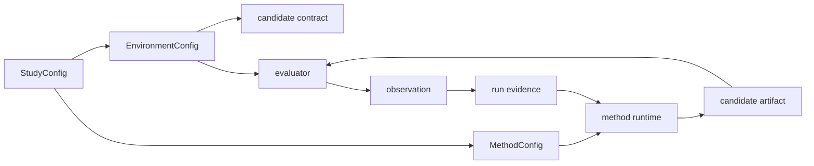

# Method Runtime Design

OptPilot exposes one optimization abstraction: `method`.

The method owns whatever loop the user wants: Bayesian optimization, RL training, LLM code editing, a hand-written heuristic, an existing agent workflow, or a command-line tool. OptPilot does not split that implementation into separate study-policy and candidate-generation components.



## Authoring Shape

```yaml
apiVersion: optpilot.io/v1
kind: MethodConfig
id: baseline-file-copy

implementation:
  type: python
  callable: python:examples.methods.baseline_file_copy.method:BaselineFileCopyMethod
  protocol: optpilot.method.batch.v1

config:
  batchSize: 1

compatibility:
  candidateTypes: [files]
  artifactKinds: [code_bundle]
  requiredContext: [files.source, files.editable]
```

`implementation.type` is `python` or `command`. Python methods support both batch and session protocols. Command methods support the batch protocol.

Command methods can optionally declare an execution runtime:

```yaml
runtime:
  type: container
  image: my-agent-image:latest
  containerExecutable: docker
  networkPolicy: disabled
  build:
    context: .
    dockerfile: Dockerfile.agent
    tag: my-agent-image:latest
```

This runs the method command itself inside a container. It is useful for existing LLM agents, Bayesian optimization scripts, RL trainers, or other user-owned workflows that already have their own dependency stack.

## Runtime Responsibilities

OptPilot owns:

- compiling config into `StudySpec`
- validating method/environment compatibility
- constructing candidate context
- evaluating returned candidates
- recording observations, artifacts, method calls, scheduler events, and lineage

The method owns:

- the search or training algorithm
- internal memory, prompts, models, policies, and retries
- candidate proposal decisions
- optional interpretation of prior evidence

## Evidence Files

Runs record method activity through:

- `method_calls.jsonl`
- `method_events.jsonl` when emitted by the method

Observations and artifacts carry `method_id` provenance.

## Batch Protocol

A batch method is asked to propose one or more candidates and then receives observations after evaluation.

Python methods can implement:

```python
def propose(self, n_candidates, study_state):
    ...

def observe(self, observations):
    ...
```

or the lifecycle shape:

```python
def start(self, method_input): ...
def poll(self, handle): ...
def finalize(self, handle): ...
def intervene(self, handle, action): ...
```

Command methods receive a JSON request on stdin unless their command contains `{input_file}` or `{output_file}` placeholders. The response is JSON with `candidates` or `artifacts`.

## Container Execution

The current implementation has two independent container boundaries:

- Method runtime containers run command methods through a Docker/Podman-compatible CLI.
- Execution backend containers run trial evaluation workers through a Docker/Podman-compatible CLI.

Both container boundaries can build a local image from a declared `build` block before launching. OptPilot does not infer dependencies or generate Dockerfiles; users keep dependency declarations in their own Dockerfiles and OptPilot runs the declared build.

Python methods run in the host process context today. Existing Python agents that need isolated dependencies can be exposed as command methods and launched with `runtime.type: container`.
