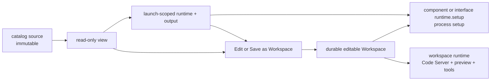

# Workspace Management

Studio separates immutable selections, temporary execution realizations, and
durable editable work. The **Workspaces** list contains only projects that the
user can edit. Viewing registered Catalog source, opening a Run, viewing
Candidate files, or launching an interface does not create a Workspace.

A durable Workspace appears only after an explicit editing or preservation
action: **Open local folder**, **Edit in Workspace**, or **Save as Workspace**.
When that project is already linked, the corresponding action becomes **Open
Workspace**.

## Workspace Types

| Workspace type | How it is created | Typical use |
| --- | --- | --- |
| Connected local project | Open local folder | Work directly in a server-authorized existing folder without copying it. Removing the Studio reference does not delete the folder. |
| Catalog-derived project | Edit in Workspace | Modify a registered Catalog version without editing that version in place. |
| Candidate-derived project | Edit in Workspace | Continue working with an eligible complete project retained by a Run. |
| Saved generated output | Save as Workspace | Preserve temporary generator/interface output before its launch ends. |

Read-only Catalog source may reuse Code Server behind a **Registered version ·
Read-only** presentation, but its support record is hidden from Workspaces.
Runs open directly as recorded evidence. Interfaces use temporary launch
storage until a generated output is explicitly saved.

Studio-owned metadata is stored under `.optpilot-ui/`. Realm-managed editable
projects live in provider-private Realm storage and are addressed by Workspace
id and revision rather than by a public storage path. Neither location is
authored Catalog source.

When Studio opens a Realm-managed checkout in Code Server or Preview, it
authorizes only the exact open root reconciled by the active Realm provider. It
does not grant access to the surrounding checkout namespace or to arbitrary
paths under Application Support.

## Setup And Runtime

The user-facing rule is that `runtime.setup` describes dependencies; it never
edits Catalog source. OptPilot prepares those dependencies in private storage
and mounts the result read-only beside the source. The supported recipe is
explicit for each execution target.

For a retained Environment or Method, the current process-runtime recipe is
`cache: prepared` with one `python-venv` step pointing to package-relative lock
files. Those locks may contain only vendored, hash-locked pure-Python wheels.
**Check** validates the declaration and paths. **Test** verifies hashes and runs
the exact prepared layers through the ordinary retained Study path. No setup
shell, package-index network, host secret, editable install, or native wheel is
accepted. The resulting layer may be reused from the local cache, but each Run
retains its exact dependency tree as evidence.

A Resource interface has a separate live-interface setup contract. Its
dependency output is launch-scoped by default; a sealed Catalog interface can
opt into exact-provider/path reuse with `runtime.setup.cache: prepared`. Studio
then mounts that cached layer read-only on later launches while output,
control, logs, HOME, and scratch remain launch-scoped. Container runtimes use
their image or build configuration instead of `runtime.setup`; the public
schema rejects `runtime.setup` on container runtimes.

Prepared cache identity includes the exact catalog selection, normalized setup
and component config, immutable workspace-runtime image digest, platform, and
provider/cache path. Production cache bytes live in OS-local Realm application
storage, never in a project or synchronized checkout. Failed setup commits no
entry, concurrent misses are single-flight, and active launch leases prevent
eviction. Editable live Workspaces do not share this cache because they do not
yet provide an immutable source revision at this launch boundary.

Interface setup does not receive interface launch secrets. Cache-enabled
interface setup that needs network access is an explicit package-author opt-in
and remains scoped to the exact local provider/path; it is not portable Run
evidence. Retained Environment/Method dependency preparation never enables
network access.

Declared outputs are sealed with their runtime-visible executable semantics.
On macOS, Docker transport ownership metadata is treated as non-content only
when strict validation proves that its complete permission mode agrees with the
host descriptor; a disagreement fails capture instead of changing the tree.

Typical setup work includes:

- syncing Python dependencies
- installing Node dependencies
- building a local helper app
- preparing a component-specific runtime directory

Studio does not infer dependencies automatically. The package author should
declare the setup commands needed for the component to run.



## Embedded Code Server

Studio can open a workspace in an embedded Code Server editor. The Code Server
process runs inside a per-workspace Docker/Podman-compatible container by
default.

Useful launch options:

```bash
uv run optpilot ui \
  --workspace-runtime-bin docker \
  --workspace-runtime-image optpilot/workspace-dev:latest \
  --workspace-runtime-port-start 18766
```

When no image is specified, Studio builds and uses
`optpilot/workspace-dev:latest` from the packaged runtime Dockerfile. The image
includes Code Server, Python, `uv`, Node.js, npm, git, ripgrep, and common build
tools.

## Preview Ports

If a workspace starts a web app, bind it to `0.0.0.0` inside the workspace
runtime. Studio can proxy that port back to the browser through the workspace
preview panel.

For catalog entries with an `interface` block, Studio automates this flow:

1. expose catalog source read-only
2. allocate private launch-scoped dependency, runtime, control, output, and
   frontend storage
3. run declared setup steps and the interface command
4. wait for the configured `readyPath`
5. open the configured port in Preview
6. capture completed outputs reported by the interface and offer **Save as
   Workspace** for folders

After a successful save, the card offers **Open Workspace** and **Set up for
Catalog**; both point to the same saved Workspace. Stopping with an unsaved
ready output asks whether to save, discard, or cancel. Once stopping is
confirmed, Studio proves the runtime terminal, captures any final reported
output, and releases launch-scoped storage.

## Runtime Defaults

Workspace containers default to:

- `2` CPUs
- `4g` memory
- process limit `1024`
- Docker/Podman `no-new-privileges`

Override with environment variables:

```bash
OPTPILOT_WORKSPACE_RUNTIME_IDLE_TIMEOUT_SECONDS=3600
OPTPILOT_WORKSPACE_RUNTIME_CPUS=4
OPTPILOT_WORKSPACE_RUNTIME_MEMORY=8g
OPTPILOT_WORKSPACE_RUNTIME_PIDS_LIMIT=2048
OPTPILOT_WORKSPACE_RUNTIME_NO_NEW_PRIVILEGES=true
```

Studio stops idle workspace containers after the configured idle timeout when no
assistant session, selected editor, or reachable Code Server is using them. It
does not delete workspace files or runtime cache.

## Image Allowlist

Hosted deployments can restrict workspace images:

```bash
OPTPILOT_WORKSPACE_RUNTIME_IMAGE_ALLOWLIST="optpilot/workspace-dev:*,ghcr.io/coder/code-server:*,registry.example.com/optpilot/*"
```

When an allowlist is configured, Studio refuses to build, pull, or start a
workspace runtime image outside the allowed patterns.
