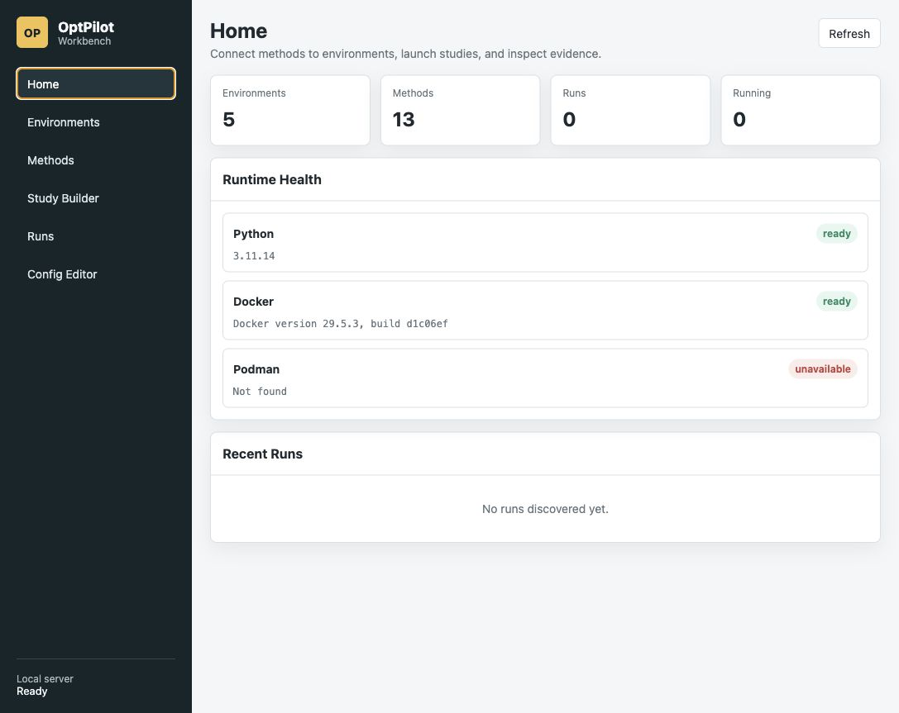
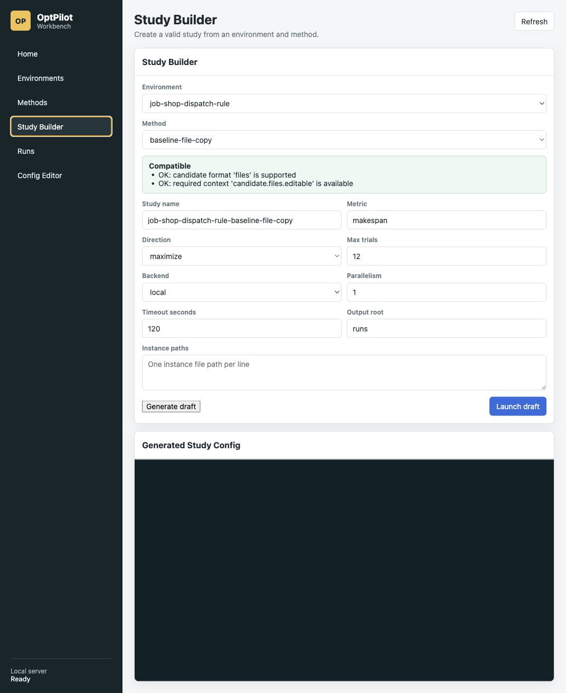
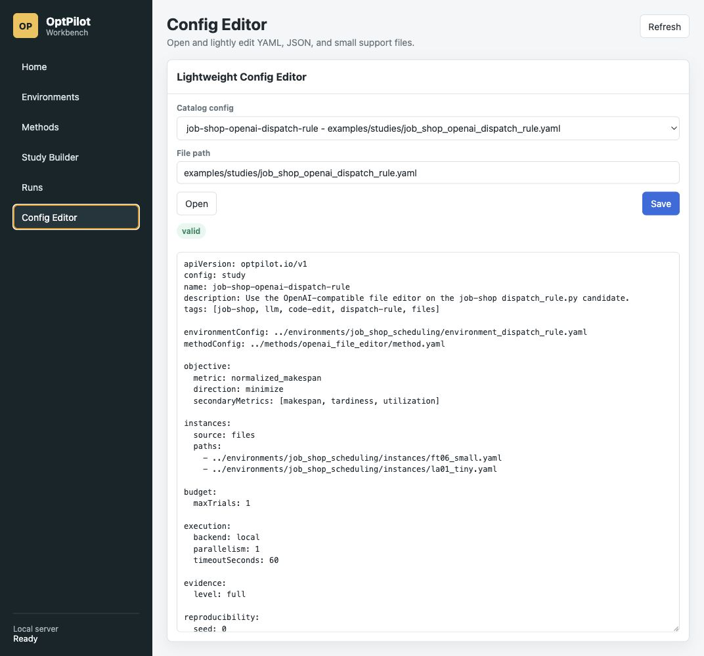

# UI

OptPilot includes a lightweight local web UI.

```bash
uv run optpilot ui --open-browser
```

This starts a local server and opens the browser. Stop the server with `Ctrl-C`
in the terminal when you are done.

## Assistant-Enabled Startup

For the full Studio experience with the OpenHands assistant and embedded VS Code
editor, run these services locally:

```bash
# Terminal 1: OpenHands agent server
OPENHANDS_SUPPRESS_BANNER=1 uv run agent-server --host 127.0.0.1 --port 8781

# Terminal 2: OptPilot Studio
uv run optpilot ui --host 127.0.0.1 --port 8866
```

The embedded VS Code server is managed by OptPilot Studio. Start it from the
Editor page, or trigger it after the GUI is up:

```bash
curl -s -X POST http://127.0.0.1:8866/api/code-server/start \
  -H "Content-Type: application/json" \
  -d "{\"folder\":\"$PWD\"}" | uv run python -m json.tool
```

Expected local ports:

- OptPilot Studio: `http://127.0.0.1:8866/`
- VS Code server: `http://127.0.0.1:8766/`
- OpenHands agent server: `http://127.0.0.1:8781/`

By default, the UI scans:

- `examples/`
- `user_catalog/`

You can pass explicit roots:

```bash
uv run optpilot ui --catalog user_catalog --runs runs
```

## What The UI Does

- Browse environments, methods, and studies.
- Inspect method/environment compatibility.
- Draft and validate study configs.
- Launch studies.
- Track UI-launched jobs.
- Inspect previous run directories, trials, candidate records, events, and files.

## Screenshots

Home:



Study Builder:



Config Editor:



## Design Boundary

The UI is a local-first workbench. It does not replace a full IDE, and it does not embed simulator-specific visualizations into the core platform. Environment-specific assets and frontends can still live beside the environment implementation.
