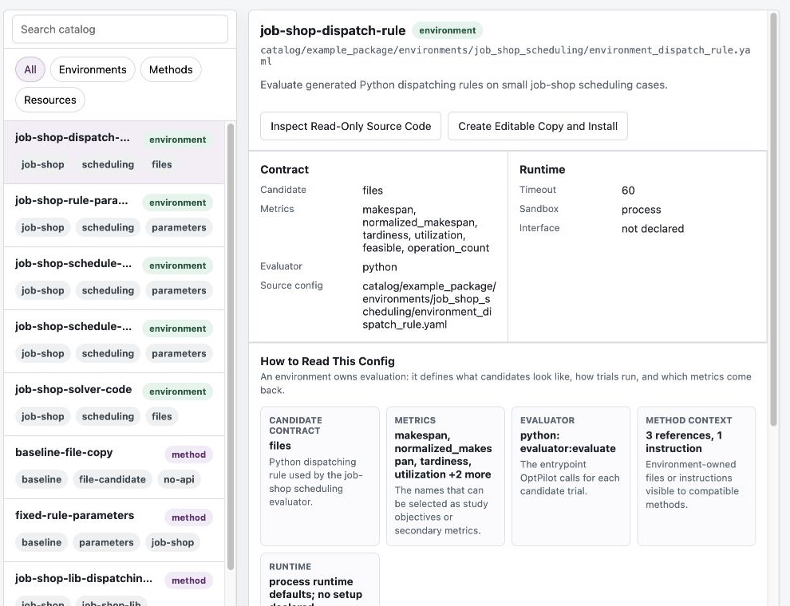

# OptPilot Studio

OptPilot Studio is the local web UI for OptPilot. It is included in the full
source checkout, not in the PyPI core package.

Use Studio when you want to:

- browse package environments, methods, resources, and studies
- inspect read-only catalog source
- create editable workspace copies
- configure and launch studies from forms
- inspect run metrics, trials, candidates, events, runtime logs, and artifacts
- manage local environment variables and secrets
- use the optional OpenHands-backed OptPilot Assistant

## Start Studio

First install the full source checkout from [Installation](installation.md).

Then run:

```bash
uv run optpilot ui --open-browser
```

The default URL is usually:

```text
http://127.0.0.1:8765/
```

Studio scans packages under `catalog/` by default. The bundled tutorial package
is `catalog/example_package/`.

## First 10 Minutes In Studio

Start with this path:

1. Open **Catalog** and inspect the bundled job-shop environments and methods.
2. Open **Studies** and select `job_shop_rule_parameters_baseline.yaml`.
3. Inspect the environment, method, and study forms.
4. Launch the dependency-free baseline study.
5. Open **Runs** and watch the metric, trials, candidates, events, runtime logs,
   and files update.
6. Open the run as a workspace when you want to inspect evidence files in the
   embedded editor.
7. Use **Create Editable Copy and Install** when you want to modify package
   source without changing catalog source.
8. Use **Settings** to configure assistant runtime and Studio-managed
   environment variables.



_Captured from the current Studio source checkout with `catalog/example_package/` loaded._

## Main Views

| View | What it is for |
| --- | --- |
| Catalog | Browse reusable environments, methods, resources, and study files from packages. |
| Studies | Edit and launch concrete study YAML files through configuration forms. |
| Runs | Inspect completed and running study evidence. |
| Workspaces | Open editable copies, local folders, and run-analysis workspaces. |
| Settings | Configure assistant settings and platform-level environment variables. |

Catalog source should be treated as immutable. Actions that execute or edit a
catalog entry create an editable workspace copy first.

## Catalog Actions

Catalog entries may expose these actions:

| Action | Behavior |
| --- | --- |
| Inspect Read-Only Source Code | Opens the package source directly without creating an editable copy. |
| Create Editable Copy and Install | Copies the package source into a workspace and runs declared setup steps. |
| Launch Interface | Creates an editable copy, runs setup, starts the declared interface command, and opens its preview. |
| Launch Study | Runs the selected study using OptPilot Core and records evidence under `runs/`. |

For the package model behind these entries, see
[Packages and Catalogs](catalog.md).

## Platform Status

The Studio sidebar reports the local services it can see:

| Service | Meaning |
| --- | --- |
| Studio | The local UI server is reachable. |
| Code Server | The embedded editor for the selected workspace is reachable. |
| OpenHands | The assistant runtime is configured and reachable. |
| Sandbox | The workspace container runtime is available. |

Not every workflow requires every service. Browsing the catalog and launching
CLI-style studies only require Studio and the core runner. Editing workspaces in
the embedded editor requires Code Server. Assistant tool execution requires
OpenHands and a workspace runtime.

## Related Pages

- [Workspace Management](studio-workspaces.md): editable copies, Code Server,
  previews, and workspace containers.
- [OptPilot Assistant](assistant.md): OpenHands setup, assistant settings,
  tools, approvals, and secrets.
- [Installation](installation.md): why Studio is source-checkout only.
