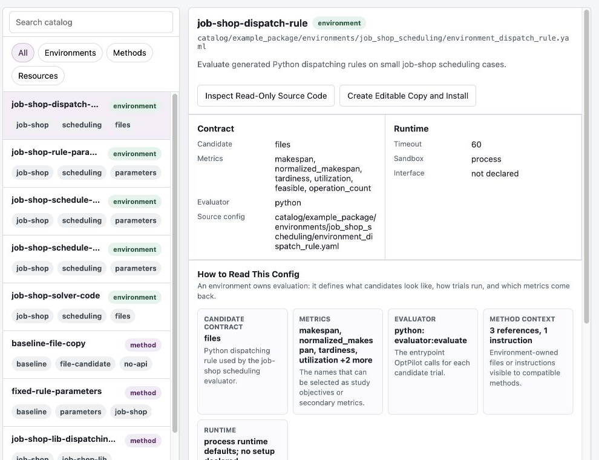

# OptPilot Studio

OptPilot Studio is the local web UI for OptPilot. It is included in the full
source checkout, not in the PyPI core package.

Studio is organized around one working loop:

1. Start in a **Conversation** and describe what you want to accomplish.
2. Let the Assistant recommend published Catalog capabilities, or open **Catalog** to
   browse Environments, Methods, and Resources directly.
3. Review the setup or inputs before anything runs.
4. Operate a simulator or other rich interface in the full main area, or let
   OptPilot run the work in the background.
5. Return to a Conversation and recover running interfaces and Runs from
   **Open work**. Durable items remain in Run setups, Runs, and Workspaces.

Conversation is the default surface, but it is not the only way to use Studio.
Catalog remains directly browsable, and focused interfaces do not depend on the
Assistant remaining visible.

## Start Studio

First install the full source checkout from [Installation](installation.md).

Then run:

```bash
uv run optpilot ui --open-browser
```

The default URL is usually:

```text
http://127.0.0.1:8765/
```

Studio scans packages under `catalog/` by default. The largest bundled package
is `catalog/production_agv_scheduling/`.

## First 10 Minutes In Studio

Start with this path:

1. On the opening Conversation, choose a suggested intent or describe a problem
   in your own words.
2. Review the Environment, Method, or Resource cards recommended by the
   Assistant. Open **Catalog** whenever you want to inspect the available
   components yourself.
3. Ask to evaluate one of the ready-made Run setups, or find
   **Tutorial · Find better factory settings** in Catalog.
4. Review the **Run setup**: Environment, Method, objective, direction, and
   budget. Expand its detailed configuration only when needed.
5. Choose **Launch run** explicitly. Starting work is never implied by ordinary
   Assistant prose.
6. Follow the running item in **Open work**. Open the Run to inspect its
   Overview and Candidates; **Trials**, **Trial attempts**, **Trial results**,
   **Saved files**, and **Event history** are under **More**.
7. Open a Candidate. Its saved values and evaluation details load directly.
   Use **View files** without creating a Workspace, and choose **Try once** or
   **Open interactive interface** when eligible.
8. In a full-stage interface, choose **Ask from this page** to open the currently
   selected Conversation without restarting the interface. Studio includes the
   current page and selected object as read-only context for that request. This
   does not create another Conversation or make any Workspace available. If no
   Conversation is selected, start or select one first. Returning to a
   Conversation or closing the interface view does not itself stop the
   underlying work.
9. Choose **Edit in Workspace** only when you want an eligible complete project
   to become durable editable work. For a configured mutable source, use
   **Link local folder**.
10. Use **Settings** to configure the assistant runtime and declared local
    values. They are stored as plaintext in the project-scoped
    `.optpilot-ui/settings.json` and are not copied into Run evidence; a
    synchronized project directory may synchronize that file. Studio Settings
    is not a secret vault.



_Captured from the Studio source checkout with the bundled `catalog/` packages loaded._

## Navigation And Working Surfaces

The left rail separates conversations from the three durable OptPilot
destinations. You never need to remember which conversation created a Study,
Run, or Workspace in order to find it again.

| Item | What it is for |
| --- | --- |
| New conversation | Start a separate problem or line of work. |
| Catalog | Browse reusable Environments, Methods, and Resources directly. |
| Run setups (Studies) | Configure or reopen a Run setup, then launch a Run. |
| Runs | Monitor active Runs and inspect retained results. |
| Conversations | Return to earlier discussions and their associated work. |
| Settings | Configure the Assistant, approval defaults, and project-scoped local values. |

A **Conversation** is the durable discussion thread. **OptPilot Assistant** is
the participant that responds and acts inside that thread; it is not a second
kind of conversation. The **Ask from this page** action on Catalog, Study, Run,
Candidate, Workspace, and interface surfaces opens the currently selected
Conversation with the visible page as additional context.

Conversation cards are deliberately compact: they show a topic title, current
state, and only a nonzero Workspace count. Studio derives an immediate title
from the first substantive request, and the Assistant can refine it during the
same turn or after a material change of goal. The rail does not show a total
Conversation count or repeat “New conversation” on every card.

When a Workspace is open, the Conversation list is replaced by a compact
list of editable projects. Read-only Catalog source never appears in that list.
Use **Manage Workspaces** in the Conversation Workspace panel to open the
editable Workspace surface at any time.

On the Conversation surface, the right-hand **Workspaces in this conversation**
panel shows only the editable Workspaces that the current Conversation can use.
This is not another Workspace collection: each project remains a durable
Workspace with its own lifetime, and no files are copied. **Add Workspace**
makes a project available, **Open Workspace** opens
the ordinary editable surface, **Make default** chooses the file and command
target used when a request does not name one, and **Remove** affects only the
current Conversation. It never deletes the Workspace or removes it from Catalog.

Current-page context and Conversation Workspaces are deliberately different. Asking
about a Catalog item, Run, Candidate, or interface gives the Conversation a
bounded read-only description of that selection. A Workspace becomes editable
Assistant context only after the user explicitly makes that Workspace available
in **Workspaces in this conversation**.

Creating a Workspace or adding a local folder from this panel makes it available
to the current Conversation immediately. At narrower widths the same panel
moves above the Conversation and can be collapsed, so it does not squeeze the
message area.

The current browser addresses for Catalog entries, Studies, Runs, Candidates,
Workspaces, and interfaces remain refresh-safe. Existing bookmarks and links
such as `#/studies/...`, `#/runs/...`, and `#/workspaces/...` continue to open
the corresponding focused surface. User-facing surfaces present the saved
configuration that binds an Environment, Method, objective, and budget as a
**Run setup**; `study` remains the configuration kind name in the YAML schema,
API routes, and CLI commands.

## Open Work

**Open work** is a compact process monitor, not a new kind of saved object. It
contains only work that may continue — or is waiting on you — while you leave
its page:

- an interface that is starting, running, stopping, failed, or needs cleanup
- a Run that is still being prepared or needs attention
- a queued, preparing, running, or stopping Run
- a Conversation with a pending approval (the card returns you to that
  Conversation to approve or reject; it never creates a new one)
- a finished interface session whose reported outputs are still reviewable
  (the card returns you to its outputs; dismiss it once you are done)

It does not contain Conversations as such, Workspaces, read-only source
viewers, saved Studies, completed Runs, or ordinary Assistant messages.
Workspaces stay out deliberately: a Workspace is a durable saved object with
its own named destination, not a process that finishes — listing it here
would blur "work in flight" with "work you keep". Durable items live in their
named destinations and stay reachable from there.

Select an item to open its normal detailed surface. Leaving that surface does
not cancel a Run or stop an interface. Completed Runs remain under **Runs**,
saved Run setups remain under **Run setups**, Workspaces remain under
**Workspaces**, and Assistant activity remains with its Conversation.

## Source Viewer And Workspace Editor

The same full-stage workbench is reused for two deliberately different modes:

| Mode | What you see | What it means |
| --- | --- | --- |
| **Read-only Catalog item** | A **Source** tab, a static component name, and an **Open source** action. | These are the exact published files. Inspecting them does not create a Workspace and cannot modify the Catalog version. |
| **Workspace · Editable** | **Code**, optional **Interface**, and **Publish** tabs, an editable Workspace name, and an **Open Workspace editor** action. | This is durable editable work listed under Workspaces. |

Choose **Edit in Workspace** from a Catalog source only when you actually want
an editable project. That explicit action creates or reopens the editable
boundary; merely viewing source does not.

## Assistant Cards And Run Setups

The Assistant currently presents three structured card families: published
Catalog recommendations, Run setups, and Runs (including a Run launch while it
is being prepared). A card carries the exact Catalog reference or object
identity behind the recommendation. Catalog recommendation cards may offer a
declared interface, and Run setup cards may open their Workspace; these are
actions on those cards, not separate interface, Workspace, or output card
families. Buttons on a card invoke known Studio actions; links or prose generated
in a chat message do not become privileged actions.

A Run setup exposes the common choices directly:

- Environment and Method
- objective metric and direction
- evaluation budget
- compatibility and readiness
- advanced execution and evidence settings when needed

The Assistant may propose values, but the user can inspect and change them.
Launching remains an explicit, approval-aware action. For arbitrary component
settings that do not have a declared form contract, Studio shows the known
inputs and lets the user inspect the underlying YAML instead of guessing field
semantics.

## Full-Stage Interfaces

Environments, Methods, and Resources may declare interactive interfaces. When
one is opened, it occupies the main area so the user can operate it without a
permanent split-screen Conversation. Use **Ask from this page** to reveal the
currently selected Conversation as an overlay and include the interface as
read-only page context. Hiding the overlay preserves both the Conversation and
the live interface session.

Catalog interfaces run over read-only published source plus private,
launch-scoped runtime and output storage. Workspace interfaces run from the
selected editable Workspace. Candidate interfaces retain their exact Run,
Candidate, and job coordinates. Studio never puts presentation credentials in
the refresh-safe address.

## Catalog And Workspace Actions

Catalog entries may expose these actions:

| Action | Behavior |
| --- | --- |
| View source | Opens the published version read-only without creating a Workspace. |
| Edit in Workspace | Creates or reopens one editable Workspace for intentional changes. |
| Open interface | Starts the declared interface over read-only source and temporary launch storage. Prepared dependencies may be reused. |
| Run Resource action | Shows the registered command, network grant, timeout, and environment/secret names, then asks for confirmation. The current host executor runs only reviewed actions that declare `network: enabled`; secret values stay hidden and are redacted from results. |
| Configure Run setup | Choose a compatible Environment or Method and open a Run setup while preserving the exact Catalog reference. |

A configured source card is labeled **Local source · Mutable**. **Link local
folder** connects that existing folder as one editable Workspace without
copying it and opens the normal **Publish** flow.

Selecting a Run opens its recorded evidence directly; there is no public
“Open as Workspace” step. Candidate values and evaluation details load directly,
and **View files** is a short-lived bounded file view. **Edit in Workspace** creates
or reopens durable editable work only for an eligible complete project.
**Save to Shortlist** keeps a decision and its note inside the source Run
without creating a Workspace or runtime.

When comparing file Candidates, Studio first shows the sealed manifest changes.
Use **View text diff** on one added, removed, or changed file to inspect its
contents. This is a direct, read-only operation over the two exact retained
Candidate trees. Text diffs are intentionally bounded to strict UTF-8 files no
larger than 48 KiB and 4,000 lines per side. If a complete diff cannot be
returned, Studio explains why; use **View files** for broader manual inspection.

The **Shortlist** tab appears after its first Candidate is saved. Edit the
Shortlist name, Candidate notes, membership, and order, then choose **Save
changes**. **More** contains saved history, export, and **Delete Shortlist**.
Viewing an earlier saved version does not discard unsaved edits to the current
one, and deleting a Shortlist never deletes its source Run.

When **Try once** or **Open interactive interface** finishes, the result
offers **Save inspection to Shortlist** for an already-saved Candidate or
**Save Candidate and inspection** otherwise. This preserves bounded terminal
results, not the live process or interface.

For the package model behind these entries, see
[Packages and Catalogs](catalog.md).

## Platform Status

Studio reports the local services it can see:

| Service | Meaning |
| --- | --- |
| Studio | The local UI server is reachable. |
| Code editor | The embedded editor is reachable; its current implementation uses code-server. |
| Assistant | The Conversation assistant is configured and reachable; its current tool runtime uses OpenHands. |
| Sandbox | The Workspace container runtime is available. |

Not every workflow requires every service. Browsing Catalog and launching
CLI-style Studies only require Studio and the core runner. Editing Workspaces in
the embedded Code editor requires code-server. Assistant tool execution requires
OpenHands and, for Workspace actions, a Workspace runtime.

## Related Pages

- [Workspace Management](studio-workspaces.md): editable projects, Code Server,
  previews, and Workspace containers.
- [OptPilot Assistant](assistant.md): conversations, OpenHands setup, Assistant
  cards, tools, approvals, and local credential handling.
- [Installation](installation.md): why Studio is source-checkout only.
