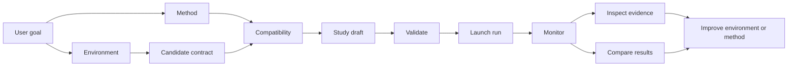
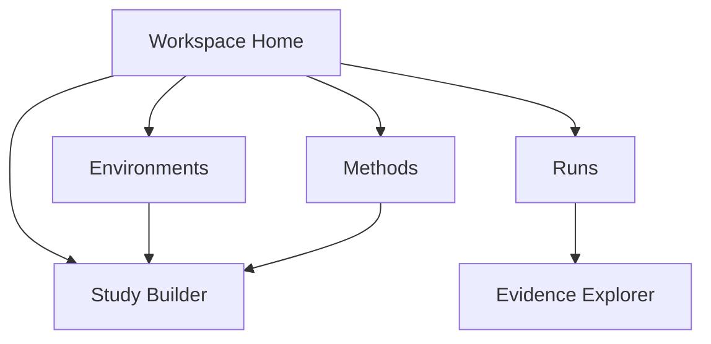

# OptPilot UI Overhaul Design

This document defines the intended product direction for the OptPilot UI.

The UI should not be a thin YAML launcher. It should be a local-first experiment workbench for connecting optimization methods to environments, validating compatibility, launching studies, monitoring progress, comparing results, and inspecting evidence.

## Product Goal

OptPilot helps users run optimization studies where methods and environments remain user-owned. The UI should make that model visible and usable:



The UI should keep the core OptPilot boundary clear:

- Environments define what can be evaluated.
- Methods define how candidates are proposed.
- Studies bind one environment to one method under an objective, budget, instances, and runtime policy.
- Runs record what actually happened.

## Target Users

### Industry Problem Owner

This user has a real problem and wants a better solution. They may have a simulator, evaluator, historical dataset, or operational scoring script. They do not primarily care about OptPilot internals.

Primary needs:

- Register or inspect an environment.
- Understand what candidate surface the environment exposes.
- See compatible methods immediately.
- Launch several studies with different methods.
- Compare results by objective, failures, runtime, and best candidate.
- Export or reuse the best candidate.

The UI should optimize this user's first path:

```text
Select environment -> see compatible methods -> choose objective/budget -> launch -> compare results
```

### Method Developer

This user builds Bayesian optimization, RL, metaheuristic, LLM-agent, or hybrid methods. They want to test a method across environments and debug behavior.

Primary needs:

- Register or inspect a method.
- See compatible environments.
- Understand why a method is incompatible with an environment.
- Test command/Python method integration.
- Inspect method calls, emitted events, candidates, and observations.
- Configure method runtime containers and environment variables.

### Environment Developer

This user owns a simulator, benchmark, or evaluator contract.

Primary needs:

- Define the candidate contract.
- Define metrics and artifacts.
- Configure evaluator execution and container image/build settings.
- Run validation checks before launching a study.
- See which existing methods can use the environment.
- Inspect evaluator failures and output files.

### Research Or Platform Operator

This user runs many studies and cares about evidence and reproducibility.

Primary needs:

- Monitor running jobs.
- Compare previous studies.
- Inspect run policies, build/runtime metadata, seeds, and environment snapshots.
- Identify failed trials and recurring errors.
- Export run evidence for review.

## Design Principles

1. Start from user intent, not files.
2. Make compatibility visible before launch.
3. Keep YAML available but secondary.
4. Prefer structured controls for common settings.
5. Make runtime boundaries explicit: method runtime and environment execution are separate.
6. Treat evidence as a first-class product surface.
7. Do not become a full IDE.
8. Do not embed environment-specific visualization into the core UI.

The UI can show files, logs, configs, and artifacts. It should not try to replace VS Code or build simulator-specific visualizations directly into the platform.

## Information Architecture

The redesigned UI should have six primary areas.



Default catalog discovery should be deliberately narrow:

- `examples/` for curated built-in integrations.
- `user_catalog/` for user-owned configs, assets, and implementation code.

Users can still pass explicit `--catalog` roots for advanced workflows, but the default UI should not scan the entire repository.

### Workspace Home

Purpose: provide a compact operational overview.

Content:

- Running jobs.
- Recent runs.
- Recently edited studies.
- Best recent results.
- Runtime health, including local Python and Docker availability.

This page should not be a marketing landing page. It should be an operational dashboard.

### Environments

Purpose: make environments inspectable and connect them to compatible methods.

List view:

- Environment name/id.
- Candidate type.
- Artifact kind.
- Metrics.
- Evaluator type.
- Runtime requirement summary.
- Compatible method count.

Detail view:

- Candidate contract summary.
- Parameter schema or file candidate policy.
- Metrics and extraction rules.
- Evaluator invocation.
- Workspace copy rules.
- Runtime/build settings.
- Compatible methods.
- Incompatible methods with reasons.
- Past studies using this environment.

Important interaction:

```text
Open environment -> compatible methods are visible without creating a study
```

### Methods

Purpose: make methods inspectable and connect them to compatible environments.

List view:

- Method name/id.
- Implementation type: Python or command.
- Protocol.
- Supported candidate types.
- Supported artifact kinds.
- Runtime type: host or container.
- Compatible environment count.

Detail view:

- Method config.
- Compatibility declaration.
- Runtime/container/build settings.
- Required context and required capabilities.
- Compatible environments.
- Incompatible environments with reasons.
- Past studies using this method.
- Method event/call examples from previous runs.

### Study Builder

Purpose: guide users from environment and method selection to a valid launch.

The builder should support two entry modes:

- Environment-first: user chooses an environment, then sees compatible methods.
- Method-first: user chooses a method, then sees compatible environments.

Recommended flow:


Builder sections:

- Environment selection.
- Method selection.
- Compatibility result.
- Objective and aggregation.
- Instances.
- Budget.
- Method config.
- Method runtime.
- Environment execution backend.
- Evidence level and output root.
- Generated YAML preview.
- Validation result.
- Launch action.

The builder should never silently allow an incompatible pairing. It can allow advanced override only when the validation error is explicit and the user intentionally switches to YAML mode.

### Runs

Purpose: monitor current and previous studies.

List view:

- Run name.
- Status.
- Environment.
- Method.
- Objective.
- Best metric.
- Completed/failed trials.
- Start/finish time.

Detail view:

- Summary.
- Metric chart.
- Trial table.
- Best candidate.
- Observations.
- Artifacts.
- Method calls/events.
- Scheduler events.
- Runtime/build metadata.
- Files.
- Logs.

Runs should support comparison:

- Select multiple runs.
- Compare objective values.
- Compare failure rates.
- Compare methods.
- Compare runtime/backend settings.
- Compare best candidates.

### Evidence Explorer

Purpose: inspect what happened in a run without leaving the UI.

The evidence explorer should include:

- File tree for the run directory.
- Read-only file preview for JSON, YAML, CSV, logs, and text.
- Structured viewers for observations, trials, artifacts, method calls, method events, scheduler events, run policy, lineage, and environment snapshot.
- Links from table rows to related files.

This is a file explorer for evidence, not a general system file manager.

## Compatibility Matrix

Compatibility should be a first-class UI concept.

For every environment/method pair, the UI should compute:

- compatible: true/false
- candidate type match
- artifact kind match
- required context availability
- required capability availability
- implementation/runtime warnings

Example reasons:

```text
Compatible
- method supports candidateTypes: parameters
- environment candidate.type is parameters
- method supports artifactKinds: parameter_spec
- environment artifactKind is parameter_spec
- requiredContext parameters.schema is available
```

```text
Not compatible
- method supports candidateTypes: parameters
- environment candidate.type is files
```

The matrix should be available in:

- Environment detail: methods grouped by compatible/incompatible.
- Method detail: environments grouped by compatible/incompatible.
- Study Builder: incompatible options hidden by default, with an option to show them and explain why.

## File Explorer And Code Editor

### File Explorer

The UI should include a file explorer for:

- run evidence
- generated artifacts
- logs
- method call workspaces
- trial workspaces
- config files referenced by catalog entries

It should support:

- read-only preview
- syntax-aware formatting for JSON/YAML
- CSV table preview for small files
- download/open path affordances
- size limits

### Code Editor

The UI should include a lightweight editor for small config and support files:

- EnvironmentConfig
- MethodConfig
- StudyConfig
- Dockerfiles
- small scripts or prompt files

It should not try to become a full IDE for large method/environment codebases. Large code editing should stay in the user's normal editor. The UI can show paths and validation errors.

Recommended editor behavior:

- Structured form is primary for common fields.
- YAML mode is available for advanced editing.
- Validation runs after edits.
- Generated YAML preview is visible in the Study Builder.
- Save writes only explicit user-edited files.

## Screen-Level Design

### Workspace Home Layout

```text
Top bar: workspace path, Docker status, refresh

Left navigation:
- Home
- Environments
- Methods
- Study Builder
- Runs

Main:
- Running jobs table
- Recent runs table
- Runtime health
```

### Environment Detail Layout

```text
Header:
  environment id, tags, evaluator type

Left:
  candidate contract
  metrics
  evaluator/runtime settings

Right:
  compatible methods
  incompatible methods with reasons
  recent runs

Actions:
  create study with this environment
  validate environment
  open config
```

### Method Detail Layout

```text
Header:
  method id, implementation type, protocol

Left:
  compatibility declaration
  method config
  runtime/build settings

Right:
  compatible environments
  incompatible environments with reasons
  recent runs

Actions:
  create study with this method
  validate method
  open config
```

### Study Builder Layout

```text
Step 1: Environment and method
Step 2: Objective and instances
Step 3: Runtime and build settings
Step 4: Review and launch

Right side:
  compatibility explanation
  generated YAML preview
  validation result
```

### Run Detail Layout

```text
Header:
  run name, status, environment, method, objective

Summary:
  best metric, completed trials, failures, elapsed time

Tabs:
  Overview
  Trials
  Candidates
  Metrics
  Events
  Runtime
  Files
```

## API Additions Needed

The current UI API can list catalog entries, runs, jobs, and run files. The overhaul needs more structured endpoints.

Recommended endpoints:

```text
GET  /api/workspace
GET  /api/catalog
GET  /api/environments
GET  /api/environments/{id}
GET  /api/methods
GET  /api/methods/{id}
GET  /api/compatibility
POST /api/studies/draft
POST /api/studies/validate
POST /api/studies/launch
GET  /api/runs
GET  /api/runs/{id}
GET  /api/runs/{id}/file?path=...
GET  /api/config/file?path=...
POST /api/config/file
GET  /api/runtime/health
```

`/api/compatibility` should return pairwise environment/method compatibility with reasons.

`/api/studies/draft` should accept structured builder input and return a generated StudyConfig draft plus validation results.

Run comparison can be computed client-side from `GET /api/runs/{id}` payloads for selected runs.

## Data Model For UI State

The UI should normalize catalog data into these entities:

```text
EnvironmentSummary
MethodSummary
StudySummary
CompatibilityResult
RunSummary
RunDetail
UiJob
RuntimeHealth
```

The backend should avoid forcing the frontend to parse YAML to answer compatibility questions. The server should compile and validate configs, then return structured summaries.

## Current Backend Surface

The local UI server provides the structured backend surface needed for this workbench:

- catalog discovery from `examples/` and `user_catalog/`
- environment, method, and study summaries
- compatibility results for environment/method pairs
- generated StudyConfig drafts
- config file read/write with validation
- UI-launched job tracking
- run directory discovery and evidence inspection
- run file browsing

### Compatibility Checker

Server-side compatibility summaries report:

- Environment -> methods.
- Method -> environments.
- Reasons for incompatibility.
- Tests around candidate type, artifact kind, required context, and capabilities.

### Catalog Pages

The UI should expose:

- Environments list/detail.
- Methods list/detail.
- Compatibility sections.

### Study Builder

The study builder uses structured state:

- Environment-first flow.
- Method filtering.
- Objective/budget/runtime forms.
- Generated YAML preview.
- Validate and launch.

### Run Detail And Evidence Explorer

Run detail should expose:

- Better trial table.
- Runtime/build metadata.
- Linked artifacts.
- File tree and previews.

### Run Comparison

Run comparison should summarize selected runs by:

- Best metrics.
- Failure counts.
- Method/environment.
- Candidate summaries.
- Runtime settings.

### Lightweight Editing

Lightweight editor support should cover config files and small support files:

- YAML validation.
- Save with explicit user action.
- No large-project IDE behavior.

## Non-Goals

The redesigned UI should not:

- Implement domain-specific simulator visualization inside core OptPilot.
- Replace a user's code editor for large codebases.
- Hide YAML completely from advanced users.
- Invent method/environment behavior that is not declared in configs.
- Become a multi-user production platform before the local-first workflow is excellent.

## Success Criteria

The UI overhaul succeeds when:

- A user can open an environment and immediately see compatible methods.
- A user can create and launch a valid study without editing YAML.
- A user can understand why a method is incompatible with an environment.
- A user can compare multiple runs and identify the best candidate.
- A user can inspect evidence, logs, artifacts, runtime settings, and build metadata from the browser.
- Advanced users can still inspect and edit YAML when needed.
