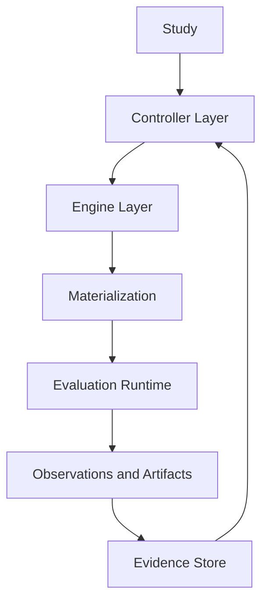

# OptPilot V2: Flexible and Extensible System Design

Historical note: this is an earlier design draft. The current release-facing
config contract is documented in [`config_files_v3alpha.md`](config_files_v3alpha.md).

## 1. Purpose

OptPilot is a platform for improving performance on simulation-driven industrial engineering tasks. The platform should support a wide range of optimization workflows without forcing them into separate product silos.

The system must support cases such as:

- direct parameter search over a simulator
- Bayesian optimization over structured parameters
- meta-heuristic search
- reinforcement learning with rollout workers
- LLM-guided code evolution similar to AlphaEvolve
- LLM-supervised RL or Bayesian optimization, where the LLM configures, monitors, and adapts another optimization process
- nested optimization, where one solver is evaluated by the performance it eventually achieves in the environment

The design goal is not to enumerate every workflow in advance. The design goal is to define a small set of stable abstractions that make these workflows composable.

## 2. Design Stance

The platform should avoid hard-coding categories such as "optimizer families" or rigid candidate subclasses as the primary architectural boundary. Those categories are useful examples, but they are not the most stable abstraction.

The more stable design is based on the following ideas:

1. There is always a target system to evaluate against.
2. There is always a versioned artifact or state being improved.
3. There is always an execution process that turns an artifact into observations.
4. There is always a controller that decides what to try next.
5. There is always stored evidence that can be inspected, retrieved, and reused.

This design treats LLMs, RL trainers, Bayesian optimizers, and evolutionary loops as interchangeable components inside a common control-and-evaluation architecture.

## 3. Core Architectural Decision

The top-level abstraction should be a `Study` rather than an `OptimizerFamily`.

A `Study` is a controlled search process over a target system under a specified objective, budget, and policy envelope. A study may contain one or more controllers and one or more engines. This allows the same framework to support:

- a simple one-layer search loop
- an LLM supervising a Bayesian optimization engine
- an LLM launching and monitoring RL training
- code evolution where the generated code itself is the object under study
- nested studies where an outer controller evaluates the final output of an inner optimization run

This is more extensible than treating RL, BO, and LLM search as three sibling categories.

## 4. Primary Abstractions

### 4.1 Target System

A `TargetSystem` is the system against which performance is measured. In most cases this is a simulation environment, but the abstraction should be slightly broader because the system may include not only the simulator itself but also a surrounding evaluation harness.

A target system should define:

- `target_id`: stable identifier
- `target_version`: version, hash, or snapshot ID
- `adapter_type`: Python callable, CLI program, service endpoint, Gym-like environment, or custom adapter
- `instance_schema`: how concrete problem instances are defined
- `observation_schema`: metrics, traces, tables, files, and events the target may produce
- `runtime_contract`: dependencies, timeout rules, resource needs, and isolation requirements
- `access_policy`: what parts of the target are visible to controllers and engines
- `mutation_boundary`: what parts of the surrounding runtime may be changed by the study

The key point is that the target system is the protected reference world. It is not the same thing as the evolving artifact.

### 4.2 Study

A `Study` is the top-level object representing one optimization effort.

A study should define:

- the target system
- the objective
- the evaluation scope
- the budget
- the controller stack
- the execution policy
- the storage policy
- the reproducibility policy

A study is intentionally broader than an optimizer. It includes the full protocol under which search is performed.

### 4.3 Objective

An `Objective` defines how performance is judged.

It should support:

- a primary metric to maximize or minimize
- optional constraints
- optional secondary metrics for reporting and tie-breaking
- aggregation rules over multiple evaluations
- cost-aware objectives, such as quality adjusted by runtime or compute cost

This matters because many realistic optimization tasks are not simply "maximize a single scalar." The platform should not assume that a trial produces only one number.

### 4.4 Evaluation Scope

An `EvaluationScope` defines what population of instances a study cares about.

Supported modes should include:

- `FixedInstance`: optimize for one concrete instance
- `InstanceSet`: optimize over a fixed benchmark set
- `Distribution`: optimize expected or robust performance over a sampling distribution
- `Curriculum`: optimize over a staged sequence of instance distributions

This abstraction is more future-proof than only distinguishing fixed instance versus distribution.

### 4.5 Optimizable Artifact

A study improves an `OptimizableArtifact`.

This is the artifact-oriented replacement for a rigid candidate class hierarchy. The artifact is the versioned object whose changes may influence performance.

An optimizable artifact should contain:

- `artifact_id`
- `artifact_kind`
- `spec`
- `lineage`
- `generator_record`
- `validation_rules`
- `materialization_plan`

Examples of artifact kinds include:

- parameter specification
- code module
- policy checkpoint
- training specification
- reward function
- search-space definition
- workflow graph
- hybrid bundle of code, parameters, and learned assets

The system should treat these as typed data, not as a rigid taxonomy of top-level platform entities.

### 4.6 Materialization

A `MaterializationPlan` defines how an optimizable artifact becomes runnable.

Examples:

- convert a parameter spec into CLI flags or simulator config files
- inject candidate-owned code into a controlled workspace
- restore a policy checkpoint into an evaluator
- build a training job configuration
- assemble multiple assets into one runtime package

This is one of the most important abstractions in the whole design. It decouples the optimization representation from the execution representation.

### 4.7 Observation

An `Observation` is the normalized result of executing an artifact against the target system.

It should include:

- `trial_id`
- `study_id`
- `artifact_id`
- `target_id`
- `instance_descriptor`
- `status`
- `metric_values`
- `constraint_results`
- `resource_usage`
- `artifacts`
- `event_summary`
- `provenance`

The observation is the common language between execution and control.

### 4.8 Controller

A `Controller` decides what should happen next in a study.

A controller may:

- propose a new artifact
- launch or configure an engine
- inspect intermediate observations
- stop or branch the study
- reallocate budget
- retrieve historical artifacts and traces
- modify the configuration of other components when permitted

Controllers are intentionally broad. An LLM agent belongs here naturally.

### 4.9 Engine

An `Engine` is an execution-capable search or training mechanism that can operate under controller direction.

Examples include:

- Bayesian optimization engine
- CMA-ES engine
- RL training engine
- rollout engine
- code mutation engine
- prompt-construction engine
- static validation engine

An engine is not necessarily the top-level decision maker. In many cases it is subordinate to a controller.

This distinction is what cleanly supports scenarios where an LLM implements and monitors RL or Bayesian optimization.

### 4.10 Trial

A `Trial` is one bounded execution unit inside a study.

Examples:

- evaluate one parameter artifact on one instance
- evaluate one code artifact across a benchmark set
- run one RL training job for a configured budget
- run one Bayesian optimization batch that itself produces a sequence of internal evaluations

The trial abstraction must therefore support both simple evaluations and compound evaluations.

### 4.11 Evidence Store

An `EvidenceStore` is the persistent memory of the system.

It should contain:

- study definitions
- trial records
- observations
- lineage edges
- prompts and retrieved context
- logs
- traces
- generated code
- checkpoints
- tables, CSVs, SQL outputs, and other run artifacts

This should be first-class because LLM-guided search often depends on retrieving selected prior evidence, not just reading the current best score.

## 5. Control Model

The platform should be defined by a layered control model.



This creates a reusable loop:

`Controller chooses or updates artifact/engine -> runtime evaluates -> observations are stored -> controller reacts`

That loop covers simple search, agentic orchestration, and nested optimization.

## 6. Why This Design Is More Flexible

### 6.1 It does not force RL, BO, and LLM search into the same conceptual bucket

RL and Bayesian optimization are often engines. An LLM is often a controller. Sometimes generated code is the artifact under study. Sometimes the generated code itself implements a new engine. This design allows those roles to vary without changing the platform model.

### 6.2 It supports both direct and indirect optimization

Some studies directly optimize a parameter vector or policy. Other studies optimize a solver that then optimizes the target. The outer platform model stays the same because the thing being optimized is always an optimizable artifact evaluated through observations.

### 6.3 It supports nested search cleanly

If the LLM writes a trainer, monitors training, edits the reward function, or changes BO settings, the platform still sees a study containing controllers, engines, trials, and observations.

## 7. Access and Mutation Policies

The platform should represent permissions explicitly.

### 7.1 Access Policy

An `AccessPolicy` defines what a controller or engine may inspect.

Levels may include:

- `BlackBox`: only task description and final observations
- `SchemaAware`: structured input and output schemas
- `TraceAware`: logs, intermediate files, event traces, tables, and databases
- `CodeAwareReadOnly`: environment source code is visible but immutable
- `FullStudyContext`: all study-owned evidence and artifacts are visible

### 7.2 Mutation Policy

A `MutationPolicy` defines what may be changed.

This is separate from visibility. Seeing code is not the same as being allowed to change it.

Mutation scopes may include:

- `NoMutation`
- `StudyArtifactOnly`
- `StudyWorkspaceOnly`
- `EngineConfigOnly`
- `ControllerConfigOnly`

This split is necessary for safety and for maintaining a clean distinction between the protected target system and study-owned evolving artifacts.

## 8. Execution Architecture

The runtime architecture should separate control, scheduling, execution, and storage.

### 8.1 Study Coordinator

The `StudyCoordinator` owns the lifecycle of the study.

Responsibilities:

- initialize study state
- instantiate controllers and engines
- manage study-level budget and stopping rules
- issue trials
- aggregate observations
- support branching and resuming

### 8.2 Scheduler

The `Scheduler` manages dispatch and resource allocation.

It should distinguish at least three execution modes:

- candidate parallelism: many artifacts evaluated at once
- rollout parallelism: many environment episodes for one artifact
- engine parallelism: many subordinate engines running concurrently

This distinction matters because these modes consume resources differently and aggregate evidence differently.

### 8.3 Runtime Worker

A `RuntimeWorker` executes one trial.

Responsibilities:

- prepare workspace
- materialize artifact
- invoke target adapter or engine runtime
- capture observations and artifacts
- enforce timeout, sandbox, and resource limits
- publish results to the evidence store

### 8.4 Adapter Layer

The `AdapterLayer` hides target-specific invocation details.

Adapters may include:

- Python target adapter
- CLI target adapter
- service adapter
- Gym-like adapter
- compound adapter for multi-stage evaluations

## 9. Supporting LLM-Implemented or LLM-Monitored RL and BO

This design must support the following cases naturally.

### 9.1 LLM monitors RL training

- the study artifact may be a training specification or reward definition
- the RL trainer is an engine
- the LLM is a controller
- intermediate learning curves, checkpoints, and episode traces are observations and artifacts
- the controller may revise engine configuration or artifact definitions between trials

### 9.2 LLM supervises Bayesian optimization

- the search space, surrogate settings, acquisition settings, and batching rules may be study-owned artifacts or engine config
- the BO engine runs as a subordinate engine
- the LLM controller inspects search progress and adjusts bounds, priors, or stopping rules

### 9.3 LLM generates a new optimizer implementation

- the study artifact is code implementing a solver or workflow
- a materialization plan packages that code into a study-owned runtime
- the generated solver becomes the engine used in the next trial
- the observation is the final target performance, plus efficiency and robustness metrics

### 9.4 LLM runs a multi-stage workflow

The LLM may choose among several engines in one study, for example:

1. use BO to find a promising parameter region
2. launch RL in that region
3. evolve reward-shaping code
4. compare branches and allocate more budget to the best one

This should be represented as one study with a controller orchestrating multiple engines, not as a special case.

## 10. Trial Semantics

The platform should not assume that every trial is a single simulator call.

There should be at least three trial shapes:

- `AtomicTrial`: one materialization and one evaluation
- `BatchTrial`: one artifact evaluated over many instances or seeds
- `CompoundTrial`: one controlled process that internally performs multiple steps, such as RL training or a BO loop

This prevents the design from breaking as soon as a trial becomes more than one scalar evaluation.

## 11. Data and Lineage Model

The lineage model should support:

- artifact lineage: what was derived from what
- trial lineage: retries, branches, replications, continuations
- controller decisions: what evidence was consulted and why a decision was made
- engine state lineage: checkpoints, resumed runs, and altered configs

For LLM-based studies, it is especially important to store:

- prompt inputs
- retrieved evidence IDs
- model identity and settings
- produced outputs
- acceptance or rejection decisions

Without this, the study cannot be reproduced or audited meaningfully.

## 12. Configuration Model

Users should define studies declaratively through a `StudySpec`.

A study spec should include:

- target system reference
- objective and constraints
- evaluation scope
- controller graph or controller stack
- engine definitions
- artifact definitions or artifact templates
- access and mutation policies
- scheduling policy
- stopping rules and budget rules
- reproducibility settings
- artifact retention rules

The important point is that the configuration model should describe composition rather than choose among a few hard-coded workflow modes.

## 13. Minimal Stable Interfaces

The platform only needs a small number of interfaces to remain stable.

### 13.1 Artifact Interface

```python
class OptimizableArtifact:
    artifact_id: str
    artifact_kind: str
    spec: dict
    lineage: dict
    generator_record: dict
    validation_rules: dict
    materialization_plan: dict
```

### 13.2 Controller Interface

```python
class Controller:
    def decide(self, study_state, evidence_view) -> list[Action]:
        ...
```

Actions may include proposing artifacts, launching engines, updating configs, branching studies, or stopping the run.

### 13.3 Engine Interface

```python
class Engine:
    def start(self, engine_input) -> str:
        ...

    def poll(self, handle) -> EngineSnapshot:
        ...

    def intervene(self, handle, action) -> None:
        ...

    def finalize(self, handle) -> list[Observation]:
        ...
```

### 13.4 Evaluator Interface

```python
class Evaluator:
    def run_trial(self, trial_spec) -> list[Observation]:
        ...
```

These interfaces are intentionally generic. The implementation can specialize them later without changing the core model.

## 14. What Should Be Rigid and What Should Stay Soft

The following should be rigid:

- study
- target system
- optimizable artifact
- materialization plan
- observation
- controller
- engine
- trial
- evidence store
- access and mutation policies

The following should stay soft and data-driven:

- artifact kinds
- engine types
- controller types
- trial shapes beyond the minimal core set
- optimizer labels such as RL, BO, meta-heuristic, or code evolution

This is the main extensibility rule. Keep the platform primitives stable, and keep the specific algorithm categories soft.

## 15. Recommended Internal Modules

A corresponding code structure could be:

- `optpilot.targets`
- `optpilot.studies`
- `optpilot.artifacts`
- `optpilot.controllers`
- `optpilot.engines`
- `optpilot.execution`
- `optpilot.observations`
- `optpilot.storage`
- `optpilot.policies`
- `optpilot.specs`
- `optpilot.ui`

This structure aligns with the stable abstractions instead of prematurely encoding algorithm families.

## 16. Summary

The most flexible design for OptPilot is not one that starts by classifying optimizers or candidate types. It is one that starts by defining a study as a controlled evidence-driven search process over a target system.

Within that model:

- the thing being improved is an optimizable artifact
- the artifact becomes runnable through a materialization plan
- controllers decide what to do next
- engines carry out search or training work
- trials produce observations and artifacts
- the evidence store makes the whole process inspectable, resumable, and reusable

That design directly covers:

- direct search
- code evolution
- RL training
- Bayesian optimization
- LLM-supervised RL or BO
- nested solver search
- fixed-instance and distributional objectives
- parallel evaluation and rollout execution
- rich logging and artifact retrieval

This is the right level of abstraction for a system that needs to stay open to new optimization workflows instead of hardening too early around today's three examples.
