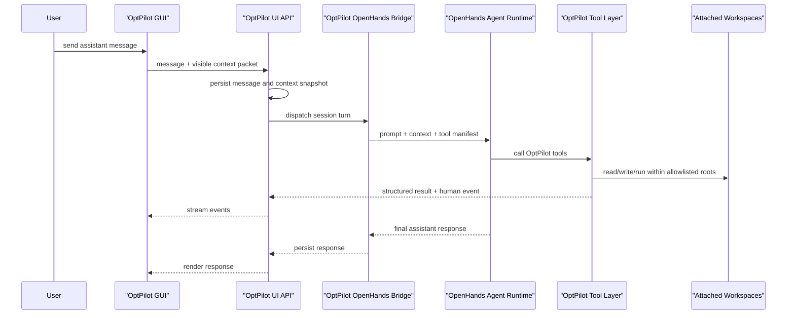

# OptPilot Assistant Design

This document designs the OpenHands-backed assistant inside OptPilot Studio.
The assistant is a global dialogue sidecar that can open beside Catalog,
Studies, Runs, or the embedded code editor. It helps users create, adapt, run,
monitor, and analyze OptPilot optimization studies while respecting OptPilot's
core model:

```text
method proposes candidate -> environment evaluates candidate -> OptPilot records evidence
```

The assistant should make that model easier to use. It should not replace the
OptPilot runner, the environment/method boundary, the catalog, or the evidence
store.

## Goals

1. Let the user ask questions about the currently visible tab and get answers
   grounded in what the GUI is showing.
2. Let the assistant operate on attached workspaces only, with server-enforced
   file and command permissions.
3. Help users build new environments and methods as normal OptPilot assets:
   environment configs, method configs, study configs, implementation files,
   prompts, assets, and tests.
4. Help connect uploaded or cloned code to OptPilot by writing adapters,
   configs, registration manifests, smoke tests, and study plans.
5. Help monitor running studies and analyze completed runs using structured
   evidence rather than ad hoc log scraping.
6. Reuse OptPilot documentation and schema knowledge through a curated prompt
   and retrieval package.
7. Keep OpenHands as the coding-agent runtime, while keeping OptPilot Studio as
   the product UI, permission layer, catalog, and evidence browser.

## Non-Goals

- The assistant is not an OptPilot optimization method by default. It helps
  users author and operate studies. A user may still create a method that uses
  an LLM agent inside the study loop, but that is a separate catalog method.
- The assistant should not directly run environment trials outside OptPilot's
  validation, smoke-test, and study-launch tools.
- The assistant should not modify files outside attached workspace roots.
- The assistant should not rely on prompt instructions alone for safety. Tool
  wrappers must enforce path and command policy.
- The first version does not need multi-user cloud isolation, but the local
  design should not make that impossible later.

## Current Repo State

The current UI already has much of the product shell:

- `src/optpilot/ui/server.py` serves Catalog, Studies, Runs, workspace,
  registration, code-server, job, settings, and agent-session endpoints.
- `src/optpilot/ui/static/app.js` renders the assistant sidecar, session list,
  attached workspaces, registration menu, Catalog, Studies, Runs, and embedded
  code-server editor.
- `src/optpilot/agent.py` defines `OpenHandsRuntimeConfig`,
  `OpenHandsAdapter`, the assistant tool names, and the context packet shape.
- `.optpilot-ui/settings.json` stores local assistant settings. The API returns
  only `api_key_configured`, never the key value.
- `.optpilot-ui/agent_sessions/` stores message and event JSONL files.
- `.optpilot-ui/workspaces/` stores workspace metadata and registration
  manifests.

The current adapter dispatches to either an OpenHands agent server or an
OpenAI-compatible chat-completions endpoint. In agent-server mode, OptPilot
creates or resumes an OpenHands conversation, sends the current GUI context,
advertises OptPilot client tools, executes requested tools through the UI
server permission layer, and persists assistant responses and tool events under
`.optpilot-ui/agent_sessions/`.

The current settings shape stores an OpenHands server URL, session endpoint,
model, API key, and enabled flag. For clarity, the next schema should separate
the OpenHands agent server from the LLM provider credentials. For example:

```json
{
  "assistant": {
    "runtime": "openhands",
    "openhands": {
      "enabled": true,
      "agent_server_url": "http://127.0.0.1:8771",
      "session_endpoint": "/api/sessions"
    },
    "llm": {
      "provider": "openrouter",
      "model": "deepseek/deepseek-v4-flash",
      "api_key_ref": "openhands_api_key",
      "base_url": "https://openrouter.ai/api/v1"
    }
  }
}
```

The existing settings reader can keep backward compatibility by mapping
`assistant.openhands.base_url` to `agent_server_url` until the UI is migrated.

## Product Model

The assistant is session-scoped and page-aware.

```text
OptPilot Studio
  Catalog page
  Studies page
  Runs page
  Editor canvas
  Assistant sidecar
    Agent sessions
    Attached workspaces
    Current visible page context
    OpenHands-backed chat and tool events
```

The assistant panel can open beside any primary page. It should display a
subtitle such as `Catalog context`, `Studies context`, `Runs context`, or
`Editor context`, and every user message should include a compact snapshot of
the visible page.

The current frontend uses `experiments` as the internal view id for the Studies
page. The assistant API should normalize that to `studies` in context packets
while accepting the old value during migration.

Workspaces are persistent project folders that may be attached to one or more
assistant sessions. A workspace is not inherently an environment or method. It
may later register zero, one, or many catalog entries.

Closing a workspace from the sidebar means detach from the current assistant
session. It must not delete files. Deleting or archiving workspace files should
be a separate action with stronger confirmation.

## Page Awareness

The assistant should "see what the user sees" through structured context
providers, not by scraping DOM text or reading the whole repository every turn.
The frontend already builds `assistantVisibleContext()` before persisting a
message. This should become a formal contract between UI and backend.

### Context Packet

Each assistant request should include:

```json
{
  "session_id": "as_...",
  "current_page": "catalog",
  "assistant_mode": "chat",
  "selected_workspace": {
    "id": "ws_...",
    "title": "Edit Job Shop Method",
    "root": ".optpilot-ui/workspaces/ws_.../workspace",
    "mode": "editable",
    "source_type": "catalog-copy",
    "registered_entries": [
      {"kind": "method", "id": "job-shop-ortools-cpsat", "config_path": "method.yaml"}
    ],
    "focus_paths": ["method.yaml", "method.py"]
  },
  "attached_workspaces": [
    {"id": "ws_...", "title": "Edit Job Shop Method", "mode": "editable"}
  ],
  "selected_catalog_entry": {
    "kind": "environment",
    "id": "job-shop-schedule-solution",
    "label": "Job Shop Schedule Solution",
    "path": "examples/environments/job_shop_scheduling/environment_schedule_solution.yaml"
  },
  "selected_study_plan": {
    "id": "pair-job-shop-ortools",
    "status": "draft",
    "environment_id": "job-shop-schedule-solution",
    "method_id": "job-shop-ortools-cpsat"
  },
  "selected_run": {
    "id": "...",
    "name": "job-shop-ortools-cpsat",
    "path": "runs/...",
    "status": "completed",
    "environment_id": "job-shop-schedule-solution",
    "method_id": "job-shop-ortools-cpsat"
  },
  "registration_menu": {
    "workspace_id": "ws_...",
    "status": "draft",
    "selected_configs": [
      {"path": "method.yaml", "kind": "method", "validation": {"valid": true}}
    ]
  },
  "code_editor": {
    "folder": ".optpilot-ui/workspaces/ws_.../workspace",
    "status": "ready",
    "focus_path": "method.py"
  },
  "catalog_counts": {"environments": 4, "methods": 9, "resources": 2},
  "study_plan_count": 12,
  "run_count": 6,
  "available_tools": ["optpilot_catalog_list", "optpilot_config_validate"]
}
```

The packet should be compact. It should include identifiers, selected rows,
visible filters, active tab, validation state, and paths. It should not include
large file contents, full run JSONL files, or the entire catalog by default.
The assistant should call tools when it needs more detail.

### Tab-Specific Providers

| GUI context | Packet contents | Common assistant jobs |
| --- | --- | --- |
| Catalog | Selected environment/method/study, filters, compatibility summary, available actions | Explain a component, compare compatible methods, open workspace, create edit copy, draft a study |
| Studies | Selected plan, form fields, YAML preview path, compatibility checks, validation status | Fix study config, adjust budget/objective/runtime, save or launch after approval |
| Runs | Selected run, active run tab, summary stats, visible metric, selected trial/candidate/file | Summarize progress, diagnose failures, compare candidates, open run workspace |
| Editor | Selected workspace, focus paths, registration state, code-server status | Edit code/config, run validation, prepare registration, explain files |
| Registration | Discovered configs, selected targets, validation results, manifest id | Choose files, fix validation errors, apply registration after approval |

For the embedded code editor, OptPilot should not assume it can read unsaved VS
Code buffers. If the assistant needs exact file contents, it should use file
tools on saved files. A later code-server extension can expose active unsaved
buffer text if needed.

## Workspace Model

Workspaces are the assistant's file permission units.

```json
{
  "id": "ws_...",
  "title": "New Airlift Environment",
  "root": ".optpilot-ui/workspaces/ws_.../workspace",
  "source_type": "blank|git|local|catalog|catalog-copy|run|study-plan|generated",
  "mode": "editable|read-only|analysis",
  "attached_sessions": ["as_..."],
  "registered_entries": [],
  "focus_paths": ["environment.yaml", "evaluator.py"],
  "registration_enabled": true
}
```

Workspace modes:

| Mode | Meaning | Assistant writes |
| --- | --- | --- |
| `editable` | User-owned working folder | Allowed inside root through tool wrappers |
| `read-only` | Packaged example, imported source, or inspection workspace | Rejected by write tools; use edit copy for changes |
| `analysis` | Run evidence or derived analysis input | Rejected by write tools unless creating a separate derived workspace |

Built-in examples should open read-only. User catalog entries can open editable
for local use, but higher-stakes deployments should still prefer edit-copy plus
registration. Run directories should open as `analysis` workspaces.

## Permission Enforcement

The workspace permission rule is:

```text
An assistant may read/write only through tools that receive the active session
and enforce the attached workspace allowlist.
```

Prompt instructions are not enough. Every tool that touches the filesystem or
shell must enforce:

- resolve all paths with `Path.resolve()`
- reject paths outside attached workspace roots
- reject writes in `read-only` and `analysis` workspaces
- reject symlink escapes after resolution
- run shell commands with `cwd` inside one attached workspace
- pass environment variables through an explicit allowlist
- redact API keys and other configured secrets from logs and events
- cap output size and store full logs under session events when needed
- treat catalog writes as a special approved registration action, not as normal
  workspace writes

Registration is the one normal path for writing from a workspace into
`user_catalog/`. It should copy only the files declared by a registration
manifest after validation and user approval.

The embedded code editor is also a write surface. For read-only examples, the
safer implementation is to open either an edit copy or a filesystem mount with
read-only permissions. If code-server opens a physically writable examples
folder, the UI label alone does not enforce read-only behavior.

## OpenHands Runtime Architecture

OpenHands should be used as the coding-agent runtime behind OptPilot's own
assistant panel. Do not iframe the OpenHands UI into OptPilot.



OptPilot owns:

- authentication and local project state
- assistant session history and context snapshots
- workspace registry and path allowlists
- catalog scanning and registration
- config validation and compatibility checks
- study launch, stop, resume, branch, and run inspection
- event streaming to the GUI
- secret storage and redaction policy

OpenHands owns:

- agent planning and conversation reasoning
- code editing through approved tools
- shell/tool use through approved wrappers
- model-provider calls using configured model credentials
- task tracking and agent-local state

The bridge should isolate API drift. If OpenHands SDK or server APIs change,
OptPilot should update `optpilot.agent` without changing frontend context,
workspace permissions, or OptPilot-specific tools.

## Agent Session Lifecycle

Session states:

| State | Meaning |
| --- | --- |
| `idle` | Ready for a user message |
| `running` | OpenHands is processing the turn |
| `waiting_for_agent` | Message was sent but no final runtime answer has been observed yet |
| `error` | Runtime or tool bridge failed |
| `awaiting_approval` | Agent proposed a launch, registration, risky shell command, smoke test, or catalog write |
| `canceling` | User requested cancellation |

Suggested persisted layout:

```text
.optpilot-ui/
  agent_sessions/
    index.json
    as_<id>/
      session.json
      messages.jsonl
      events.jsonl
      context_snapshots/
        msg_<id>.json
      openhands/
        remote_session.json
        tool_calls.jsonl
  workspaces/
    index.json
    ws_<id>/
      workspace.json
      workspace/
      registrations/
        reg_<id>.json
      events.jsonl
```

Each message should store the context snapshot used for that turn. This makes
answers auditable when the UI selection changes later.

## Assistant Tools

OpenHands should see OptPilot through typed tools. Tools should return compact
JSON for the agent and a human-readable event for the GUI timeline.

### Workspace Tools

| Tool | Purpose |
| --- | --- |
| `optpilot_workspace_list` | List known workspaces and attachment state |
| `optpilot_workspace_create` | Create a blank workspace or register an allowed existing local folder |
| `optpilot_workspace_attach` | Attach workspace to assistant session |
| `optpilot_workspace_detach` | Detach workspace from session without deleting files |
| `optpilot_workspace_focus` | Select workspace and focus path in UI |
| `optpilot_file_tree` | List files under an attached workspace |
| `optpilot_file_read` | Read a file under an attached workspace |
| `optpilot_file_write` | Write a file under an editable attached workspace |
| `optpilot_file_diff` | Show diff for proposed workspace changes |
| `optpilot_shell_run` | Run a bounded command in an editable attached workspace; risky commands require approval |

### Catalog And Config Tools

| Tool | Purpose |
| --- | --- |
| `optpilot_catalog_list` | List reusable environments, methods, resources, and saved study plans |
| `optpilot_catalog_detail` | Inspect a catalog entry or saved study plan contract |
| `optpilot_compatibility_check` | Explain method/environment compatibility |
| `optpilot_config_discover` | Find OptPilot configs in a workspace |
| `optpilot_config_validate` | Run `validate_authoring_config` on environment, method, or study YAML |
| `optpilot_registration_prepare` | Create or update a registration manifest |
| `optpilot_registration_validate` | Validate selected registration targets |
| `optpilot_registration_apply` | Copy approved files into `user_catalog/` |

### Study And Run Tools

| Tool | Purpose |
| --- | --- |
| `optpilot_study_draft` | Draft normal `config: study` YAML from selected environment and method |
| `optpilot_study_save` | Save a study config inside an editable attached workspace |
| `optpilot_study_launch` | Launch a validated study after explicit approval |
| `optpilot_job_stop` | Stop a live UI-launched job after explicit approval |
| `optpilot_run_list` | List live and completed runs |
| `optpilot_run_detail` | Read run summary, trials, observations, candidates, events, and files |
| `optpilot_run_file_read` | Read one run file safely |
| `optpilot_run_open_workspace` | Attach a run directory as an analysis workspace |
| `optpilot_run_compare` | Compare runs with compatible environment/metric policy |

### Smoke-Test And Docs Tools

| Tool | Purpose |
| --- | --- |
| `optpilot_smoke_test_study` | Launch a validated study into a temporary run directory after approval |
| `optpilot_docs_search` | Retrieve compact excerpts from OptPilot docs and schema references |

`src/optpilot/agent.py` contains the OpenHands client-tool specs. The UI server
implements the same tool names through `POST
/api/agent-sessions/{session_id}/tools/{tool_name}`, so the GUI and the
OpenHands bridge share one permission-enforced execution path.

## Prompt And Knowledge Design

The assistant needs a durable OptPilot instruction package rather than one
large prompt pasted into every request.

### Prompt Layers

1. **Base assistant contract**
   - You are the OptPilot Assistant.
   - Use current GUI context first.
   - Ask for clarification only when the OptPilot boundary is ambiguous.
   - Do not edit outside attached workspaces.
   - Use tools for platform actions.
   - Request approval before registration, study launch, job stop, deletion, or
     broad dependency installation.

2. **OptPilot model brief**
   - Environment: what can be evaluated.
   - Method: how candidates are produced.
   - Study: objective, budget, runtime, and evidence binding.
   - Candidate contracts are the boundary.
   - Public configs are YAML; `study_spec.json` is a run record, not user input.
   - Environment-owned inputs belong in `evaluator.settings`.
   - Method-visible static files belong in `methodContext.references`.
   - Evidence contains dynamic results and artifacts.

3. **Workspace and safety brief**
   - Attached workspaces define readable/writable roots.
   - `read-only` and `analysis` roots are not writable.
   - Register through manifests, not whole-folder copying.
   - Built-in examples should usually become edit copies before modification.

4. **Current tab brief**
   - Catalog, Studies, Runs, Editor, and Registration each add a short task
     policy and visible state.

5. **Retrieved docs**
   - Add compact excerpts only when relevant to the task.
   - Prefer `docs/concepts.md`, `docs/candidate-contracts.md`,
     `docs/configuration.md`, `docs/user-catalog.md`,
     `docs/how-it-works.md`, `docs/methods.md`, `docs/evidence.md`, and
     `docs/job-shop-environment.md`.

### Tab Prompts

Catalog prompt:

```text
You are assisting from the Catalog page. Use the selected catalog entry and
compatibility summary first. Explain environment/method contracts by candidate
format, required context, metrics, evaluator/entrypoint, and runtime. If the
user asks to modify packaged examples, open an edit-copy workspace.
```

Studies prompt:

```text
You are assisting from the Studies page. Treat the study YAML as the
reproducible source of truth. Keep environment and method configs reusable.
Before launch, validate the study and explain any compatibility or objective
metric errors. Ask for approval before launching.
```

Runs prompt:

```text
You are assisting from the Runs page. Use structured evidence first:
summary.json, observations.jsonl, trials.jsonl, candidates.jsonl,
method_calls.jsonl, method_events.jsonl, scheduler_events.jsonl, and run
artifacts. Open a run workspace for deeper file-level inspection. Do not edit
run evidence directly; create a derived analysis workspace for reports or
notebooks.
```

Editor prompt:

```text
You are assisting from the Editor canvas. Work only inside attached editable
workspace roots. Use config discovery before assuming which file is active.
Validate configs after edits. Register through a manifest after the user
approves the destination and included files.
```

Registration prompt:

```text
You are assisting in catalog registration. Select one or more OptPilot config
targets, validate each target, include only required implementation/assets, show
destination paths, and apply registration only after explicit user approval.
```

## Core Workflows

### Build A New Environment

1. Create or attach an editable workspace.
2. Ask the user enough to identify the evaluation boundary:
   - What candidate should a method propose: parameters, files, or opaque?
   - What metrics define success?
   - What does one evaluator call do?
   - What environment-owned inputs belong in `evaluator.settings`?
   - What static files should methods read through `methodContext.references`?
   - What is the smallest smoke test?
3. Write `environment.yaml`, evaluator code, assets, prompts, and README.
4. Run config validation.
5. Run environment smoke test with a baseline/default candidate.
6. Prepare registration manifest.
7. Ask for approval and register into `user_catalog/environments/<slug>/`.
8. Suggest compatible existing methods or draft a new method.

The assistant should avoid creating a new public abstraction for benchmark
instances. For public configs, use environment-owned settings and
method-visible references. If the evaluator needs a list of cases, put the list
under `evaluator.settings` and let the evaluator or adapter interpret it.

### Build A New Method

1. Create or attach an editable workspace.
2. Identify the method type:
   - schema-general parameter method
   - fixed-shape solver wrapper
   - file-candidate editor or code generator
   - command wrapper around an existing optimizer
   - session-style method
3. Write `method.yaml`, implementation code, prompts/assets, and README.
4. Declare `accepts.formats` and required context paths.
5. Add `produces` only when the output shape is known before runtime.
6. Dry-run against a selected environment contract.
7. Validate and register into `user_catalog/methods/<slug>/`.
8. Draft one or more studies against compatible environments.

### Connect Uploaded Or Cloned Code

1. Import the uploaded folder, archive, or cloned repository as a workspace.
2. Inspect project structure, dependencies, CLIs, tests, and examples.
3. Decide the OptPilot boundary:
   - Environment adapter if the code evaluates candidates.
   - Method adapter if the code proposes candidates.
   - Both, if the repository contains a benchmark and solver.
4. Keep third-party code in the workspace unless registration manifest
   explicitly includes required source files/assets.
5. Write thin adapters and OptPilot configs.
6. Use `evaluator.settings` for environment-side scenarios, datasets, or
   benchmark arguments.
7. Use `methodContext.references` for read-only files methods need before
   proposing candidates.
8. Validate, smoke-test, and register only selected files.

### Monitor And Analyze Runs

1. Use the Runs page context to identify the selected run or live job.
2. For live jobs, poll job and run status.
3. Use `summary.json` for status, best metric, failure count, and best trial.
4. Use `observations.jsonl` for metric trends.
5. Use `trials.jsonl` and scheduler events for lifecycle and backend issues.
6. Use `candidates.jsonl` and candidate stores to inspect candidate payloads.
7. Use `method_calls.jsonl` and method events for agent/optimizer behavior.
8. Use output files and records for domain-specific debugging.
9. Open a read-only run workspace for deeper inspection.
10. Create a derived analysis workspace for reports, notebooks, or scripts.

The assistant should call out when two runs are not directly comparable because
they use different environment configs, objective metrics, cases, or evidence
policies.

## Approval Policy

The assistant may do these without extra approval:

- inspect catalog metadata
- read attached workspace files
- discover configs
- validate configs
- draft files inside an editable attached workspace
- read run summaries and evidence files

The assistant must request explicit approval before:

- applying registration into `user_catalog/`
- launching a study
- stopping a running job
- deleting, archiving, or overwriting workspace files
- running commands that install packages or access the network
- running smoke tests that execute environment or method code
- exposing configured secrets to a subprocess

Approval records should be persisted in `events.jsonl` with the exact action,
target paths, command, or study config path.

## Backend API Additions

The current server exposes the assistant bridge and tool endpoints:

```text
GET  /api/agent-sessions/{session_id}/context
GET  /api/agent-sessions/{session_id}/events
GET  /api/agent-sessions/{session_id}/approvals
POST /api/agent-sessions/{session_id}/message
POST /api/agent-sessions/{session_id}/tools/{tool_name}
POST /api/agent-sessions/{session_id}/approvals/{approval_id}/approve
POST /api/agent-sessions/{session_id}/approvals/{approval_id}/reject
```

The first production bridge uses polling through the existing JSON endpoints.
Server-Sent Events or WebSocket streaming can be added later without changing
the tool contracts.

## Data Contracts

### Tool Result

```json
{
  "ok": true,
  "tool": "optpilot_config_validate",
  "summary": "study.yaml is valid.",
  "data": {"valid": true, "errors": []},
  "artifacts": [],
  "events": [
    {"level": "info", "message": "Validated study.yaml against OptPilot schema."}
  ]
}
```

### Approval Request

```json
{
  "id": "approval_...",
  "session_id": "as_...",
  "kind": "study_launch",
  "title": "Launch study job-shop-ortools-cpsat",
  "summary": "Run 8 trials into runs/ after validation passes.",
  "targets": [".optpilot-ui/workspaces/ws_123/workspace/studies/job_shop_ortools_cpsat.yaml"],
  "arguments": {"study_path": "...", "output_root": "runs"},
  "status": "pending",
  "created_at": "..."
}
```

### Agent Event

```json
{
  "id": "evt_...",
  "type": "optpilot_tool_result",
  "created_at": "...",
  "payload": {
    "tool": "optpilot_config_validate",
    "ok": true,
    "summary": "Validation passed."
  }
}
```

## Secrets

The assistant settings UI should treat API keys as write-only:

- The browser may submit a key.
- The server stores it with restricted permissions.
- The browser receives only `api_key_configured: true`.
- Context packets, messages, events, tool logs, and run evidence must not store
  raw keys.
- The OpenHands bridge should inject keys only into the OpenHands or model
  provider call path that needs them.
- Shell tools should receive secrets only through explicit allowlists and
  approval.

## Implementation Status

### Implemented

- OpenHands HTTP dispatch bridge with conversation resume.
- OpenRouter/OpenAI-compatible fallback path.
- Client-tool specs for the OptPilot tool surface.
- Server-side tool executor with attached-workspace path enforcement.
- Workspace file tree/read/write/diff tools.
- Bounded shell execution in editable attached workspaces.
- Catalog, compatibility, config discovery, validation, registration, study,
  run, docs, and study smoke-test tools.
- Approval records and GUI approval/rejection actions.
- Secret redaction and write-only API key settings.
- Regression tests for tool safety and OpenHands client-tool round trips.

### Remaining Hardening

- Add true streaming events once the GUI needs token-level progress.
- Separate OpenHands agent-server settings from LLM provider settings.
- Add stronger container isolation for untrusted uploaded projects.
- Add per-user workspace roots and auth for multi-user deployment.
- Add quotas, timeout policies, and credential scopes.
- Add environment-level and method-level smoke tools if they become necessary.

## Validation Plan

Backend tests:

- context packet includes selected Catalog, Studies, Runs, Editor, and
  Registration state
- messages persist context snapshots
- workspace tools reject paths outside attached roots
- write tools reject read-only and analysis workspaces
- registration writes only to `user_catalog/`
- study launch requires prior validation and approval
- settings APIs never return raw API keys

Frontend tests:

- assistant opens beside Catalog, Studies, Runs, and Editor
- assistant subtitle reflects current page
- selecting a catalog entry changes assistant context
- selecting a run changes assistant context
- registration menu state is included in sent messages
- settings modal shows model and key-configured state without revealing key

Agent tests:

- mocked OpenHands session receives context packet and tool manifest
- mocked tool calls stream events to the GUI
- assistant can fix an invalid environment config in an editable workspace
- assistant cannot write into a read-only catalog workspace
- assistant can open a run workspace and summarize evidence
- assistant asks for approval before registration or study launch

Manual smoke test:

1. Configure OpenHands with `deepseek/deepseek-v4-flash` through OpenRouter.
2. Start `uv run optpilot ui --open-browser`.
3. Open Catalog, select a job-shop environment, and ask why a method is
   compatible.
4. Create an edit-copy workspace and ask the assistant to add a small config
   variant.
5. Validate and register the variant after approval.
6. Draft and launch a study after approval.
7. Open the run in Runs and ask the assistant to summarize the result.

## Open Questions

- Should local deployments allow editable user catalog entries by default, or
  should every catalog edit go through an edit-copy workspace?
- Should code-server enforce read-only workspace modes through filesystem
  permissions, container mounts, or an OptPilot editor extension?
- The first bridge currently uses the OpenHands agent-server HTTP surface. Should
  future deployments move selected workloads to the Python SDK or a local
  subprocess wrapper?
- Should OpenRouter provider settings be stored in the OpenHands settings block
  or a separate generic LLM provider block?
- What is the smallest useful smoke-test interface for file-candidate
  environments that need baseline files?
- Should run comparison become a first-class UI model, or remain an assistant
  analysis workflow that creates reports in derived workspaces?

## Definition Of Done

The assistant design is implemented when:

- a user can open the assistant beside any page and ask about the selected tab
- messages are dispatched to OpenHands with a context packet
- OpenHands can use OptPilot tools for catalog, workspaces, validation,
  registration, studies, and runs
- file writes and shell commands are restricted to attached editable workspaces
- API keys are never shown in UI responses, logs, context packets, or events
- environment/method/study assets produced by the assistant validate and
  register through the same manifest workflow as human-authored assets
- run analysis uses structured evidence and can create derived analysis
  workspaces without mutating run directories
