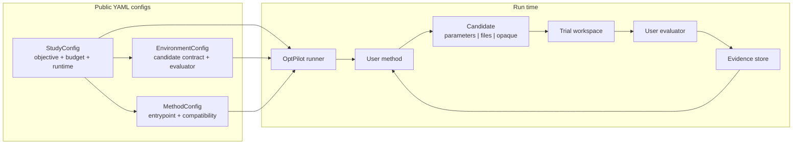

# OptPilot

OptPilot is a lightweight orchestration layer for iterative optimization studies.
It connects a user-owned optimization method to a user-owned evaluation
environment, runs candidate solutions, records objective results, and keeps the
evidence needed to inspect, compare, or reproduce a study.

OptPilot does not try to become your simulator, dataset evaluator, LLM agent,
Bayesian optimizer, RL trainer, or metaheuristic. Those pieces stay in your
code. OptPilot provides the contract and runtime around them:

- what a method must return
- how the environment evaluates it
- how each trial workspace is prepared
- how metrics, records, output files, and provenance are stored
- how compatible environments and methods are discovered and launched

## What You Build

Most OptPilot integrations have three authored YAML files:

| File role | Main question |
| --- | --- |
| `config: environment` | What can be evaluated, what candidate format is valid, and how are metrics returned? |
| `config: method` | How are candidates proposed, and which environment contracts can the method target? |
| `config: study` | Which environment and method should run together, with which objective, budget, and runtime? |

Environment and method configs are reusable components. Study configs are
concrete run plans.

The boundary between environment and method is the [candidate contract](candidate-contracts.md). That contract is the first thing to understand when adding a new integration.

## Who Owns What?

| Piece | Owned by | What it does |
| --- | --- | --- |
| Environment | You | Evaluates one candidate and returns metrics. |
| Method | You | Proposes candidates from the current study state and evidence. |
| Study | You | Binds one environment to one method for a run. |
| Runner | OptPilot | Validates, materializes, evaluates, and records each trial. |
| Evidence store | OptPilot | Stores what happened: observations, artifacts, method calls, events, and summaries. |

## Core Loop

Every OptPilot run follows the same loop:

```text
method proposes candidate
runner validates and materializes candidate
environment evaluates materialized candidate
runner records evidence
```

That loop supports parameter search, file/code evolution, simulator control, metaheuristics, Bayesian optimization, LLM agents, LLM-assisted methods, and coarse-grained wrappers around existing search repositories.



## Candidate Contracts Are The Spine

An environment declares a candidate contract:

Environment candidate-contract fragment:

```yaml
candidate:
  format: parameters
  parameters:
    schema:
      x:
        valueType: float
```

A method declares what it can target:

Method compatibility fragment:

```yaml
accepts:
  formats: [parameters]
  requires:
    context: [candidate.parameters.schema]
```

Some methods are schema-general: their code first reads the environment's schema, then decides what candidate to return. For example, if one environment asks for `{x, mode}` and another asks for `{learning_rate, batch_size}`, the same method can read the schema and fill in either set of fields. A random sampler, Bayesian optimizer, or LLM parameter proposer can be written this way.

Other methods are specific: their code is written to return one known candidate shape. For example, a route solver might always return `{route: [...]}` and a schedule solver might always return `{solutions: ...}`. These methods can declare `produces`, which means "this is the candidate shape my method promises to return." OptPilot then checks that promised shape against the environment's candidate contract before the run starts.

See [Candidate Contracts](candidate-contracts.md) for the full model and examples.

## Ways To Use OptPilot

Use the CLI when you want a simple validate/run loop:

```bash
uv run optpilot validate examples/studies/job_shop_rule_parameters_baseline.yaml
uv run optpilot run examples/studies/job_shop_rule_parameters_baseline.yaml
```

Use OptPilot Studio when you want a local GUI for browsing reusable components,
opening workspaces, launching studies, inspecting run evidence, and asking the
assistant for help:

```bash
uv run optpilot ui --open-browser
```

Studio scans `examples/` and `user_catalog/` by default. It also has an
assistant-enabled mode backed by OpenHands and per-workspace Code Server
containers; see [UI](ui.md) for setup.

## Start Here

1. Run the first example with [Getting Started](getting-started.md).
2. Read [Candidate Contracts](candidate-contracts.md) for the environment/method boundary.
3. Read [Concepts](concepts.md) for the vocabulary.
4. Read [How A Run Works](how-it-works.md) and [Evidence](evidence.md) when you want the runtime model.
5. Use [Examples](examples.md) and [Job-Shop Environment](job-shop-environment.md) to choose a method track.
6. Use [User Catalog](user-catalog.md) and [Configuration](configuration.md) when you start writing your own integrations.

For personal or team use, put reusable environments, methods, and resources
under `user_catalog/`. Keep study YAML files where you draft or launch them;
they are run plans rather than reusable catalog entries.
