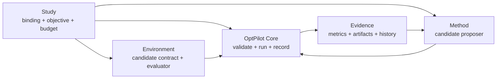

# OptPilot

OptPilot is a lightweight orchestration layer for iterative optimization
studies. It connects a user-owned **method** to a user-owned **environment**,
runs candidate solutions, records metrics and artifacts, and keeps the evidence
needed to inspect or reproduce a study.

OptPilot does not replace your simulator, solver, dataset evaluator, RL
trainer, LLM workflow, or metaheuristic. Those pieces stay in your code.
OptPilot provides the contract and runtime around them.

## The Core Idea

Every run follows the same loop:

```text
method proposes candidate
OptPilot validates and materializes it
environment evaluates it
OptPilot records evidence
method can use evidence for the next proposal
```

The three public config roles map onto that loop:

| Config role | Question it answers |
| --- | --- |
| `environment` | What can be evaluated, what candidate shape is valid, and how are metrics returned? |
| `method` | How are candidates proposed, and which environment contracts can the method use? |
| `study` | Which environment and method should run together, with which objective, budget, and execution policy? |

Environment and method configs are reusable. Study configs are concrete run
plans.



## Two Ways To Use OptPilot

OptPilot has two installation modes:

- **Core CLI/SDK**: install from PyPI when you want to validate packages and run
  studies in your own project without the GUI.
- **Full OptPilot Studio**: clone the repository when you want the local Studio
  UI, workspace management, assistant integration, and bundled tutorial package.

Start with [Installation](installation.md) to choose the right mode.

## Documentation Map

Read the docs in this order if you are new:

1. [Installation](installation.md): choose Core CLI/SDK or full Studio.
2. [OptPilot Core](concepts.md): learn environments, methods, studies,
   candidates, runtime workspaces, and evidence.
3. [Packages and Catalogs](catalog.md): understand how reusable environments,
   methods, resources, and studies are organized.
4. [Job-Shop Tutorial](examples.md): run the built-in example package and see
   several method families target the same evaluation problem.
5. [OptPilot Studio](ui.md): use the local GUI, workspace manager, and assistant.

Use [Configuration Reference](configuration.md) when you need the allowed YAML
fields and [How A Run Works](how-it-works.md) when you need the runtime sequence.

## What Ships Where?

The PyPI core package contains the CLI, SDK, schemas, runners, runtime
backends, evidence store, and package validation command.

The source checkout also contains:

- `catalog/example_package/`: the built-in job-shop tutorial package
- `studio/`: the OptPilot Studio UI package
- docs, tests, and contributor tooling

A package that works with the core CLI can be dropped into a Studio catalog root
later. That is the intended path: integrate with the schema first, then use
Studio for browsing, editing copies, launching studies, and inspecting runs.
